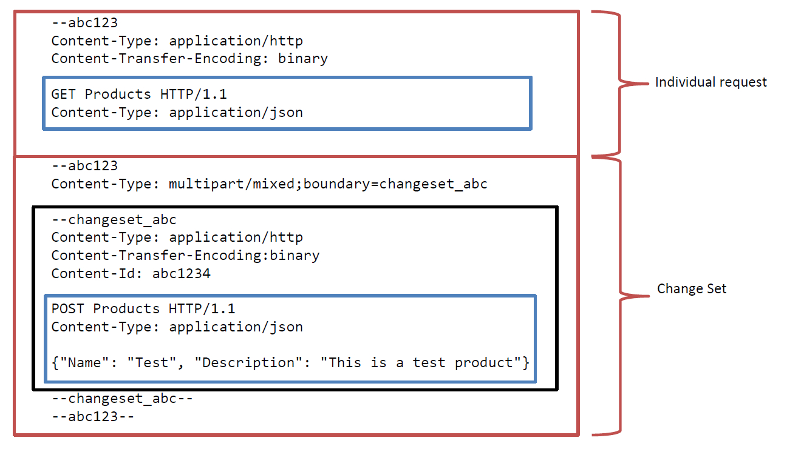

Title: How to build an OData Service with Olingo V4

# How to build an OData Service with Olingo V4

# Part 8: Batch Request Support

## Introduction

In the present tutorial, we’ll implement batch requests.

**Note:**
The final source code can be found in the project [git repository](https://gitbox.apache.org/repos/asf/olingo-odata4).
A detailed description how to checkout the tutorials can be found [here](/doc/odata4/tutorials/prerequisites/prerequisites.html).   
This tutorial can be found in subdirectory /samples/tutorials/p11_batch

**Table of Contents**

   1. Introduction
   2. Preparation
   3. Implementation
   4. Run the implemented service
   5. Links

# 1. Introduction

Batch requests [(OData Version 4.0 Part 1: Protocol Plus Errata 02)](http://docs.oasis-open.org/odata/odata/v4.0/errata02/os/complete/part1-protocol/odata-v4.0-errata02-os-part1-protocol-complete.html#_Toc406398359) allow grouping multiple operations into a single HTTP request payload. A batch request is represented as a Multipart MIME v1.0 message [(RFC2046)](https://www.ietf.org/rfc/rfc2046.txt).
Each part of a Multipart MINE message can have a different content type. For example you can mix OData requests with Content-Type `application/json` and Media Ressource Requests with Content Type `image/png`.

The content of batch requests can consist of a series of individual requests and Change Sets, each represented as a distinct MIME part. In difference to OData V2 an individual request can be a Data Request, Data Modification Request, Action invocation request or a Function invocation request. So all kinds of OData requests are allowed at top level. The order of individual requests and Change Set sets in significant. Within a Change Set you can use Data Modification requests and Action invocation requests. Due to the fact that all requests within a Change Set are unordered, GET requests must not be used within a Change Set. All operations in a change set represent a single change unit so a service must successfully process and apply all the requests in the change set or else apply none of them.

**Example**

The request below consists of an individual request (upper red box), actually a GET request(the upper blue box) to the Entity Set `Products` and a Change Set (lower red box). The Change Set contains a single POST request (lower blue box) to create a new `Product`. Please note that the *boundary delimiter* `abc123` is used in the request below.  The whole content must be wrapped in a single POST request issued against the resource `/$batch`. The Content-Type of the POST request is consequently `Content-Type: multipart/mixed;boundary=abc123`

# 2. Preparation

You should read the previous tutorials first to have an idea how to read and write entities. In addition the following code is based on the write tutorial.

As a shortcut you should checkout the prepared tutorial project in the git repository in folder /samples/tutorials/p3_write.

The main idea of the following implementation is to reuse the existing processors.
To do so, we will implement a new processor, which takes a batch request and dispatches the single requests to the responsible processors.

The following steps have to be performed:

  - Modify the data store
  - Implement the interface `BatchProcessor`

## Add transactional behavior to the data store

Before we start with the actual processor implementation the data store has to be modified to provide transactional behavior. In real world service the underlying database may supports transactional handling. This tutorial is not based on a database so we have implement a simple transaction handling by ourselves.

Add the following methods to the class `myservice.mynamespace.data.Storage`. When a new transaction has been begun the data of the service is copied and stored in an instance variable. If `rollbackTransaction` has been called the current data is replaced with the previous copied one.

~~~java
    private List<Entity> productListBeforeTransaction;
    
    public void beginTransaction() {
        if(productListBeforeTransaction == null) {
            productListBeforeTransaction = cloneEntityCollection(productList);
        } 
    }

    public void commitTransaction() {
        if(productListBeforeTransaction != null) {
            productListBeforeTransaction = null;
        }
    }

    public void rollbackTranscation() {
        if(productListBeforeTransaction != null) {
            productList = productListBeforeTransaction;
            productListBeforeTransaction = null;
        }
    }

    private List<Entity> cloneEntityCollection(final List<Entity> entities) {
        final List<Entity> clonedEntities = new ArrayList<Entity>();

        for(final Entity entity : entities) {
            final Entity clonedEntity = new Entity();

            clonedEntity.setId(entity.getId());
            for(final Property property : entity.getProperties()) {
                clonedEntity.addProperty(new Property(property.getType(),
                                                      property.getName(),
                                                      property.getValueType(),
                                                      property.getValue()));
            }

            clonedEntities.add(clonedEntity);
        }

        return clonedEntities;
    }
~~~

## Implement the interface `BatchProcessor`

Create a new class `myservice.mynamespace.service.DemoBatchProcessor`. The class should implement the interface `org.apache.olingo.server.api.processor.BatchProcessor`.

Create a constructor and pass the data store to the processor.

~~~java
    public class DemoBatchProcessor implements BatchProcessor {

        private OData odata;
        private Storage storage;

        public DemoBatchProcessor(final Storage storage) {
            this.storage = storage;
        }

        @Override
            public void init(final OData odata, final ServiceMetadata serviceMetadata) {
            this.odata = odata;
        }
        ...
~~~

### Implement batch handling

Batch requests will be dispatched to the method `processBatch`. First, the boundary have to be extract from the Content-Type of the POST request.

~~~java
        @Override
        public void processBatch(final BatchFacade facade, final ODataRequest request, final ODataResponse response)
            throws ODataApplicationException, ODataLibraryException {

            // 1. Extract the boundary
            final String boundary = facade.extractBoundaryFromContentType(request.getHeader(HttpHeader.CONTENT_TYPE));
~~~

After that we are able to parse the multipart mixed body. The parser needs to know what the base URI and the service resolution paths are. The result of the parser is a list of BatchRequestParts. Each of these parts represents either a single request or a Change Set (Collection of one or more requests).

~~~java
        // 2. Prepare the batch options
        final BatchOptions options = BatchOptions.with().rawBaseUri(request.getRawBaseUri())
                                                        .rawServiceResolutionUri(request.getRawServiceResolutionUri())
                                                        .build();

        // 3. Deserialize the batch request
        final List<BatchRequestPart> requestParts = odata.createFixedFormatDeserializer()
                                                         .parseBatchRequest(request.getBody(), boundary, options);
~~~

Now the requests have to be executed by our service. If you like, you can do it by our own or simply call the method `handleBatchRequest`. This method dispatches individual requests directly to the responsible processor. If a Change Set is passed to `handleBatchRequest` the implementation dispatches the request to the method `processChangeSet` of our `DemoBatchProcessor`.

~~~java
        // 4. Execute the batch request parts
        final List<ODataResponsePart> responseParts = new ArrayList<ODataResponsePart>();
        for (final BatchRequestPart part : requestParts) {
            responseParts.add(facade.handleBatchRequest(part));
        }
~~~

The last steps are to serialize the responses and setup the response of the batch request.

~~~java
        // 5. Create a new boundary for the response
        final String responseBoundary = "batch_" + UUID.randomUUID().toString();

        // 6. Serialize the response content
        final InputStream responseContent = odata.createFixedFormatSerializer().batchResponse(responseParts, responseBoundary);

        // 7. Setup response
        response.setHeader(HttpHeader.CONTENT_TYPE, ContentType.MULTIPART_MIXED + ";boundary=" + responseBoundary);
        response.setContent(responseContent);
        response.setStatusCode(HttpStatusCode.ACCEPTED.getStatusCode());
    }
~~~

### Implement Change Set handling

As mentioned above Change Sets are dispatched to the method `processChangeSet`.
In this tutorial the implementation is quite simple. First we begin a new transaction. After that we try to execute all requests of the Change Set. If one of the requests fail all changes have to be rolled back.
The comments in the source code give a detailed explanation about the steps done in this method.

~~~java
    @Override
    public ODataResponsePart processChangeSet(final BatchFacade facade, final List<ODataRequest> requests)
        throws ODataApplicationException, ODataLibraryException {
        /* 
        * OData Version 4.0 Part 1: Protocol Plus Errata 02
        *      11.7.4 Responding to a Batch Request
        * 
        *      All operations in a change set represent a single change unit so a service MUST successfully process and 
        *      apply all the requests in the change set or else apply none of them. It is up to the service implementation 
        *      to define rollback semantics to undo any requests within a change set that may have been applied before 
        *      another request in that same change set failed and thereby apply this all-or-nothing requirement. 
        *      The service MAY execute the requests within a change set in any order and MAY return the responses to the 
        *       individual requests in any order. The service MUST include the Content-ID header in each response with the 
        *      same value that the client specified in the corresponding request, so clients can correlate requests 
        *      and responses.
        * 
        * To keep things simple, we dispatch the requests within the Change Set to the other processor interfaces.
        */
        final List<ODataResponse> responses = new ArrayList<ODataResponse>();

        try {
            storage.beginTransaction();

            for(final ODataRequest request : requests) {
                // Actual request dispatching to the other processor interfaces.
                final ODataResponse response = facade.handleODataRequest(request);

                // Determine if an error occurred while executing the request.
                // Exceptions thrown by the processors get caught and result in a proper OData response.
                final int statusCode = response.getStatusCode();
                if(statusCode < 400) {
                    // The request has been executed successfully. Return the response as a part of the change set
                    responses.add(response);
                } else {
                    // Something went wrong. Undo all previous requests in this Change Set
                    storage.rollbackTranscation();

                   /*
                    * In addition the response must be provided as follows:
                    * 
                    * OData Version 4.0 Part 1: Protocol Plus Errata 02
                    *     11.7.4 Responding to a Batch Request
                    *
                    *     When a request within a change set fails, the change set response is not represented using
                    *     the multipart/mixed media type. Instead, a single response, using the application/http media type
                    *     and a Content-Transfer-Encoding header with a value of binary, is returned that
                    *     applies to all requests in the change set and MUST be formatted according to the Error Handling
                    *     defined for the particular response format.
                    *     
                    * This can be simply done by passing the response of the failed ODataRequest to a new instance of 
                    * ODataResponsePart and setting the second parameter "isChangeSet" to false.
                    */
                    return new ODataResponsePart(response, false);
                }
            }

            // Everything went well, so commit the changes.
            storage.commitTransaction();
            return new ODataResponsePart(responses, true);

        } catch(ODataApplicationException e) {
            // See below
            storage.rollbackTranscation();
            throw e;
        } catch(ODataLibraryException e) {
            // The batch request is malformed or the processor implementation is not correct.
            // Throwing an exception will stop the whole batch request not only the Change Set!
            storage.rollbackTranscation();
            throw e;
        }
    }
~~~

# 4. Run the implemented service

After building and deploying your service to your server, you can try the following requests:

All requests are issued againest [http://localhost:8080/DemoService-Action/DemoService.svc/$batch](http://localhost:8080/DemoService-Action/DemoService.svc/$batch)
Set the Content-Type header to `Content-Type: multipart/mixed;boundary=abc123`

**Example 1**    
Please note that the second request in the Change Set references the first request of the Change Set.
This is done by prefixing the Content-Id of the referenced request with a $. e.g. `$abc`

    --abc123
    Content-Type: application/http
    Content-Transfer-Encoding: binary

    GET Products HTTP/1.1
    Content-Type: application/json

    --abc123
    Content-Type: multipart/mixed;boundary=changeset_abc

    --changeset_abc
    Content-Type: application/http 
    Content-Transfer-Encoding:binary
    Content-Id: 1

    POST Products HTTP/1.1
    Content-Type: application/json

    {"Name": "Test Product", "Description": "This is a test product"}

    --changeset_abc
    Content-Type: application/http 
    Content-Transfer-Encoding:binary
    Content-ID: 2

    PATCH $1 HTTP/1.1
    Content-Type: application/json
    Accept: application/json

    {"Description": "With a changed Description"}

    --changeset_abc--

    --abc123
    Content-Type: application/http
    Content-Transfer-Encoding: binary

    GET Products HTTP/1.1
    Content-Type: application/json

    --abc123--

Now have a look at the response. As you can see a new product has been created and the description has been updated to 'With a changed Description'

    {
        "@odata.context": "$metadata#Products",
        "value": [
            ...
            {
                "ID": 4,
                "Name": "Test Product",
                "Description": "With a changed Description"
            }
        ]
    }

**Example 2**    
Let us try what is happing if we send a invalid request within an Change Set. Use the same URI and Content-Type as before and use the following body:

    --abc123
    Content-Type: multipart/mixed;boundary=changeset_abc

    --changeset_abc
    Content-Type: application/http 
    Content-Transfer-Encoding:binary
    Content-Id: 1

    POST Products HTTP/1.1
    Content-Type: application/json

    {"Name": "Test Product2", "Description": "This is a test product"}

    --changeset_abc
    Content-Type: application/http 
    Content-Transfer-Encoding:binary
    Content-ID: 2

    PATCH $1 HTTP/1.1
    Content-Type: application/json
    Accept: application/json

    {"Description": "Invalid....

    --changeset_abc--
    --abc123--

As you can see the response contains a single request response instead of a Change Set response. The error message in stored in the response body.

# 5. Links

### Tutorials

Further topics to be covered by follow-up tutorials:

  * Tutorial OData V4 service part 1: [Read Entity Collection](/doc/odata4/tutorials/read/tutorial_read.html)
  * Tutorial OData V4 service part 2: [Read Entity, Read Property](/doc/odata4/tutorials/readep/tutorial_readep.html) 
  * Tutorial OData V4 service part 3: [Write (Create, Update, Delete Entity)](/doc/odata4/tutorials/write/tutorial_write.html)
  * Tutorial OData V4 service, part 4: [Navigation](/doc/odata4/tutorials/navigation/tutorial_navigation.html)
  * Tutorial OData V4 service, part 5.1: [System Query Options $top, $skip, $count (this page)](/doc/odata4/tutorials/sqo_tcs/tutorial_sqo_tcs.html)
  * Tutorial OData V4 service, part 5.2: [System Query Options $select, $expand](/doc/odata4/tutorials/sqo_es/tutorial_sqo_es.html)
  * Tutorial OData V4 service, part 5.3: [System Query Options $orderby](/doc/odata4/tutorials/sqo_o/tutorial_sqo_o.html)
  * Tutorial OData V4 service, part 5.4: [System Query Options $filter](/doc/odata4/tutorials/sqo_f/tutorial_sqo_f.html)
  * Tutorial OData V4 service, part 6: [Action and Function Imports](/doc/odata4/tutorials/action/tutorial_action.html)
  * Tutorial OData V4 service, part 7: [Add Media entities to the service](/doc/odata4/tutorials/media/tutorial_media.html)
  * Tutorial OData V4 service, part 8: Batch request support
  * Tutorial OData V4 service, part 9: [Handling "Deep Insert" requests](/doc/odata4/tutorials/deep_insert/tutorial_deep_insert.html)

### Code and Repository
  * [Git Repository](https://gitbox.apache.org/repos/asf/olingo-odata4)
  * [Guide - To fetch the tutorial sources](/doc/odata4/tutorials/prerequisites/prerequisites.html)
  * [Demo Service source code as zip file (contains all tutorials)](http://www.apache.org/dyn/closer.lua/olingo/odata4/4.0.0/DemoService_Tutorial.zip)

### Further reading

  * [Official OData Homepage](http://odata.org/)
  * [OData documentation](http://www.odata.org/documentation/)
  * [Olingo Javadoc](/javadoc/odata4/index.html)