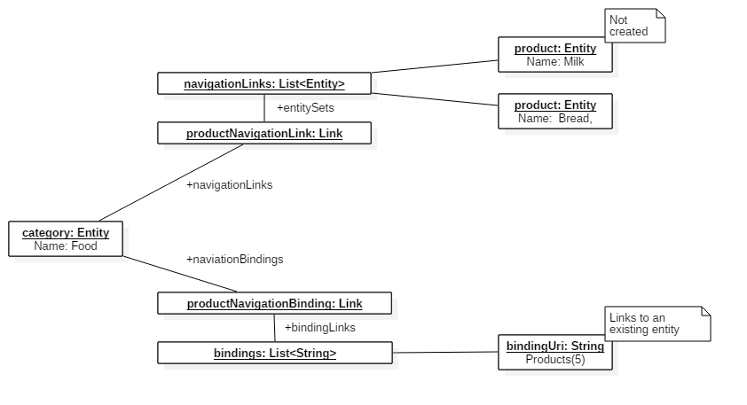
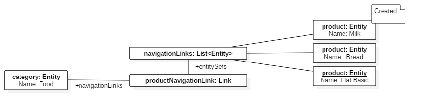
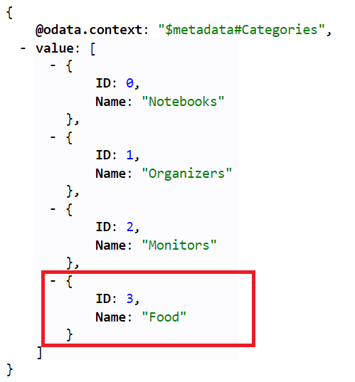
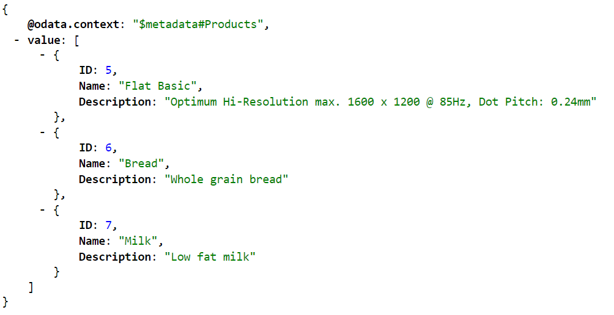

Title: How to build an OData Service with Olingo V4

# How to build an OData Service with Olingo V4

# Part 9: Handling "Deep Insert" requests

## Introduction


In the present tutorial, we will implement the handling of deep insert requests.

**Note:**
The final source code can be found in the project [git repository](https://gitbox.apache.org/repos/asf/olingo-odata4).
A detailed description how to checkout the tutorials can be found [here](/doc/odata4/tutorials/prerequisites/prerequisites.html).   
This tutorial can be found in subdirectory /samples/tutorials/p12_deep_insert


**Table of Contents**

   1. Introduction
   2. Preparation
   3. Implementation
   4. Run the implemented service
   5. Links

# 1. Introduction

In this tutorial shows how to handle "deep insert" requests. OData gives us the possibility to create  related entities, and bind existing entities to a new created entity in a single request. (More detailed information: [OData Version 4.0 Part 1: Protocol](http://docs.oasis-open.org/odata/odata/v4.0/errata02/os/complete/part1-protocol/odata-v4.0-errata02-os-part1-protocol-complete.html#_Toc406398326), [OData JSON Format Version 4.0](http://docs.oasis-open.org/odata/odata-json-format/v4.0/errata02/os/odata-json-format-v4.0-errata02-os-complete.html#_Toc403940637))

OData uses to create a related entity the same syntax as for an expanded navigation property, as descripted in [OData JSON Format](http://docs.oasis-open.org/odata/odata-json-format/v4.0/errata02/os/odata-json-format-v4.0-errata02-os-complete.html#_Toc403940637). To bind an existing entity, OData uses the `odata.bind` property annotation. The value of the annotation is either an entity-Id or a collection of entity-Ids. An [entity-Id](http://docs.oasis-open.org/odata/odata/v4.0/errata02/os/complete/part1-protocol/odata-v4.0-errata02-os-part1-protocol-complete.html#_Toc406398204) is a durable, opaque, globally unique [IRI](https://www.ietf.org/rfc/rfc3987.txt). The specification recommends to use the canonical URL of the entity. In this tutorial the relative canonical URL of an entity is used.

**Example**

For example you may want to create a new category and also create new products, which are related to the new created category. In addition you would like to bind an existing product to the new created category.
Such a request is issued againest the URL of the entity set. 

In this example, a new Category "Food" and two products ("Bread", "Milk") are created. In addition the Product with the key 5 is bind to the just created entity.


    POST /Categories HTTP/1.1
    Content-Type: application/json

    {
        "Name": "Food",
        "Products@odata.bind": [
            "Products(5)"
        ],
        "Products": [
            {
                "Name": "Bread",
                "Description": "Whole grain bread"
            },
            {
                "Name": "Milk",
                "Description": "Low fat milk"
            }
        ]
    }

# 2. Preparation

You should read the previous tutorials first to have an idea how to read and write entities. In addition the following code is based on the write tutorial merged with the navigation tutorial. **It is strongly recommended to have a look at the prepared code.** There are some changes how related entites are linked together. More details are descripted in the implementation chapter.

As a shortcut you should checkout the prepared tutorial project in the [git repository](https://gitbox.apache.org/repos/asf/olingo-odata4) in folder /samples/tutorials/p12_deep_insert_preparation.

Afterwards do a Deploy and run: it should be working. At this state you can perform CRUD operations and do navigations between products and categories.

# 2. Implementation

Before we start with the implementation, please have a look at the class `myservice.mynamespace.data.Storage`. In difference to the [navigation tutorial](http://olingo.apache.org/doc/odata4/tutorials/navigation/tutorial_navigation.html) the relations between two entities can not be hard coded because we would like to create and change relations between entities dynamically. In the constructor of the data storage the creation of the sample data is called. After that the method `linkProductsAndCategories`is called. This methods sets a few links between the just created entities. **The linked entites are stored as navigation links**

To express the relation between two entities, Olingo uses the class [Link](http://olingo.apache.org/javadoc/odata4/org/apache/olingo/commons/api/data/Link.html). This class is used for related entites (directly connected via Java references) and bindings (which are actually strings) to other entities. To get the related entites for a particual navigation property, you can ask an entity with the method [`getNavigationLink(String name)`](http://olingo.apache.org/javadoc/odata4/org/apache/olingo/commons/api/data/Linked.html#getNavigationLink(java.lang.String)) for an navigation property link. The link will contain either an entity or a collection of entities dependenting on the type of the navigation property. To get the actual entities use the methods [`getInlineEntity()`](http://olingo.apache.org/javadoc/odata4/org/apache/olingo/commons/api/data/Link.html#getInlineEntity()) or [`getInlineEntitySet()`](http://olingo.apache.org/javadoc/odata4/org/apache/olingo/commons/api/data/Link.html#getInlineEntitySet())
The same can be done for bindings via the method [`getNavigationBinding(String name)`](http://olingo.apache.org/javadoc/odata4/org/apache/olingo/commons/api/data/Linked.html#getNavigationBinding(java.lang.String)). The values of the Binding can be gotten by the methods [`getBindingLink()`](http://olingo.apache.org/javadoc/odata4/org/apache/olingo/commons/api/data/Link.html#getBindingLink()) and [`getBindingLinks()`](http://olingo.apache.org/javadoc/odata4/org/apache/olingo/commons/api/data/Link.html#getBindingLinks()). 

The point is that the Entity deserializer uses the same concept to represent the payload as Java objects.
Please have a look at the figure below. The deserializer returns an entity with two aggregated Link Objects which belons to the same navigation property "Product". The upper Link object stores the related entites, which have to be created. The lower Link contains the entity-ids to the already existing entities.


When our implementation has processed the whole request, all entites are created and linked as **navigationLinks**.



If one of the requests fail, or one of the binding links is invalid, none of the entities must be created. 
The prepared implementation provides the methods `beginTransaction`, `rollbackTransaction` and `commitTransaction` in the data store to simulate a transactional behavior.
Those methods are called in the `DemoEntityProcessor` implementation. So if you throw an exception in the createEntity Method the transaction will automatically rolled back.
 
So let us begin with the implementation. In the previous tutorials the entity object returned by the deserializer is passed to the data store. Please open the class `myservice.mynamespace.data.Storage` and jump the method `createEntity`.

The implementation should look like the following:

```java
    private Entity createEntity(EdmEntitySet edmEntitySet, EdmEntityType edmEntityType, Entity entity, 
        List<Entity> entityList, final String rawServiceUri) throws ODataApplicationException {

        // 1.) Create the entity
        final Entity newEntity = new Entity();
        newEntity.setType(entity.getType());

        // Create the new key for the entity
        int newId = 1;
        while (entityIdExists(newId, entityList)) {
            newId++;
        }

        // Add all provided properties
        newEntity.getProperties().addAll(entity.getProperties());

        // Add the key property
        newEntity.getProperties().add(new Property(null, "ID", ValueType.PRIMITIVE, newId));
        newEntity.setId(createId(newEntity, "ID"));

	    // --> Implement Deep Insert handling here <--

        entityList.add(newEntity);
        return newEntity;
    }
```

The implementation is split in two steps:

  - Handle entity bindings
  - Handle related entities

## Handle entity bindings

To handle entity bindings we need two helper methods.

The first method takes an entity-Id and returns the addressed entity. The OData objects provides a helper object to parse entity-ids. (See [UriHelper](http://olingo.apache.org/javadoc/odata4/org/apache/olingo/server/api/uri/UriHelper.html)). After parsing the id we have to check if the addressed entity set fits to the entity set the navigation property points to. After that the data is read by calling `readEntityData`.

```java
    private Entity readEntityByBindingLink(final String entityId, final EdmEntitySet edmEntitySet, 
        final String rawServiceUri) throws ODataApplicationException {

        UriResourceEntitySet entitySetResource = null;
        try {
            entitySetResource = odata.createUriHelper().parseEntityId(edm, entityId, rawServiceUri);

            if(!entitySetResource.getEntitySet().getName().equals(edmEntitySet.getName())) {
                throw new ODataApplicationException("Execpted an entity-id for entity set " + edmEntitySet.getName() +
                    " but found id for entity set " + entitySetResource.getEntitySet().getName(), 
                    HttpStatusCode.BAD_REQUEST.getStatusCode(), Locale.ENGLISH);
            }
        } catch (DeserializerException e) {
            throw new ODataApplicationException(entityId + " is not a valid entity-Id", 
                HttpStatusCode.BAD_REQUEST.getStatusCode(), Locale.ENGLISH);
        }

        return readEntityData(entitySetResource.getEntitySet(), entitySetResource.getKeyPredicates());
    }
```

The second method helps us to link entities together. If the navigation property has partner navigation property the link is set in both directions.

```java
    private void createLink(final EdmNavigationProperty navigationProperty, final Entity srcEntity,
        final Entity destEntity) {

        setLink(navigationProperty, srcEntity, destEntity);

        final EdmNavigationProperty partnerNavigationProperty = navigationProperty.getPartner();
        if (partnerNavigationProperty != null) {
            setLink(partnerNavigationProperty, destEntity, srcEntity);
        }
    }
```

If the client has used the `odata.bind` property annotation, we can get the bindings by calling `getNavigationBindings()`. The implementation loops over all bindings and links the addressed entity to the new created one.
 
```java
    // 2.1.) Apply binding links
    for(final Link link : entity.getNavigationBindings()) {
        final EdmNavigationProperty edmNavigationProperty = edmEntityType.getNavigationProperty(link.getTitle());
        final EdmEntitySet targetEntitySet = (EdmEntitySet) edmEntitySet.getRelatedBindingTarget(link.getTitle());

        if(edmNavigationProperty.isCollection() && link.getBindingLinks() != null) {
            for(final String bindingLink : link.getBindingLinks()) {
                final Entity relatedEntity = readEntityByBindingLink(bindingLink, targetEntitySet, rawServiceUri);
                createLink(edmNavigationProperty, newEntity, relatedEntity);
            }
        } else if(!edmNavigationProperty.isCollection() && link.getBindingLink() != null) {
            final Entity relatedEntity = readEntityByBindingLink(link.getBindingLink(), targetEntitySet, rawServiceUri);
            createLink(edmNavigationProperty, newEntity, relatedEntity);
        }
    }
```

## Handle related entities

The creation of related entities is similar. First the implementation loops over all navigation properties with related entites in the payload. The simplest way to create releated entities is to call the method `createEntityData`. So the the implementation is called recursively and can handle deep inserts with arbitrary depth.

```java
    // 2.2.) Create nested entities
    for(final Link link : entity.getNavigationLinks()) {
        final EdmNavigationProperty edmNavigationProperty = edmEntityType.getNavigationProperty(link.getTitle());
        final EdmEntitySet targetEntitySet = (EdmEntitySet) edmEntitySet.getRelatedBindingTarget(link.getTitle());

        if(edmNavigationProperty.isCollection() && link.getInlineEntitySet() != null) {
            for(final Entity nestedEntity : link.getInlineEntitySet().getEntities()) {
                final Entity newNestedEntity = createEntityData(targetEntitySet, nestedEntity, rawServiceUri);
                createLink(edmNavigationProperty, newEntity, newNestedEntity);
		    }
        } else if(!edmNavigationProperty.isCollection() && link.getInlineEntity() != null){
            final Entity newNestedEntity = createEntityData(targetEntitySet, link.getInlineEntity(), rawServiceUri);
            createLink(edmNavigationProperty, newEntity, newNestedEntity);
        }
	}
```

# 4. Run the implemented service

After building and deploying your service to your server, you can try the following requests:

URI: [`http://localhost:8080/DemoService-DeepInsert/DemoService.svc/Categories`](http://localhost:8080/DemoService-DeepInsert/DemoService.svc/Categories)     
HTTP-Verb: POST    
Content-Type: application/json    
Payload:

    {
        "name": "Food",
        "Products@odata.bind": [
            "Products(5)"
        ],
        "Products": [
            {
                "Name": "Bread",
                "Description": "Whole grain bread"
            },
            {
                "Name": "Milk",
                "Description": "Low fat milk"
            }
        ]
    }

After sending this requests, let us see if the enties have been created and linked togetger.
Send an GET request to `http://localhost:8080/DemoService-DeepInsert/DemoService.svc/Categories`.
If it is the first category you created, the new entity should have the key `3`



So send a request to fetch all related products for the "Food" category.
[`http://localhost:8080/DemoService-DeepInsert/DemoService.svc/Categories(3)/Products`]()

As you can see the two products are created and linked to the category.



# 5. Links

### Tutorials

Further topics to be covered by follow-up tutorials:

  * Tutorial OData V4 service part 1: [Read Entity Collection](/doc/odata4/tutorials/read/tutorial_read.html)
  * Tutorial OData V4 service part 2: [Read Entity, Read Property](/doc/odata4/tutorials/readep/tutorial_readep.html) 
  * Tutorial OData V4 service part 3: [Write (Create, Update, Delete Entity)](/doc/odata4/tutorials/write/tutorial_write.html)
  * Tutorial OData V4 service, part 4: [Navigation](/doc/odata4/tutorials/navigation/tutorial_navigation.html)
  * Tutorial OData V4 service, part 5.1: [System Query Options $top, $skip, $count (this page)](/doc/odata4/tutorials/sqo_tcs/tutorial_sqo_tcs.html)
  * Tutorial OData V4 service, part 5.2: [System Query Options $select, $expand](/doc/odata4/tutorials/sqo_es/tutorial_sqo_es.html)
  * Tutorial OData V4 service, part 5.3: [System Query Options $orderby](/doc/odata4/tutorials/sqo_o/tutorial_sqo_o.html)
  * Tutorial OData V4 service, part 5.4: [System Query Options $filter](/doc/odata4/tutorials/sqo_f/tutorial_sqo_f.html)
  * Tutorial OData V4 service, part 6: [Action and Function Imports](/doc/odata4/tutorials/action/tutorial_action.html)
  * Tutorial OData V4 service, part 7: [Add Media entities to the service](/doc/odata4/tutorials/media/tutorial_media.html)
  * Tutorial OData V4 service, part 8: [Batch Request support](/doc/odata4/tutorials/batch/tutorial_batch.html)
  * Tutorial OData V4 service, part 9: Handling "Deep Insert" requests 

### Code and Repository
  * [Git Repository](https://gitbox.apache.org/repos/asf/olingo-odata4)
  * [Guide - To fetch the tutorial sources](/doc/odata4/tutorials/prerequisites/prerequisites.html)
  * [Demo Service source code as zip file (contains all tutorials)](http://www.apache.org/dyn/closer.lua/olingo/odata4/4.0.0/DemoService_Tutorial.zip)

### Further reading

  * [Official OData Homepage](http://odata.org/)
  * [OData documentation](http://www.odata.org/documentation/)
  * [Olingo Javadoc](/javadoc/odata4/index.html)