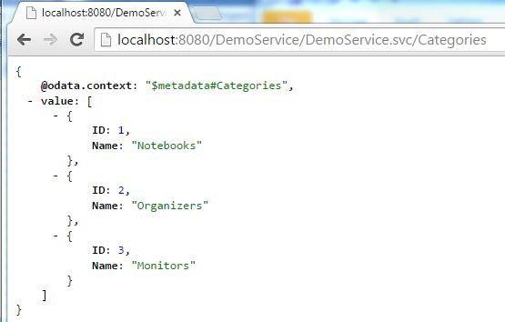
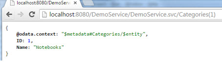
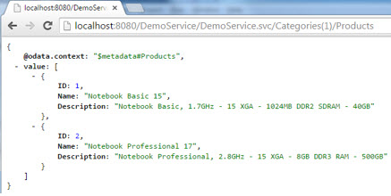
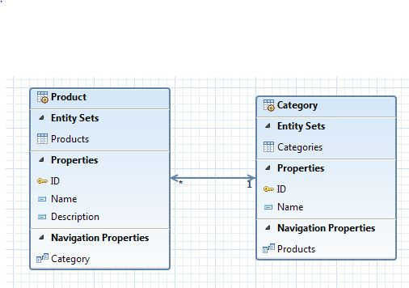
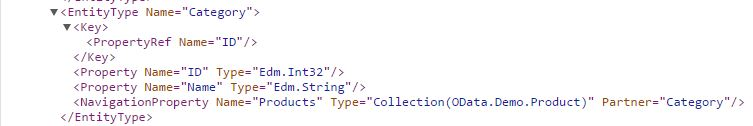

Title:    Tutorial - Read service with Olingo V4

# How to build an OData Service with Olingo V4

# Part 4: Navigation

## Introduction

In the present tutorial, we will learn how to implement navigation between 2 Entity Types in an OData V4 service.

**Note**  

The final source code can be found in the project [git repository](https://gitbox.apache.org/repos/asf/olingo-odata4).
A detailed description how to checkout the tutorials can be found [here](/doc/odata4/tutorials/prerequisites/prerequisites.html).   
This tutorial can be found in subdirectory *\samples\tutorials\p4_navigation*

**Disclaimer**  

Again, in the present tutorial, we will focus only on the relevant implementation, in order to keep the code small and simple.
The sample code shouldn’t be reused for advanced scenarios.

**Background**  

Say, we have an electronics shop and we have a lot of products which we’re selling and these products can be notebooks or monitors or organizers, which are the categories.
We would have 3 requirements:

  1. We want to show a list of all our categories, then select one and display a list of all products that belong to this category, e.g. all monitors
  In terms of OData, this is called navigation
  2. From the list of our products, we want to choose one and display its category
  3. We want to navigate from a category to its products and perform a READ operation on one of them.

**Example for navigating in a service**

We open the Categories collection: <http://localhost:8080/DemoService/DemoService.svc/Categories>

We open the details of the first Category, the “Notebooks”-category:
<http://localhost:8080/DemoService/DemoService.svc/Categories(1)>

In order to display all products that are notebooks, we can navigate from the selected category to its products:
<http://localhost:8080/DemoService/DemoService.svc/Categories(1)/Products>

In the above example we’ve executed a one-to-many navigation.

As mentioned in the Background section, it is also required to navigate from a selected product to its category, which is a to-one relation, like:
<http://localhost:8080/DemoService/DemoService.svc/Products(1)/Category>

And finally, it is possible to navigate to a list of products and directly access one of them, e.g.
<http://localhost:8080/DemoService/DemoService.svc/Categories(1)/Products(1)>

All three cases are covered by the present tutorial.

**Table of Contents**

  1. Prerequisites
  2. Preparation
  3. Implementating the navigation
    1. Declare the Metadata
    2. Implement the to-many navigation
    3. Implement the to-one navigation
    4. Implement the to-many navigation with key access
  4. Run the implemented service
  5. Summary
  6. Links
  7. Appendix: code snippets

---

# 1. Prerequisites

Same prerequisites as in [Tutorial Part 1: Read Entity Collection](/doc/odata4/tutorials/read/tutorial_read.html) and [Tutorial Part 2: Read Entity](/doc/odata4/tutorials/readep/tutorial_readep.html) as well as basic knowledge about the concepts presented in both tutorials.

---

# 2. Preparation

Follow [Tutorial Part 1: Read Entity Collection](/doc/odata4/tutorials/read/tutorial_read.html) and [Tutorial Part 2: Read Entity](/doc/odata4/tutorials/readep/tutorial_readep.html) or as shortcut import *Part 2: Read Entity, Read Property* into your Eclipse workspace.

Afterwards do a Deploy and run: it should be working.

---

# 3. Implementing the navigation

In our sample scenario, we want to navigate from a product to its category and from a category to a list of products.
In order to achieve this, we need to create a second Entity Type, "Category", and we need to specify _Navigation Properties_ in both Entity Types.
Our model looks as follows:

**Note**
When designing the OData model, we could think of specifying a property “ProductCategory” in the entity type “Product”.
E.g. a product with name “Brilliant flat and wide” would have the category “Monitors”.
But this is not necessary, because that information can be obtained by navigating to the respective “Category”-entity using the navigation property.
That way, we can keep the entity types lightweight, which is one of the intentions of OData.

## 3.1. Declare the metadata

In order to declare the metadata of our OData service, we open the class myservice.mynamespace.service.DemoEdmProvider_

### 3.1.1. Extend the Entity Type “Product”

In the previous tutorial we’ve already created the metadata for the “Product” entity type:

~~~xml
    <EntityType Name="Product">
        <Key>
          <PropertyRef Name="ID" />
        </Key>
        <Property Name="ID" Type="Edm.Int32" Nullable="false" />
        <Property Name="Name" Type="Edm.String" Nullable="false" />
        <Property Name="Description" Type="Edm.String" Nullable="false" />
    </EntityType>
~~~

Now we have to add a navigation property.
That navigation property element has the following attributes:

**Name**
The name of the navigation property is used as segment in the URI
e.g. for the following URL: <http://localhost:8080/DemoService/DemoService.svc/Products(1)/Category>
The segment “Category” is the name of the navigation property

**Type**
Here we specify the Entity Type to which we’re navigating.
e.g. for the following URL: <http://localhost:8080/DemoService/DemoService.svc/Products(1)/Category>
we’re navigating to an entity which has the entity type “OData.Demo.Category”
(we still have to create this entity type in this tutorial)
Note that the fully qualified name has to be specified.
Note that here we don’t specify a collection, so we have a to-one relationship.

**Nullable**
Specifies if the navigation target is required.
If we don’t specify it, then the default is assumed to be “true”.
In our example we want to declare that every product must have a category, so we have to set it to “false”

**Partner**
An optional attribute, used to define a bi-directional relationship.
Specifies a path from the entity type (specified here) to the navigation property (defined there).
In our example, we can navigate from product to category and from category to product

In our example, the metadata of our “Product” entity type looks as follows:

~~~xml
     <EntityType Name="Product">
       <Key>
         <PropertyRef Name="ID"/>
       </Key>
       <Property Name="ID" Type="Edm.Int32"/>
       <Property Name="Name" Type="Edm.String"/>
       <Property Name="Description" Type="Edm.String"/>
       <NavigationProperty Name="Category" Type="OData.Demo.Category" Nullable="false" Partner="Products"/>
     </EntityType>
~~~

Implementation-wise we have to create and configure an object of type `CsdlNavigationProperty`:

~~~java
    CsdlNavigationProperty navProp = new CsdlNavigationProperty()
                                        .setName("Category")
                                        .setType(ET_CATEGORY_FQN)
                                        .setNullable(false)
                                        .setPartner("Products");
~~~

Since an entity type can have multiple navigation properties, we have to put it into a list:

~~~java
    List<CsdlNavigationProperty> navPropList = new ArrayList<CsdlNavigationProperty>();
    navPropList.add(navProp);
~~~

That list becomes relevant for the entity type that has been created earlier:

~~~java
    entityType.setNavigationProperties(navPropList);
~~~

There’s one more step to consider with respect to the navigation: the entity set.
At runtime, we need to know how to implement the navigation, when an entity set is invoked.
For this purpose, the OData specifies the `NavigationPropertyBinding` element, which is a child element of the entity set and should be defined for each navigation property.
That `NavigationPropertyBinding` has the following attributes:

**Path**
Here we specify the name of the corresponding navigation property.
In our example, the navigation property that we’ve defined above is named “Category”

**Target**
Here we specify the entity set where we’re navigating to.
In our example it is the entity set “Categories” (which we will create below)

In our example, the definition of our “Products” entity set looks as follows:

~~~xml
    <EntitySet Name="Products" EntityType="OData.Demo.Product">
      <NavigationPropertyBinding Path="Category" Target="Categories"/>
    </EntitySet>
~~~

Code-wise, the getEntitySet method is extended as follows:

~~~java
    CsdlNavigationPropertyBinding navPropBinding = new CsdlNavigationPropertyBinding();
    navPropBinding.setPath("Category"); // the path from entity type to navigation property
    navPropBinding.setTarget("Categories"); //target entitySet, where the nav prop points to
    List<CsdlNavigationPropertyBinding> navPropBindingList = new ArrayList<CsdlNavigationPropertyBinding>();
    navPropBindingList.add(navPropBinding);
    entitySet.setNavigationPropertyBindings(navPropBindingList);
~~~

### 3.1.2. Create the Entity Type “Category”

Now we have to create the second entity type, the “Category”.
In order to keep our sample as simple as possible, we define only 2 properties, the “ID” and a “Name”.
Since we want to be able to navigate from one given category (e.g. “Monitors”) to a list of products (e.g. all products that are monitors), we have to specify a navigation property in this entity type as well.
Here, the navigation property has the following attributes:

**Name**
In our example, we specify “Products”, in plural because we want to get multiple entities.

**Type**
The “Type” attribute can be either an “entity type” or a “collection of entity types”
In our example this time, we specify a “collection” of “OData.Demo.Product”

**Nullable**
According to the OData specification (see odata.org), this attribute is not allowed for a collection
A collection can be empty, but never null.

**Partner**
In our example, we’re defining a bi-directional navigation, so here we specify “Category”, the name of the navigation property defined above.

In our example, the metadata of our “Category” entity type looks as follows:

~~~xml
    <EntityType Name="Category">
      <Key>
        <PropertyRef Name="ID"/>
      </Key>
      <Property Name="ID" Type="Edm.Int32"/>
      <Property Name="Name" Type="Edm.String"/>
      <NavigationProperty Name="Products" Type="Collection(OData.Demo.Product)" Partner="Category"/>
    </EntityType>
~~~

The code for the “Category” entity type:

~~~java
    if (entityTypeName.equals(ET_CATEGORY_FQN)){
	    //create EntityType properties
	    CsdlProperty id = new CsdlProperty()
                                .setName("ID")
                                .setType(EdmPrimitiveTypeKind.Int32.getFullQualifiedName());
	    CsdlProperty name = new CsdlProperty()
                                .setName("Name")
                                .setType(EdmPrimitiveTypeKind.String.getFullQualifiedName());

	    // create PropertyRef for Key element
	    CsdlPropertyRef propertyRef = new CsdlPropertyRef();
	    propertyRef.setName("ID");

	    // navigation property: one-to-many
	    CsdlNavigationProperty navProp = new CsdlNavigationProperty()
                                .setName("Products")
                                .setType(ET_PRODUCT_FQN)
                                .setCollection(true)
                                .setPartner("Category");
	    List<CsdlNavigationProperty> navPropList = new ArrayList<CsdlNavigationProperty>();
	    navPropList.add(navProp);

    	// configure EntityType
    	entityType = new CsdlEntityType();
    	entityType.setName(ET_CATEGORY_NAME);
    	entityType.setProperties(Arrays.asList(id, name));
    	entityType.setKey(Arrays.asList(propertyRef));
    	entityType.setNavigationProperties(navPropList);
    }
~~~

The `NavigationPropertyBinding` element and its attributes for the entity set “Categories”:

**Path**
In our example, the navigation property that we’ve defined above is named “Products”

**Target**
In our example it is the entity set “Products”

In our example, the definition of our “Categories” entity set looks as follows:

~~~xml
    <EntitySet Name="Categories" EntityType="OData.Demo.Category">
      <NavigationPropertyBinding Path="Products" Target="Products"/>
    </EntitySet>
~~~

And the implementation in the `getEntitySet` method:

~~~java
    CsdlNavigationPropertyBinding navPropBinding = new CsdlNavigationPropertyBinding();
    navPropBinding.setTarget("Products");//target entitySet, where the nav prop points to
    navPropBinding.setPath("Products"); // the path from entity type to navigation property
    List<CsdlNavigationPropertyBinding> navPropBindingList = new ArrayList<CsdlNavigationPropertyBinding>();
    navPropBindingList.add(navPropBinding);
    entitySet.setNavigationPropertyBindings(navPropBindingList);
~~~

---

## 3.2. Implement the to-many navigation

Let’s again have a look at our example, as described in the introduction section above.
The user of our service invokes the “Categories” collection and chooses one “Category”.
This is done with e.g. the following URL: <http://localhost:8080/DemoService/DemoService.svc/Categories(1)>

The returned response payload doesn’t contain any information about possible navigation.
So the user has to check the metadata document, where he can see that the entity type “Category” defines one navigation property:

This means, that he can append the navigation property name to his URL, which takes him to the set of “Products” that belong to the chosen “Category”: <http://localhost:8080/DemoService/DemoService.svc/Categories(1)/Products>

From the metadata we can see that the “Type” attribute defines a collection.
This means that the implementation has to be done in the `EntityCollectionProcessor`, since we have to provide a collection of entities.

Open the class `myservice.mynamespace.service.DemoEntityCollectionProcessor.java`

There, the implementation for a “normal” read operation is already in place and we have to add the case when an entity collection is expected after navigation.
Note that we want to keep our tutorial and our code simple, so we decide that only one step navigation is to be supported by our service.
This means that we can navigate only once from one entity to another one.
For example:
Categories(1)/Products
We don’t support navigation from one entity to an entity and then to another entity and so on
For example:
Categories(1)/Products(1)/Category

Based on this assumption, in our `EntityCollectionProcessor`, we can rely on the fact that the URI can have either one or two segments.
This means: we can be called for the following kind of URLs:

Example URL for one sement: <http://localhost:8080/DemoService/DemoService.svc/Categories>

Example URL for two segments: <http://localhost:8080/DemoService/DemoService.svc/Categories(1)/Products>

As such, in our code we distinguish these 2 cases:

~~~java
    if(segmentCount == 1){
        // here the “normal” entity set is requested
    }else if (segmentCount == 2){
        // this is reached in case of navigation: DemoService.svc/Categories(1)/Products
    }else{
        // in our example, we don’t support URIs like Products(1)/Category/Products
        throw new ODataApplicationException("Not supported", HttpStatusCode.NOT_IMPLEMENTED.getStatusCode(),Locale.ENGLISH);
    }
~~~

The segments of the URI are retrieved from the uriInfo parameter:

~~~java
    List<UriResource> resourceParts = uriInfo.getUriResourceParts();
    int segmentCount = resourceParts.size();
~~~

In both cases, we have to retrieve the list of entities to be returned.
For the first case, we have only one entitySet, so the implementation is straight forward:

~~~java
    EdmEntitySet startEdmEntitySet = uriResourceEntitySet.getEntitySet();
    if(segmentCount == 1) {
        // 2nd: fetch the data from backend for this requested EntitySetName
        responseEntityCollection = storage.readEntitySetData(responseEdmEntitySet);
        responseEdmEntitySet = startEdmEntitySet; //there’s only one entity set
    }
~~~

Now let’s focus on the second case, the navigation.

Our tasks are:
  1. depending on the chosen key of the first segment, we have to compute which and how many entities exactly have to be returned. With other words, find the right data in the backend
  e.g. for the category “monitors”, we have to find the right products that are monitors
  2. find out, which entity set has to be returned (can be products, categories, etc)
  This `EdmEntitySet` is required in order to properly build the context URL

The following sections explain how to do that.

### 3.2.1. Get the data for the response

Getting the data for the response is reylized in 2 steps:

**A)** get the data for the first URI segment
in our example, we have to perform a read operation for retrieving the Category with ID 3, which is "Monitors"

**B)** get the data for the navigation
in our example, we have to find the products that are monitors.

With respect to data, remember that we're using sample data that we create in our `Storage` class which represents our kind of database-mock.  
On startup of our service, we initialize some sample products and categories.
During initialization, there’s no assignment of products to its categories.
In our sample code, we’re doing this when requested in a hard-coded method in our `Storage` class.

**A) get the data for the first URI segment**

In our example, the URL would be: <http://localhost:8080/DemoService/DemoService.svc/Categories(3)/Products>

For this example, we would have to retrieve the Category with *ID=3*.  
The code looks like a normal `READ` operation:

~~~java
    List<UriParameter> keyPredicates = uriResourceEntitySet.getKeyPredicates();
    Entity sourceEntity = storage.readEntityData(startEdmEntitySet, keyPredicates);
~~~

In our example, the result is an entity that represents the “Monitors” – category.

**B) get the data for the navigation**

Now we have to follow the navigation, based on the retrieved entity.  
In our example, we have to retrieve all products that are monitors.

This is backend logic, so we can directly call a helper method in our Storage class:

~~~java
    responseEntityCollection = storage.getRelatedEntityCollection(sourceEntity, targetEntityType);
~~~

This helper method requires the source entity and returns the target collection.
Additionally, the method needs the `EdmEntityType` that corresponds to the requested target.
In our example, we pass the “Category” (i.e. "Monitors") as source entity and the navigation target entity type, which is “Product”.
As a result, we get the desired “Products” collection, all products that are monitors.

After this step, we’re almost done, because we have the entity collection that our OData service returns in the response body.
We only need to do some more hand work: the response entity collection has to be serialized and the serializer which is in charge of doing that has to be configured properly.
For that we need the `EdmEntitySet` that corresponds to the response.
Since it is different in case of navigation and non-navigation, we still need to retrieve it for the case of navigation.

### 3.2.2. Retrieve the EdmEntitySet for the response

First, we have to analyze the URI, and find out if the URI segment is used for navigation.
As mentioned, in our simple example we assume that the second segment is used for navigation (in advanced services, a segment could as well be an action or function import, etc).
The navigation URI segment can then be asked for the corresponding `EdmNavigationProperty`

~~~java
    UriResource lastSegment = resourceParts.get(1);
    if(lastSegment instanceof UriResourceNavigation){
	    UriResourceNavigation uriResourceNavigation = (UriResourceNavigation)lastSegment;
	    EdmNavigationProperty edmNavigationProperty = uriResourceNavigation.getProperty();
~~~

The bad news is that the `EdmNavigationProperty` doesn’t know about the target `EdmEntitySet`.
This is as per design, just check the metadata:

~~~xml
    <EntityType Name="Category">
	    ...
	    <NavigationProperty Name="Products" Type="Collection(OData.Demo.Product)" Partner="Category"/>
    </EntityType>
~~~

The navigation property is defined on entity-type-level and as such, it does know the target entity type.
The target entity set is defined in the navigation property binding element on entity-set-level:

~~~xml
    <EntitySet Name="Categories" EntityType="OData.Demo.Category">
	    <NavigationPropertyBinding Path="Products" Target="Products"/>
    </EntitySet>
~~~

This is where we get the information that we need.

For our implementation, this means:
  1. we need the `EdmEntitySet` that corresponds to the first segment of the URI
  	in our example: Categories
  2. we need the navigation property that corresponds to the second segment of the URI
  	in our example: Products

As shown below, from the source `EdmEntitySet` we get the binding target, based on the navigation property.

~~~java
    EdmBindingTarget edmBindingTarget = startEdmEntitySet.getRelatedBindingTarget(navPropName);
    if(edmBindingTarget instanceof EdmEntitySet){
	    navigationTargetEntitySet = (EdmEntitySet)edmBindingTarget;
~~~

This target is the entity set that we need.

We move the code into the utility method `Util.getNavigationTargetEntitySet(startEdmEntitySet, edmNavigationProperty)`
Reason is that we'll need it again, later in this tutorial.

### 3.2.3 Remaining tasks

In the previous tutorials we’ve already learned what else has to be done: transform the retrieve data into an `InputStream` i.e. serialize the content.
Furthermore, configure the response object, i.e. set the response body, the content type and the header.

The following snippet shows the implementation of the `readEntityCollection(…)` method.

~~~java
    public void readEntityCollection(ODataRequest request, ODataResponse response, UriInfo uriInfo, ContentType responseFormat)
                                    throws ODataApplicationException, SerializerException {

	EdmEntitySet responseEdmEntitySet = null; // for building ContextURL
	EntityCollection responseEntityCollection = null; // for the response body

	// 1st retrieve the requested EntitySet from the uriInfo
	List<UriResource> resourceParts = uriInfo.getUriResourceParts();
	int segmentCount = resourceParts.size();

	UriResource uriResource = resourceParts.get(0); // the first segment is the EntitySet
	if (! (uriResource instanceof UriResourceEntitySet)) {
		throw new ODataApplicationException("Only EntitySet is supported", HttpStatusCode.NOT_IMPLEMENTED.getStatusCode(),Locale.ROOT);
	}

	UriResourceEntitySet uriResourceEntitySet = (UriResourceEntitySet) uriResource;
	EdmEntitySet startEdmEntitySet = uriResourceEntitySet.getEntitySet();

	if(segmentCount == 1){ // this is the case for: DemoService/DemoService.svc/Categories
		responseEdmEntitySet = startEdmEntitySet; // first (and only) entitySet

		// 2nd: fetch the data from backend for this requested EntitySetName
		responseEntityCollection = storage.readEntitySetData(startEdmEntitySet);
	}else if (segmentCount == 2){ //navigation: e.g. DemoService.svc/Categories(3)/Products
		UriResource lastSegment = resourceParts.get(1); // don't support more complex URIs
		if(lastSegment instanceof UriResourceNavigation){
			UriResourceNavigation uriResourceNavigation = (UriResourceNavigation)lastSegment;
			EdmNavigationProperty edmNavigationProperty = uriResourceNavigation.getProperty();
			EdmEntityType targetEntityType = edmNavigationProperty.getType();
			responseEdmEntitySet = Util.getNavigationTargetEntitySet(startEdmEntitySet, edmNavigationProperty);

			// 2nd: fetch the data from backend
			// first fetch the entity where the first segment of the URI points to
            // e.g. Categories(3)/Products first find the single entity: Category(3)
			List<UriParameter> keyPredicates = uriResourceEntitySet.getKeyPredicates();
			Entity sourceEntity = storage.readEntityData(startEdmEntitySet, keyPredicates);
			// error handling for e.g.  DemoService.svc/Categories(99)/Products
			if(sourceEntity == null) {
                throw new ODataApplicationException("Entity not found.", HttpStatusCode.NOT_FOUND.getStatusCode(), Locale.ROOT);
			}
			// then fetch the entity collection where the entity navigates to
			responseEntityCollection = storage.getRelatedEntityCollection(sourceEntity, targetEntityType);
		}
	}else{ // this would be the case for e.g. Products(1)/Category/Products
		throw new ODataApplicationException("Not supported", HttpStatusCode.NOT_IMPLEMENTED.getStatusCode(),Locale.ROOT);
	}
        // 3rd: create and configure a serializer
        ContextURL contextUrl = ContextURL.with().entitySet(responseEdmEntitySet).build();
        final String id = request.getRawBaseUri() + "/" + responseEdmEntitySet.getName();
        EntityCollectionSerializerOptions opts = EntityCollectionSerializerOptions.with().contextURL(contextUrl).id(id).build();
        EdmEntityType edmEntityType = responseEdmEntitySet.getEntityType();

        ODataSerializer serializer = odata.createSerializer(responseFormat);
        SerializerResult serializerResult = serializer.entityCollection(this.srvMetadata, edmEntityType, responseEntityCollection, opts);

        // 4th: configure the response object: set the body, headers and status code
        response.setContent(serializerResult.getContent());
        response.setStatusCode(HttpStatusCode.OK.getStatusCode());
        response.setHeader(HttpHeader.CONTENT_TYPE, responseFormat.toContentTypeString());   
    }
~~~

## 3.3. Implement the to-one navigation

As for the to-one navigation, it is the case if the navigation target is a single entity, not a collection.
In our example, the following URL represents a to-one navigation: <http://localhost:8080/DemoService/DemoService.svc/Products(1)/Category>

The user of our service has chosen a product and wants to know to which category it belongs. He can find it out by following the navigation property.
As per design, a product can only belong to **one** category (obviously, a product can only be a Notebook or a Monitor, not both). Therefore in our service, we’ve defined a navigation property that is not of type collection:

~~~xml
    <NavigationProperty
        Name="Category"
        Type="OData.Demo.Category"
        Nullable="false"
        Partner="Products"/>
~~~

So when the user follows the navigation property in order to display the product category, he expects a response that contains only one entry.
This means that we have to do the implementation in the `EntityProcessor`.

Open the class `myservice.mynamespace.service.DemoEntityProcessor.java`

As usual, we first have to analyze the URI.
Just like we did in the `EntityCollectionProcessor`, we have to distinguish between navigation and “normal” read of an entity:

~~~java
    if(segmentCount == 1){
        // in case of directly adressing of an entity
    }else if (segmentCount == 2){
        // this is reached in case of navigation
    }
~~~

In the following section, we will focus on the navigation case only.
In our example, our task is to find the category of a chosen product.
Again, we have to first fetch the chosen product (first URI segment) from our database-mock and in a second step, we have to ask our database-mock for the corresponding category.
This final entity is then serialized and set as response body for the `readEntity()` method, which we’re implementing.

**A) get the data for the first URI segment**

In our example, we have to perform a read operation for retrieving the product with ID 1: <http://localhost:8080/DemoService/DemoService.svc/Products(1)/Category>

The code is the same like in the previous chapter (to-many navigation):

~~~java
    List<UriParameter> keyPredicates = uriResourceEntitySet.getKeyPredicates();
    Entity sourceEntity = storage.readEntityData(startEdmEntitySet, keyPredicates);
~~~

**B) get the data for the navigation**

Now we have to follow the navigation, based on the retrieved entity.
In our example, we have to find the category corresponding to the chosen product.
Therefore, we invoke our helper method and pass the source Entity (Product) and the required target entity type (Category). The method will find the category which is related to the chosen product.

~~~java
    responseEntity = storage.getRelatedEntity(sourceEntity, responseEdmEntityType);
~~~

Before we can serialize the `responseEntity`, we have to retrieve the `EdmEntitySet` that corresponds to the response entity, because we need it for building the ContextURL.

The procedure is the same like in the chapter above, where we treated the to-many navigation:

~~~java
    EdmNavigationProperty edmNavigationProperty = uriResourceNavigation.getProperty();
    responseEdmEntityType = edmNavigationProperty.getType();
    responseEdmEntitySet = Util.getNavigationTargetEntitySet(startEdmEntitySet, edmNavigationProperty);
~~~

In our example, the value of the variable `responseEdmEntitySet` will be “Categories” and it will be used for building the contextURL, which will look as follows:

~~~xml
    "$metadata#Categories/$entity"
~~~

## 3.4. Implement the to-many navigation with key access

"Navigation with key access" means that we have a to-many navigation, like navigating from a chosen category to the list of corresponding products: <http://localhost:8080/DemoService/DemoService.svc/Categories(3)/Products>

but in addition, we want to read only one of the collected products, which is directly addressed by its key:   <http://localhost:8080/DemoService/DemoService.svc/Categories(3)/Products(5)>

From this URL, we can assume that the `EntityProcessor` is the relevant place to handle this request in our code.

The steps to find the requested entity are:

  1. Do a read operation for the first segment (same as in the previous chapter)
  In our example, this would be read entity for: */Categories(3)*
  2. Follow the navigation to get the collection of the second segment
  In our example, this would be get the entity collection for: */Categories(3)/Products*
  3. Pick the requested entity from the collection
  In our example, retrieve the product with ID=5, which is contained in the collection */Categories(3)/Products(5)*

We can assume, that our database-mock is able to perform step 2 and 3 together.

In our class `myservice.mynamespace.service.DemoEntityProcessor.java`, we’ve already added the navigation capability for to-one navigation.
How can we find out that we aren’t called for a to-one navigation, but instead, we’re responding to a to-many navigation with key access?
The difference is the “key predicate”.
The necessary info about it can be obtained from the URI segment.
In the first chapter, we’ve already learned that there’s a special interface responsible for navigation segments, the `org.apache.olingo.server.api.uri.UriResourceNavigation`
It also provides a method `getKeyPredicates()`
We can make use of it in order to distinguish between “to-one navigation” and “navigation with key access”.
If the call to

~~~java
    List<UriParmeter> navKeyPredicates = uriResourceNavigation.getKeyPredicates();
~~~

returns an empty list, then we can assume that our OData service has been called for a “to-one navigation”.
This to-one navigation has been explained in the chapter 3.3. above.
If  the service request is like
/Categories(3)/Products(5)
then the method `getKeyPredicates()` will return a list of with one element that contains ID=5

In our implementation of the `EntityProcessor`, we add the following code:

~~~java
    List<UriParameter> navKeyPredicates = uriResourceNavigation.getKeyPredicates();
    if(navKeyPredicates.isEmpty()){
	    responseEntity = storage.getRelatedEntity(sourceEntity, responseEdmEntityType);
    }else{
	    responseEntity = storage.getRelatedEntity(sourceEntity, responseEdmEntityType, navKeyPredicates);
    }
~~~

We get the key predicates for the navigation segment.
Then we check if returned list is empty.
If yes, we use the line that we implemented in chapter 3.3.
If not, we have to create a new helper method that uses the key predicates for retrieving the desired entity.
The new helper method

~~~java
    responseEntity = storage.getRelatedEntity(sourceEntity, responseEdmEntityType, navKeyPredicates);
~~~

will take care of getting the collection of products (`responseEntityType`) that are in scope of the chosen category (`sourceEntity`) and will then pick the requested product, based on the given key (`navKeyPredicates`).

One last thing to consider:  
As we mentioned above, the user of our service is expected to specify a key of a product that is contained in the collection of products (e.g. */Categories(3)/Products*) that is addressed by e.g. */Categories(3)/Products(5)*.

But he might specify a product ID that is existing, but not valid for the addressed navigation e.g. */Categories(3)/Products(1)*.

With other words: it is not valid to navigate from category "Monitors" to a product like "Notebook Basic 15"

If this is the case, we have to throw an appropriate exception.
However, in our simple example we’re satisfied with simply checking if an entity was found at all:

~~~java
    if(responseEntity == null) {
	    throw new ODataApplicationException("Nothing found.", HttpStatusCode.NOT_FOUND.getStatusCode(), Locale.ROOT);
    }
~~~

**Note**
When implementing this navigation for the first time, our first intention might have been:
Let’s just ignore the first segment and simply do a read operation for /Products(5)
Which would mean, from the list of all products, pick the one with ID=5
Why not?
The answer is that we cannot assume that the requested Product is automatically belonging to the specified Category.
E.g. in our example, the following URI should throw an error:
Categories(3)/Products(1)
As we know, Categories(3) is “Monitors” and Product(1) is a “Notebook”

That’s it.
We don’t need to do an additional effort to retrieve the `EdmEntitySet` for the ContextURL, because this has already been implemented in our `DemoEntityProcessor` in the context of the previous chapter 3.3.

So now we can finally have a look at the full implementation of the `readEntity()` method, the covers both the cases of chapter 3.3. and 3.4.

~~~java
    public void readEntity(ODataRequest request, ODataResponse response, UriInfo uriInfo, ContentType responseFormat)
				throws ODataApplicationException, SerializerException {

    	EdmEntityType responseEdmEntityType = null; // we'll need this to build the ContextURL
    	Entity responseEntity = null; // required for serialization of the response body
    	EdmEntitySet responseEdmEntitySet = null; // we need this for building the contextUrl

    	// 1st step: retrieve the requested Entity:
        // can be "normal" read operation, or navigation (to-one)
    	List<UriResource> resourceParts = uriInfo.getUriResourceParts();
    	int segmentCount = resourceParts.size();

    	UriResource uriResource = resourceParts.get(0);
    	if (! (uriResource instanceof UriResourceEntitySet)) {
    		throw new ODataApplicationException("Only EntitySet is supported", HttpStatusCode.NOT_IMPLEMENTED.getStatusCode(),
    		                                        Locale.ROOT);
    	}

    	UriResourceEntitySet uriResourceEntitySet = (UriResourceEntitySet) uriResource;
    	EdmEntitySet startEdmEntitySet = uriResourceEntitySet.getEntitySet();

    	// Analyze the URI segments
    	if(segmentCount == 1){  // no navigation
    		responseEdmEntityType = startEdmEntitySet.getEntityType();
    		responseEdmEntitySet = startEdmEntitySet; // since we have only one segment

    		// 2. step: retrieve the data from backend
    		List<UriParameter> keyPredicates = uriResourceEntitySet.getKeyPredicates();
    		responseEntity = storage.readEntityData(startEdmEntitySet, keyPredicates);
    	} else if (segmentCount == 2){ //navigation
    		UriResource navSegment = resourceParts.get(1);
    		if(navSegment instanceof UriResourceNavigation){
    			UriResourceNavigation uriResourceNavigation = (UriResourceNavigation) navSegment;
    			EdmNavigationProperty edmNavigationProperty = uriResourceNavigation.getProperty();
    			responseEdmEntityType = edmNavigationProperty.getType();
    			responseEdmEntitySet = Util.getNavigationTargetEntitySet(startEdmEntitySet, edmNavigationProperty);

    			// 2nd: fetch the data from backend.
                // for:  Products(1)/Category  we have to find the correct Category entity
    			List<UriParameter> keyPredicates = uriResourceEntitySet.getKeyPredicates();
                // e.g. for Products(1)/Category we have to find first the Products(1)
    			Entity sourceEntity = storage.readEntityData(startEdmEntitySet, keyPredicates);

    			// now we have to check if the navigation is
    			// a) to-one: e.g. Products(1)/Category
    			// b) to-many with key: e.g. Categories(3)/Products(5)
    			List<UriParameter> navKeyPredicates = uriResourceNavigation.getKeyPredicates();

    			if(navKeyPredicates.isEmpty()){
                    // e.g. DemoService.svc/Products(1)/Category
    				responseEntity = storage.getRelatedEntity(sourceEntity, responseEdmEntityType);
    			}else{ // e.g. DemoService.svc/Categories(3)/Products(5)
    				responseEntity = storage.getRelatedEntity(sourceEntity, responseEdmEntityType, navKeyPredicates);
    			}
    		}
    	}else{
    		// this would be the case for e.g. Products(1)/Category/Products(1)/Category
    		throw new ODataApplicationException("Not supported", HttpStatusCode.NOT_IMPLEMENTED.getStatusCode(), Locale.ROOT);
    	}

    	if(responseEntity == null) {
    		// this is the case for e.g. DemoService.svc/Categories(4) or
            // DemoService.svc/Categories(3)/Products(999)
    		throw new ODataApplicationException("Nothing found.", HttpStatusCode.NOT_FOUND.getStatusCode(), Locale.ROOT);
    	}

    	// 3. serialize
    	ContextURL contextUrl = ContextURL.with().entitySet(responseEdmEntitySet).suffix(Suffix.ENTITY).build();
    	EntitySerializerOptions opts = EntitySerializerOptions.with().contextURL(contextUrl).build();

    	ODataSerializer serializer = this.odata.createSerializer(responseFormat);
    	SerializerResult serializerResult = serializer.entity(this.srvMetadata, responseEdmEntityType, responseEntity, opts);

    	//4. configure the response object
    	response.setContent(serializerResult.getContent());
    	response.setStatusCode(HttpStatusCode.OK.getStatusCode());
    	response.setHeader(HttpHeader.CONTENT_TYPE, responseFormat.toContentTypeString());
    }
~~~

---

# 4. Run the implemented service

After building and deploying your service to your server, you can try the following URLs:

  * Metadata and Service documents
    * <http://localhost:8080/DemoService/DemoService.svc/$metadata>
    * <http://localhost:8080/DemoService/DemoService.svc>
  * “Normal” query of both entity sets
    * <http://localhost:8080/DemoService/DemoService.svc/Products>
    * <http://localhost:8080/DemoService/DemoService.svc/Categories>
  * “Normal” read of both entity types
    * <http://localhost:8080/DemoService/DemoService.svc/Products(1)>
    * <http://localhost:8080/DemoService/DemoService.svc/Categories(3)>
  * “to-many” navigation
    * <http://localhost:8080/DemoService/DemoService.svc/Categories(2)/Products>
  * “to-one” navigation
    * <http://localhost:8080/DemoService/DemoService.svc/Products(1)/Category>
  * “to-many” navigation with key access
    * <http://localhost:8080/DemoService/DemoService.svc/Categories(1)/Products(2)>
  * “to-many” navigation with key access of invalid key, throwing an error
    * <http://localhost:8080/DemoService/DemoService.svc/Categories(1)/Products(3)>

---

# 5. Summary

In this tutorial we have learned how to add navigation capabilities to an OData service.
We’ve implemented the to-many and to-one relationship and also the READ access to one entity after a to-many navigation.
We’ve restricted the navigation to two segments, no more than navigating from one entity to another one.
The modification of relations has not been covered by this tutorial.
Check the *Links* section for more OData V4 tutorials.

---

# 6. Links
### Tutorials
  * Tutorial OData V4 service part 1: [Read Entity Collection](/doc/odata4/tutorials/read/tutorial_read.html)
  * Tutorial OData V4 service part 2: [Read Entity, Read Property](/doc/odata4/tutorials/readep/tutorial_readep.html)
  * Tutorial OData V4 service part 3: [Write (Create, Update, Delete Entity)](/doc/odata4/tutorials/write/tutorial_write.html)
  * Tutorial OData V4 service, part 4: Navigation
  * Tutorial OData V4 service, part 5.1: [System Query Options $top, $skip, $count (this page)](/doc/odata4/tutorials/sqo_tcs/tutorial_sqo_tcs.html)
  * Tutorial OData V4 service, part 5.2: [System Query Options $select, $expand](/doc/odata4/tutorials/sqo_es/tutorial_sqo_es.html)
  * Tutorial OData V4 service, part 5.3: [System Query Options $orderby](/doc/odata4/tutorials/sqo_o/tutorial_sqo_o.html)
  * Tutorial OData V4 service, part 5.4: [System Query Options $filter](/doc/odata4/tutorials/sqo_f/tutorial_sqo_f.html)
  * Tutorial ODATA V4 service, part 6: [Action and Function Imports](/doc/odata4/tutorials/action/tutorial_action.html)
  * Tutorial ODATA V4 service, part 7: [Media Entities](/doc/odata4/tutorials/media/tutorial_media.html)
  * Tutorial OData V4 service, part 8: [Batch Request support](/doc/odata4/tutorials/batch/tutorial_batch.html)
  * Tutorial OData V4 service, part 9: [Handling "Deep Insert" requests](/doc/odata4/tutorials/deep_insert/tutorial_deep_insert.html)

### Code and Repository
  * [Git Repository](https://gitbox.apache.org/repos/asf/olingo-odata4)
  * [Guide - To fetch the tutorial sources](/doc/odata4/tutorials/prerequisites/prerequisites.html)
  * [Demo Service source code as zip file (contains all tutorials)](http://www.apache.org/dyn/closer.lua/olingo/odata4/4.0.0/DemoService_Tutorial.zip)

### Further reading

  * [Official OData Homepage](http://odata.org/)
  * [OData documentation](http://www.odata.org/documentation/)
  * [Olingo Javadoc](/javadoc/odata4/index.html)

---

# 7. Appendix: code snippets

When reaching the point where your OData service has to become production ready and support complex scenarions, you’ll find the following code snippets useful.

## 7.1. Find the EdmEntitySet for the navigation target

~~~java
    public static EdmEntitySet getNavigationTargetEntitySet(final UriInfoResource uriInfo) throws ODataApplicationException {

    	EdmEntitySet entitySet;
    	final List<UriResource> resourcePaths = uriInfo.getUriResourceParts();

    	// First must be entity set (hence function imports are not supported here).
    	if (resourcePaths.get(0) instanceof UriResourceEntitySet) {
    		entitySet = ((UriResourceEntitySet) resourcePaths.get(0)).getEntitySet();
    	} else {
    		throw new ODataApplicationException("Invalid resource type.",
    				HttpStatusCode.NOT_IMPLEMENTED.getStatusCode(), Locale.ROOT);
    	}

    	int navigationCount = 0;
    	while (entitySet != null
    		&& ++navigationCount < resourcePaths.size()
    		&& resourcePaths.get(navigationCount) instanceof UriResourceNavigation) {
    		final UriResourceNavigation uriResourceNavigation = (UriResourceNavigation) resourcePaths.get(navigationCount);
    		final EdmBindingTarget target = entitySet.getRelatedBindingTarget(uriResourceNavigation.getProperty().getName());
    		if (target instanceof EdmEntitySet) {
    			entitySet = (EdmEntitySet) target;
    		} else {
    			throw new ODataApplicationException("Singletons not supported", HttpStatusCode.NOT_IMPLEMENTED.getStatusCode(),
    			                                     Locale.ROOT);
    		}
    	}

    	return entitySet;
    }
~~~

## 7.2. Find the last navigation segment

~~~java
    public static UriResourceNavigation getLastNavigation(final UriInfoResource uriInfo) {

    	final List<UriResource> resourcePaths = uriInfo.getUriResourceParts();
    	int navigationCount = 1;
    	while (navigationCount < resourcePaths.size()
    		&& resourcePaths.get(navigationCount) instanceof UriResourceNavigation) {
    		navigationCount++;
    	}

    	return (UriResourceNavigation) resourcePaths.get(--navigationCount);
    }
~~~