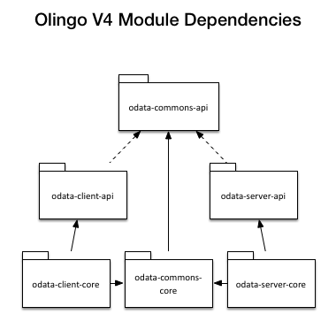
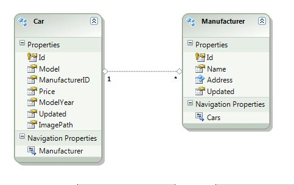

Title: How To Guide for building a Sample OData service with the OData 4.0 Library (for Java)

# How To Guide for building a Sample OData service with the OData 4.0 Library (for Java)

### Project setup
First, we setup a simple Maven project and add all necessary dependencies.

##### Maven project
Create a new Maven project. Execute the following command in your shell.

    mvn archetype:generate -DgroupId=org.apache.olingo -DartifactId=odata-server-sample -DarchetypeArtifactId=maven-archetype-webapp -DinteractiveMode=false

The Olingo library consists of different sub projects. The dependencies are shown in figure 1 below:

We will start with a server implementation, so we need to include the common and the server projects.
Each of them is split into an implementation and an API project.

The „pom.xml“ defines to include the following dependencies to the project:

* The Servlet API (javax.servlet.servlet-api)
* Olingo library
* A logging facade used by the tomcat server(slf4j)

Replace the pom.xml by the following listing.

    <?xml version="1.0" encoding="UTF-8"?>

    <project xmlns="http://maven.apache.org/POM/4.0.0" xmlns:xsi="http://www.w3.org/2001/XMLSchema-instance"
        xsi:schemaLocation="http://maven.apache.org/POM/4.0.0 http://maven.apache.org/xsd/maven-4.0.0.xsd">
      <modelVersion>4.0.0</modelVersion>

      <groupId>org.apache.olingo</groupId>
       <artifactId>odata-server-sample</artifactId>
      <packaging>war</packaging>
      <version>1.0</version>
      <name>${project.artifactId}</name>

        <properties>
            <odata.version>4.0.0-beta-02</odata.version>
        </properties>

    <dependencies>
      <dependency>
        <groupId>javax.servlet</groupId>
        <artifactId>servlet-api</artifactId>
        <version>2.5</version>
        <scope>provided</scope>
      </dependency>

      <dependency>
        <groupId>org.apache.olingo</groupId>
        <artifactId>odata-server-api</artifactId>
        <version>${odata.version}</version>
      </dependency>
      <dependency>
        <groupId>org.apache.olingo</groupId>
        <artifactId>odata-server-core</artifactId>
        <version>${odata.version}</version>
        <scope>runtime</scope>
      </dependency>

      <dependency>
        <groupId>org.apache.olingo</groupId>
        <artifactId>odata-commons-api</artifactId>
        <version>${odata.version}</version>
      </dependency>
      <dependency>
        <groupId>org.apache.olingo</groupId>
        <artifactId>odata-commons-core</artifactId>
        <version>${odata.version}</version>
      </dependency>

      <dependency>
        <groupId>org.slf4j</groupId>
        <artifactId>slf4j-simple</artifactId>
        <version>1.7.7</version>
        <scope>runtime</scope>
      </dependency>
    </dependencies>
    </project>

##### Setting up the web project

Next, setup up the web project by replacing the `web.xml`.

    <?xml version="1.0" encoding="UTF-8"?>

    <web-app xmlns:xsi="http://www.w3.org/2001/XMLSchema-instance"
        xmlns="http://java.sun.com/xml/ns/javaee" xmlns:web="http://java.sun.com/xml/ns/javaee/web-app_2_5.xsd"
        xsi:schemaLocation="http://java.sun.com/xml/ns/javaee http://java.sun.com/xml/ns/javaee/web-app_2_5.xsd" id="WebApp_ID" version="2.5">
    
    <display-name>Apache Olingo OData 4.0 Sample Service</display-name>
    
    <welcome-file-list>
      <welcome-file>index.jsp</welcome-file>
    </welcome-file-list>
    
    <servlet>
      <servlet-name>CarsServlet</servlet-name>
      <servlet-class>org.apache.olingo.server.sample.CarsServlet</servlet-class>
      <load-on-startup>1</load-on-startup>
    </servlet>
    
    <servlet-mapping>
      <servlet-name>CarsServlet</servlet-name>
      <url-pattern>/cars.svc/*</url-pattern>
    </servlet-mapping>
    </web-app>

As you can see we define a servlet, which implements the OData service. In addition we define a servlet mapping and set the welcome page.

## Implementing the OData service

Each Olingo OData service consists of several parts.

 * **EdmProvider**
Delivers an abstract definition of the service.
* **DataProvider**
The data provider connects the Olingo library with the data source. In this basic tutorial, we will use static data. In real world application, the data provider will may establish a connection to a database. There a no constraints how a DataProvider has to be build.
* **Processor**
The processor receives, validates and deserializes requests, fetches the requested data and delivers a serialized response of the data to the client.

##### EdmProvider

OData services are described in terms of an Entity Data Model (EDM). To do so, the first step is to provide such an EDM. In this basic tutorial, we will define a class that provides an EDM instance. The EDM will be used to determine the types of the entities, properties and so on. In addition, the service can deliver a service meta-document. As we have a static model we define constants for all top level elements of the schema. The data model is shown in figure 2 as entity relationship diagram.

Create a new class called `CarsEdmProvider` that inherits from `EdmProvider`

    package org.apache.odata2.server.sample.edmprovider;

    import org.apache.olingo.server.api.edm.provider.EdmProvider;

    public class CarsEdmProvider extends EdmProvider {

    // Service Namespace
    public static final String NAMESPACE = "olingo.odata.sample";

    // EDM Container
    public static final String CONTAINER_NAME = "Container";
    public static final FullQualifiedName CONTAINER_FQN = new FullQualifiedName(NAMESPACE, CONTAINER_NAME);

    // Entity Types Names
    public static final FullQualifiedName ET_CAR = new FullQualifiedName(NAMESPACE, "Car");
    public static final FullQualifiedName ET_MANUFACTURER = new FullQualifiedName(NAMESPACE, "Manufacturer");

    // Complex Type Names
    public static final FullQualifiedName CT_ADDRESS = new FullQualifiedName(NAMESPACE, "Address");

    // Entity Set Names
    public static final String ES_CARS_NAME = "Cars";
    public static final String ES_MANUFACTURER_NAME = "Manufacturers";

Implement `CarsEdmProvider.getSchemas(...)`. This method is used to retrieve the complete structural information in order to build the metadata document and the service document. The implementation makes use of other getter methods of this class for simplicity reasons. If a very performant way of building the whole structural information was required, other implementation strategies could be used.

    @Override
    public List<Schema> getSchemas() throws ODataException {
      List<Schema> schemas = new ArrayList<Schema>();
      Schema schema = new Schema();
      schema.setNamespace(NAMESPACE);

      // EntityTypes
      List<EntityType> entityTypes = new ArrayList<EntityType>();
      entityTypes.add(getEntityType(ET_CAR));
      entityTypes.add(getEntityType(ET_MANUFACTURER));
      schema.setEntityTypes(entityTypes);

      // ComplexTypes
      List<ComplexType> complexTypes = new ArrayList<ComplexType>();
      complexTypes.add(getComplexType(CT_ADDRESS));
      schema.setComplexTypes(complexTypes);

      // EntityContainer
      schema.setEntityContainer(getEntityContainer());
      schemas.add(schema);

      return schemas;
    }

For example the method `CarsEdmProvider.getComplexType(...)` delivers the definition of a complex type, if there exists a complex type with the same full qualified name. The full qualified name was provided by the getSchemas method as mentioned above.

    public ComplexType getComplexType(final FullQualifiedName complexTypeName) throws ODataException {
      if (CT_ADDRESS.equals(complexTypeName)) {
        return new ComplexType()
          .setName(CT_ADDRESS.getName())
          .setProperties(Arrays.asList(
            new Property().setName("Street").setType(EdmPrimitiveTypeKind.String.getFullQualifiedName()),
            new Property().setName("City").setType(EdmPrimitiveTypeKind.String.getFullQualifiedName()),
            new Property().setName("ZipCode").setType(EdmPrimitiveTypeKind.String.getFullQualifiedName()),
            new Property().setName("Country").setType(EdmPrimitiveTypeKind.String.getFullQualifiedName())));
      }
      return null;
    }

The same principle is used for all other types.
`CarsEdmProvider.getEntityType(...)` returns an Entity Type according to the full qualified name specified. The Entity Type holds all information about its structure like simple properties, complex properties, navigation properties and the definition of its key property (or properties)

    @Override
    public EntityType getEntityType(final FullQualifiedName entityTypeName) throws ODataException {
      if (ET_CAR.equals(entityTypeName)) {
        return new EntityType()
          .setName(ET_CAR.getName())
          .setKey(Arrays.asList(
            new PropertyRef().setPropertyName("Id")))
          .setProperties(Arrays.asList(
            new Property().setName("Id").setType(EdmPrimitiveTypeKind.Int16.getFullQualifiedName()),
            new Property().setName("Model").setType(EdmPrimitiveTypeKind.String.getFullQualifiedName()),
            new Property().setName("ModelYear").setType(EdmPrimitiveTypeKind.String.getFullQualifiedName())
              .setMaxLength(4),
            new Property().setName("Price").setType(EdmPrimitiveTypeKind.Decimal.getFullQualifiedName())
              .setScale(2),
            new Property().setName("Currency").setType(EdmPrimitiveTypeKind.String.getFullQualifiedName())
              .setMaxLength(3)
          ))
        .setNavigationProperties(Arrays.asList(
          new NavigationProperty().setName("Manufacturer").setType(ET_MANUFACTURER)
        ));

      } else if (ET_MANUFACTURER.equals(entityTypeName)) {
        return new EntityType()
          .setName(ET_MANUFACTURER.getName())
          .setKey(Arrays.asList(new PropertyRef().setPropertyName("Id")))
          .setProperties(Arrays.asList(
            new Property().setName("Id").setType(EdmPrimitiveTypeKind.Int16.getFullQualifiedName()),
            new Property().setName("Name").setType(EdmPrimitiveTypeKind.String.getFullQualifiedName()),
            new Property().setName("Address").setType(CT_ADDRESS))
          )
          .setNavigationProperties(Arrays.asList(
            new NavigationProperty().setName("Cars").setType(ET_CAR).setCollection(true)
          ));
      }

      return null;
    }

    @Override
    public EntitySet getEntitySet(final FullQualifiedName entityContainer, final String entitySetName) throws ODataException {
      if (CONTAINER_FQN.equals(entityContainer)) {
        if (ES_CARS_NAME.equals(entitySetName)) {
          return new EntitySet()
              .setName(ES_CARS_NAME)
              .setType(ET_CAR)
              .setNavigationPropertyBindings(Arrays.asList(
                      new NavigationPropertyBinding()
              .setPath("Manufacturer")
              .setTarget(new Target()
                .setTargetName(ES_MANUFACTURER_NAME)
                .setEntityContainer(CONTAINER_FQN)
              )
        )
      );
        } else if (ES_MANUFACTURER_NAME.equals(entitySetName)) {
          return new EntitySet()
              .setName(ES_MANUFACTURER_NAME)
              .setType(ET_MANUFACTURER).setNavigationPropertyBindings(
                  Arrays.asList(
                      new NavigationPropertyBinding()
              .setPath("Cars")
              .setTarget(new Target()
                .setTargetName(ES_CARS_NAME)
                .setEntityContainer(CONTAINER_FQN)
              )
            )
        );
        }
      }

      return null;
    }

Entities are not visible by default. To make them visible, we have to define a so called “EntityContainer”.
Override the method `getEntityContainer(...)` and add the following code:

    @Override
    public EntityContainer getEntityContainer() throws ODataException {
      EntityContainer container = new EntityContainer();
      container.setName(CONTAINER_FQN.getName());

      // EntitySets
      List<EntitySet> entitySets = new ArrayList<EntitySet>();
      container.setEntitySets(entitySets);
      entitySets.add(getEntitySet(CONTAINER_FQN, ES_CARS_NAME));
      entitySets.add(getEntitySet(CONTAINER_FQN, ES_MANUFACTURER_NAME));

      return container;
    }

    @Override
    public EntityContainerInfo getEntityContainerInfo(final FullQualifiedNam, entityContainerName) throws ODataException {
      if (entityContainerName == null || CONTAINER_FQN.equals(entityContainerName)) {
        return new EntityContainerInfo().setContainerName(CONTAINER_FQN);
      }
      return null;
    }

##### Servlet

As described in project setup, the web projects calls a servlet. Within the servlet the EDM provider has to be loaded. Create a new class CarsServlet which extends HttpServlet.

In the following steps a processor and a data provider will be created.  Currently there is not processor being registered, so the default processor will be used.  The default processor is been able to display the service document and the metadata document also.

Insert the following code.

    package org.apache.olingo.server.sample;

    public class CarsServlet extends HttpServlet {

      private static final long serialVersionUID = 1L;
      private static final Logger LOG = LoggerFactory.getLogger(CarsServlet.class);

      @Override
      protected void service(HttpServletRequest req, HttpServletResponse resp) throws ServletException, IOException {
        try {
          OData odata = OData.newInstance();
          ServiceMetadata edm = odata.createServiceMetadata(new CarsEdmProvider(), new 	ArrayList<EdmxReference>());
          ODataHttpHandler handler = odata.createHandler(edm);

          handler.process(req, resp);
        } catch (RuntimeException e) {
          LOG.error("Server Error", e);
          throw new ServletException(e);
        }
      }
    }

##### Conclusion

Conclusion
After the implementation of the EDM Provider the web application can be executed to show the Service Document and the Metadata Document.

* Build your project: `mvn clean install`
* Deploy the Web Application to the server (e. g. mvn tomcat:run)
* Show the Service Document: [http://localhost:8080/odata-server-sample/cars.svc/](http://localhost:8080/odata-server-sample/cars.svc/)
* Show the Metadata Document:  [http://localhost:8080/odata-server-sample/cars.svc/$metadata](http://localhost:8080/odata-server-sample/cars.svc/$metadata)

The Service Document and the Meta Document are shown by the default processor implementation.

##### Add runtime data

In the next steps we will implement read access to the Car and Manufacturer entries and the read access to the Cars and Manufacturers feed. As we need some basis for sample data we create a very simple data store which contains the data as well as access methods to serve the required data.

We will implement some helper methods to provide a bunch of sample data.

Create a new class `DataProvider`.

    package org.apache.olingo.server.sample.data;

    import java.util.ArrayList;
    import java.util.HashMap;
    import java.util.List;
    import java.util.Map;

    import org.apache.olingo.commons.api.data.EntitySet;
    import org.apache.olingo.commons.api.data.Property;
    import org.apache.olingo.commons.api.data.ValueType;
    import org.apache.olingo.commons.core.data.EntityImpl;
    import org.apache.olingo.commons.core.data.EntitySetImpl;
    import org.apache.olingo.commons.core.data.PropertyImpl;

    public class DataProvider {

      private Map<String, EntitySet> data;

      public DataProvider() {
        data = new HashMap<String, EntitySet>();
        data.put("Cars", createCars());
        data.put("Manufacturers", createManufacturers());
      }

      private EntitySet createCars() {
        EntitySet entitySet = new EntitySetImpl();

          entitySet.getEntities().add(new EntityImpl()
              .addProperty(createPrimitive("Id", 1))
              .addProperty(createPrimitive("Model", "F1 W03"))
              .addProperty(createPrimitive("ModelYear", "2012"))
              .addProperty(createPrimitive("Price", 189189.43))
              .addProperty(createPrimitive("Currency", "EUR")));

          entitySet.getEntities().add(new EntityImpl()
              .addProperty(createPrimitive("Id", 2))
              .addProperty(createPrimitive("Model", "F1 W04"))
              .addProperty(createPrimitive("ModelYear", "2013"))
              .addProperty(createPrimitive("Price", 199999.99))
              .addProperty(createPrimitive("Currency", "EUR")));

          entitySet.getEntities().add(new EntityImpl()
              .addProperty(createPrimitive("Id", 3))
              .addProperty(createPrimitive("Model", "F2012"))
              .addProperty(createPrimitive("ModelYear", "2012"))
              .addProperty(createPrimitive("Price", 137285.33))
              .addProperty(createPrimitive("Currency", "EUR")));

          entitySet.getEntities().add(new EntityImpl()
              .addProperty(createPrimitive("Id", 4))
              .addProperty(createPrimitive("Model", "F2013"))
              .addProperty(createPrimitive("ModelYear", "2013"))
              .addProperty(createPrimitive("Price", 145285.00))
              .addProperty(createPrimitive("Currency", "EUR")));

          entitySet.getEntities().add(new EntityImpl()
              .addProperty(createPrimitive("Id", 5))
              .addProperty(createPrimitive("Model", "F1 W02"))
              .addProperty(createPrimitive("ModelYear", "2011"))
              .addProperty(createPrimitive("Price", 167189.00))
              .addProperty(createPrimitive("Currency", "EUR")));

          return entitySet;
      }

      private EntitySet createManufacturers() {
          EntitySet entitySet = new EntitySetImpl();

          entitySet.getEntities().add(new EntityImpl()
              .addProperty(createPrimitive("Id", 1))
              .addProperty(createPrimitive("Name", "Star Powered Racing"))
              .addProperty(createAddress("Star Street 137", "Stuttgart", "70173", "Germany")));

          entitySet.getEntities().add(new EntityImpl()
              .addProperty(createPrimitive("Id", 2))
              .addProperty(createPrimitive("Name", "Horse Powered Racing"))
              .addProperty(createAddress("Horse Street 1", "Maranello", "41053", "Italy")));

          return entitySet;
      }

      private Property createAddress(final String street, final String city, final String zipCode, final String country) {
          List<Property> addressProperties = new ArrayList<Property>();

          addressProperties.add(createPrimitive("Street", street));
          addressProperties.add(createPrimitive("City", city));
          addressProperties.add(createPrimitive("ZipCode", zipCode));
          addressProperties.add(createPrimitive("Country", country));

          return new PropertyImpl(null, "Address", ValueType.COMPLEX, addressProperties);
        }

      private Property createPrimitive(final String name, final Object value) {
          return new PropertyImpl(null, name, ValueType.PRIMITIVE, value);
        }
    }

To access the data, we implement two helper methods.

    public EntitySet readAll(EdmEntitySet edmEntitySet) {
        return data.get(edmEntitySet.getName());
    }

The argument `edmEntitySet` will be provided by the URI parser. Further details can found in the next chapter (See processor implementation).  It contains information about the requested entity set. (e. g. name, type, navigation properties, …).

    public Entity read(final EdmEntitySet edmEntitySet, final List<UriParameter> keys) throws DataProviderException {
      final EdmEntityType entityType = edmEntitySet.getEntityType();
      final EntitySet entitySet = readAll(edmEntitySet);

      if (entitySet == null) {
        return null;
      } else {
        try {
          for (final Entity entity : entitySet.getEntities()) {
            boolean found = true;
            for (final UriParameter key : keys) {
              final EdmProperty property = (EdmProperty) entityType.getProperty(key.getName());
              final EdmPrimitiveType type = (EdmPrimitiveType) property.getType();

              if (!type.valueToString(entity.getProperty(key.getName()).getValue(), property.isNullable(),
                  property.getMaxLength(), property.getPrecision(), property.getScale(),
                  property.isUnicode()).equals(key.getText())) {
                found = false;
                break;
              }
            }
            if (found) {
              return entity;
            }
          }
          return null;
        } catch (final EdmPrimitiveTypeException e) {
          throw new DataProviderException("Wrong key!", e);
        }
      }
    }

The method DataProvider.read(..)  returns a single entity identified by key. The key property and the representation are been obtained by the EDM definition.

##### Processor implementation

The processor handles requests been sent to the server.  Each processor can handle different types of requests.  It is free to the user of library, if a single class implement all needed interfaces or if the implementation will be split in multiple classes. In this example we will implement a single class, which implements the processor interfaces *EntityCollectionProcessor*, *EntityProcessor*, *ComplexProcessor* and *PrimitiveProcessor*. The processors have to be registered in the Servlet (See chapter: Complete servlet implementation)

The design of the processor interface is given by the different representations of a resource. Consider the e.g. URI “../service/EntityCollection”, so the ODataHandler will call a processor that implements the EntityCollectionProcessor interface.  In the other hand a request to "./service/EntityCollection(myKeyValue)” will be dispatched to a processor, that implements the EntityProcessor interface. Further information about the detailed processor design can be found in the Processor Interface documentation [https://wiki.apache.org/Olingo/Documentation/ProcessorInterfaces](https://wiki.apache.org/Olingo/Documentation/ProcessorInterfaces) and in the corresponding Javadoc.

**Helper methods:**

    private EdmEntitySet getEdmEntitySet(final UriInfoResource uriInfo) throws ODataApplicationException {
      final List<UriResource> resourcePaths = uriInfo.getUriResourceParts();
      /*
       * To get the entity set we have to interpret all URI segments
       */
      if (!(resourcePaths.get(0) instanceof UriResourceEntitySet)) {
        throw new ODataApplicationException("Invalid resource type for first segment.",
            HttpStatusCode.NOT_IMPLEMENTED.getStatusCode(), Locale.ENGLISH);
      }

      /*
       * Here we should interpret the whole URI but in this example we do not support navigation so we throw an exception
       */

      final UriResourceEntitySet uriResource = (UriResourceEntitySet) resourcePaths.get(0);
      return uriResource.getEntitySet();
    }

    private ContextURL getContextUrl(final ODataSerializer serializer,
        final EdmEntitySet entitySet, final boolean isSingleEntity,
        final ExpandOption expand, final SelectOption select, final String navOrPropertyPath)
        throws SerializerException {

      return ContextURL.with().entitySet(entitySet)
          .selectList(odata.createUriHelper().buildContextURLSelectList(entitySet.getEntityType(), expand, select))
          .suffix(isSingleEntity ? Suffix.ENTITY : null)
          .navOrPropertyPath(navOrPropertyPath)
          .build();
    }

    private Entity readEntityInternal(final UriInfoResource uriInfo, final EdmEntitySet entitySet) throws DataProviderException {

      // This method will extract the key values and pass them to the data provider
      final UriResourceEntitySet resourceEntitySet = (UriResourceEntitySet) uriInfo.getUriResourceParts().get(0);
      return dataProvider.read(entitySet, resourceEntitySet.getKeyPredicates());
    }

    private void readProperty(ODataResponse response, UriInfo uriInfo, ContentType contentType, boolean complex) throws ODataApplicationException, SerializerException {

      // To read a property we have to first get the entity out of the entity set
      final EdmEntitySet edmEntitySet = getEdmEntitySet(uriInfo.asUriInfoResource());
      Entity entity;
      try {
        entity = readEntityInternal(uriInfo.asUriInfoResource(), edmEntitySet);
      } catch (DataProviderException e) {
        throw new ODataApplicationException(e.getMessage(), 500, Locale.ENGLISH);
      }

      if (entity == null) {
        // If no entity was found for the given key we throw an exception.
        throw new ODataApplicationException("No entity found for this key",
            HttpStatusCode.NOT_FOUND.getStatusCode(), Locale.ENGLISH);
      } else {
        // Next we get the property value from the entity and pass the value to serialization
        UriResourceProperty uriProperty = (UriResourceProperty) uriInfo.getUriResourceParts()
                            .get(uriInfo.getUriResourceParts().size() - 1);	// Last segment
        EdmProperty edmProperty = uriProperty.getProperty();
        Property property = entity.getProperty(edmProperty.getName());
        if (property == null) {
          throw new ODataApplicationException("No property found", HttpStatusCode.NOT_FOUND.getStatusCode(),
              Locale.ENGLISH);
        } else {
          if (property.getValue() == null) {
            response.setStatusCode(HttpStatusCode.NO_CONTENT.getStatusCode());
          } else {
            // Create suitable serializer depending on the HTTP accept header.
            final ODataFormat format = ODataFormat.fromContentType(contentType);
            ODataSerializer serializer = odata.createSerializer(format);

            // Build context URL. JSON representation with no metadata do not need a context URL.
            final ContextURL contextURL = (format == ODataFormat.JSON_NO_METADATA)
                            ? null
                             : getContextUrl(serializer,
                                 edmEntitySet,
                                 true,
                                 null,
                                 null,
                                 edmProperty.getName());

            // Serialize
            InputStream serializerContent = complex
                ? serializer.complex(	(EdmComplexType) edmProperty.getType(),
                            property,
                            ComplexSerializerOptions.with().contextURL(contextURL).build())
                : serializer.primitive(	(EdmPrimitiveType) edmProperty.getType(),
                            property,
                            PrimitiveSerializerOptions.with()
                              .contextURL(contextURL)
                              .scale(edmProperty.getScale())
                              .nullable(edmProperty.isNullable())
                              .precision(edmProperty.getPrecision())
                              .maxLength(edmProperty.getMaxLength())
                              .unicode(edmProperty.isUnicode()).build());

            // Set result to the OData response object
            response.setContent(serializerContent);
            response.setStatusCode(HttpStatusCode.OK.getStatusCode());
            response.setHeader(HttpHeader.CONTENT_TYPE, contentType.toContentTypeString());
          }
        }
      }
    }

  * `CarsProcessor.getEdmEntitySet(..)` extracts the EntitySet from the URI-Parser result.
  * `CarsProcessor.getContextUrl(..)` uses the Context  URI Builder to create a context URI. Further information about context URI can be found in the OData specification. (Chapter 10)
  * `CarsProcessor.readEntityInternal(..)` will extract the key values and pass them to the date provider.
  * `CarsProcessor.readProperty(..)` is used to read all properties. It does not matter if the property is primitive or complex. If case of primitive properties the constaints defined by the EDM has to be passed to the primitive serializer.

**Not implemented methods:**

In this tutorial, we will implement read methods only. So add to the following methods an *OdataApplicationException*:

  * `createEntity`
  * `updateComplex`
  * `deleteComplex`
  * `updateEntity`
  * `deleteEntity`
  * `updatePrimitive`
  * `deletePrimitive`

Example:

    @Override
    public void deletePrimitive(ODataRequest request, ODataResponse response, UriInfo uriInfo) throws ODataApplicationException {

    throw new ODataApplicationException("Delete primitive is not supported yet.",
        HttpStatusCode.NOT_IMPLEMENTED.getStatusCode(), Locale.ROOT);
    }

**Procesor methods:**

There are two different interfaces to read primitive and complex properties. We delegate both methods to the helper method *readProperty*.

    @Override
    public void readComplex(ODataRequest request, ODataResponse response, UriInfo uriInfo,  ContentType requestContentType) throws ODataApplicationException, SerializerException {
      readProperty(response, uriInfo, requestContentType, true);
    }

    @Override
    public void readPrimitive(ODataRequest request, ODataResponse response, UriInfo uriInfo,ContentType requestContentType) throws ODataApplicationException, SerializerException {
      readProperty(response, uriInfo, requestContentType, false);
    }

In addition we have to implement the methods `readEntityCollection(...)` and `readEntity(...)`.

    @Override
    public void readEntity(ODataRequest request, ODataResponse response, UriInfo uriInfo,
        ContentType requestedContentType) throws ODataApplicationException, SerializerException {

       // First we have to figure out which entity set the requested entity is in
        final EdmEntitySet edmEntitySet = getEdmEntitySet(uriInfo.asUriInfoResource());

        // Next we fetch the requested entity from the database
        Entity entity = null;
        try {
          entity = readEntityInternal(uriInfo.asUriInfoResource(), edmEntitySet);
        } catch (DataProviderException e) {
          throw new ODataApplicationException(e.getMessage(), 500, Locale.ENGLISH);
        }

        if (entity == null) {
          // If no entity was found for the given key we throw an exception.
          throw new ODataApplicationException("No entity found for this key", HttpStatusCode.NOT_FOUND
              .getStatusCode(), Locale.ENGLISH);
        } else {
          // If an entity was found we proceed by serializing it and sending it to the client.
          final ODataFormat format = ODataFormat.fromContentType(requestedContentType);
          ODataSerializer serializer = odata.createSerializer(format);
          final ExpandOption expand = uriInfo.getExpandOption();
          final SelectOption select = uriInfo.getSelectOption();
          InputStream serializedContent = serializer.entity(edmEntitySet.getEntityType(), entity,
              EntitySerializerOptions.with()
                  .contextURL(format == ODataFormat.JSON_NO_METADATA ? null :
                      getContextUrl(serializer, edmEntitySet, true, expand, select, null))
                  .expand(expand).select(select)
                  .build());
          response.setContent(serializedContent);
          response.setStatusCode(HttpStatusCode.OK.getStatusCode());
          response.setHeader(HttpHeader.CONTENT_TYPE, requestedContentType.toContentTypeString());
        }
    }

    @Override
    public void readEntityCollection(ODataRequest request, ODataResponse response, UriInfo uriInfo,
        ContentType requestedContentType) throws ODataApplicationException, SerializerException {

      // First we have to figure out which entity set to use
        final EdmEntitySet edmEntitySet = getEdmEntitySet(uriInfo.asUriInfoResource());

        // Second we fetch the data for this specific entity set from the mock database and transform it into an EntitySet
        // object which is understood by our serialization
        EntitySet entitySet = dataProvider.readAll(edmEntitySet);

        // Next we create a serializer based on the requested format. This could also be a custom format but we do not
        // support them in this example
        final ODataFormat format = ODataFormat.fromContentType(requestedContentType);
        ODataSerializer serializer = odata.createSerializer(format);

        // Now the content is serialized using the serializer.
        final ExpandOption expand = uriInfo.getExpandOption();
        final SelectOption select = uriInfo.getSelectOption();
        InputStream serializedContent = serializer.entityCollection(edmEntitySet.getEntityType(), entitySet,
            EntityCollectionSerializerOptions.with()
                .contextURL(format == ODataFormat.JSON_NO_METADATA ? null :
                    getContextUrl(serializer, edmEntitySet, false, expand, select, null))
                .count(uriInfo.getCountOption())
                .expand(expand).select(select)
                .build());

        // Finally we set the response data, headers and status code
        response.setContent(serializedContent);
        response.setStatusCode(HttpStatusCode.OK.getStatusCode());
        response.setHeader(HttpHeader.CONTENT_TYPE, requestedContentType.toContentTypeString());
    }

##### Complete servlet implementation

Replace the `CarsServlet.service(..)` method with following snipped:

    @Override
    protected void service(final HttpServletRequest req, final HttpServletResponse resp)
      throws ServletException, IOException {

      try {
        HttpSession session = req.getSession(true);
        DataProvider dataProvider = (DataProvider) session.getAttribute(DataProvider.class.getName());
        if (dataProvider == null) {
          dataProvider = new DataProvider();
          session.setAttribute(DataProvider.class.getName(), dataProvider);
          LOG.info("Created new data provider.");
        }

        OData odata = OData.newInstance();
        ServiceMetadata edm = odata.createServiceMetadata(
                      new CarsEdmProvider(),
                      new ArrayList<EdmxReference>());
        ODataHttpHandler handler = odata.createHandler(edm);
        handler.register(new CarsProcessor(dataProvider));
        handler.process(req, resp);
      } catch (RuntimeException e) {
        LOG.error("Server Error", e);
        throw new ServletException(e);
      }
    }

The difference to the previous implementation is that the data provider and the Cars Processor are been instantiated. The data provider is bound to the current HttpSession and reused in subsequent requests. The Cars Processor will be registered in the OData handler. At this point, any number of processors can be registered. The processor is determined by the ODataHandler implementation by using the type of the request.

* Recompile your sample service  (`mvn clean install`)
* Deploy the war file on a web server
* Test the created service

Test the following URIs

* Service document: [http://localhost:8080/odata-server-sample/cars.svc/](http://localhost:8080/odata-server-sample/cars.svc/)
* Metadata document:	[http://localhost:8080/odata-server-sample/cars.svc/$metadata](http://localhost:8080/odata-server-sample/cars.svc/$metadata)
* EntitySet:	[http://localhost:8080/odata-server-sample/cars.svc/Cars](http://localhost:8080/odata-server-sample/cars.svc/Cars)
* Entity:	[http://localhost:8080/odata-server-sample/cars.svc/Cars(1)](http://localhost:8080/odata-server-sample/cars.svc/Cars(1))
* Primitive property:	[http://localhost:8080/odata-server-sample/cars.svc/Cars(5)/Price](http://localhost:8080/odata-server-sample/cars.svc/Cars(5)/Price)
* Complex property:	[http://localhost:8080/odata-server-sample/cars.svc/Manufacturers(1)/Address](http://localhost:8080/odata-server-sample/cars.svc/Manufacturers(1)/Address)

### Basis read scenario

##### Setup Maven project

As described in the previous tutorial, create a new Maven project.

We will add the dependencies to the OData client library. To do so, replace the pom.xml by the following snipped.

    <project xmlns="http://maven.apache.org/POM/4.0.0" xmlns:xsi="http://www.w3.org/2001/XMLSchema-instance"
      xsi:schemaLocation="http://maven.apache.org/POM/4.0.0 http://maven.apache.org/xsd/maven-4.0.0.xsd">
      <modelVersion>4.0.0</modelVersion>

      <groupId>org.apache.olingo</groupId>
      <artifactId>odata-client-sample</artifactId>
      <packaging>jar</packaging>
      <version>1.0</version>
      <name>${project.artifactId}</name>

        <properties>
            <odata.version>4.0.0-beta-02</odata.version>
        </properties>

      <dependencies>
        <dependency>
          <groupId>org.apache.olingo</groupId>
          <artifactId>odata-client-api</artifactId>
          <version>${odata.version}</version>
        </dependency>

        <dependency>
          <groupId>org.apache.olingo</groupId>
          <artifactId>odata-client-core</artifactId>
          <version>${odata.version}</version>
          <scope>runtime</scope>
        </dependency>

        <dependency>
          <groupId>org.apache.olingo</groupId>
          <artifactId>odata-commons-api</artifactId>
          <version>${odata.version}</version>
        </dependency>

        <dependency>
          <groupId>org.apache.olingo</groupId>
          <artifactId>odata-commons-core</artifactId>
          <version>${odata.version}</version>
        </dependency>
      </dependencies>
    </project>

##### Implementation

The following class fetchs data from an OData service.

To request some data the following steps have to be done:

  * Get an instance of the ODataClient
  * Create an URIBuilder construct the URI
  * Create a request by using the *getRetrieveRequestFactory*
  * Use the data, as shown in the class Main

Create a new class `SampleClient`

    package org.apache.olingo.client.sample;

    import java.net.URI;
    import java.util.List;

    import org.apache.olingo.client.api.communication.response.ODataRetrieveResponse;
    import org.apache.olingo.client.api.v4.ODataClient;
    import org.apache.olingo.client.core.ODataClientFactory;
    import org.apache.olingo.commons.api.domain.v4.ODataEntity;
    import org.apache.olingo.commons.api.domain.v4.ODataEntitySet;
    import org.apache.olingo.commons.api.edm.Edm;
    import org.apache.olingo.commons.api.format.ODataFormat;

    public class SampleClient {
      private static final String ENTITY_SET_CARS = "Cars";
      private static final String ENTITY_SET_MANUFACTURERS = "Manufacturers";
      private static final String SERVICE_ROOT = "http://localhost:8080/odata-server-sample/cars.svc/";
      private final ODataClient client;

      public SampleClient() {
        client = ODataClientFactory.getV4();
        client.getConfiguration().setDefaultPubFormat(ODataFormat.JSON_NO_METADATA);
      }

      public List<ODataEntity> getAllCars() {
        final URI carsEntitySetURI = client.newURIBuilder(SERVICE_ROOT).appendEntitySetSegment(ENTITY_SET_CARS).build();
        final ODataRetrieveResponse<ODataEntitySet> carsEntitySetResponse = client.getRetrieveRequestFactory()
            .getEntitySetRequest(carsEntitySetURI).execute();

        return carsEntitySetResponse.getBody().getEntities();
      }

      public ODataEntity getCar(int key) {
        final URI carEntityURI = client.newURIBuilder(SERVICE_ROOT).appendEntitySetSegment(ENTITY_SET_CARS)
            .appendKeySegment(key).build();
        final ODataRetrieveResponse<ODataEntity> car = client.getRetrieveRequestFactory()
            .getEntityRequest(carEntityURI).execute();

        return car.getBody();
      }

      public List<ODataEntity> getAllManufacturers() {
        final URI manufacturersURI = client.newURIBuilder(SERVICE_ROOT)
            .appendEntitySetSegment(ENTITY_SET_MANUFACTURERS).build();
        final ODataRetrieveResponse<ODataEntitySet> manufacturersResponse = client.getRetrieveRequestFactory()
            .getEntitySetRequest(manufacturersURI).execute();

        return manufacturersResponse.getBody().getEntities();
      }

      public ODataEntity getManufacturer(int key) {
        final URI manufacturerURI = client.newURIBuilder(SERVICE_ROOT).appendEntitySetSegment(ENTITY_SET_MANUFACTURERS)
            .appendKeySegment(key).build();
        final ODataRetrieveResponse<ODataEntity> manufacturerResponse = client.getRetrieveRequestFactory()
            .getEntityRequest(manufacturerURI).execute();

        return manufacturerResponse.getBody();
      }

      public Edm getMetaDocument() {
        ODataRetrieveResponse<Edm> response = client.getRetrieveRequestFactory().getMetadataRequest(SERVICE_ROOT)
            .execute();

        return response.getBody();
      }
    }

Create a new class *Main*.

    package org.apache.olingo.client.sample;

    import java.util.List;

    import org.apache.olingo.client.api.communication.ODataClientErrorException;
    import org.apache.olingo.commons.api.domain.ODataComplexValue;
    import org.apache.olingo.commons.api.domain.v4.ODataEntity;
    import org.apache.olingo.commons.api.domain.v4.ODataProperty;
    import org.apache.olingo.commons.api.edm.Edm;
    import org.apache.olingo.commons.api.edm.EdmEntitySet;

    public class Main {
      public static void main(String[] args) {
        final SampleClient myClient = new SampleClient();

        try {
          final Edm metaDocument = myClient.getMetaDocument();
          final List<EdmEntitySet> entitySets = metaDocument.getSchemas().get(0).getEntityContainer().getEntitySets();
          System.out.println("Available entity sets:");
          for (EdmEntitySet entitySet : entitySets) {
            System.out.println("\t" + entitySet.getName());
          }
          System.out.println();

          for (ODataEntity carEntity : myClient.getAllCars()) {
            printEntity(carEntity);
          }

          printEntity(myClient.getCar(5));

          for (ODataEntity manufacturerEntity : myClient.getAllManufacturers()) {
            printEntity(manufacturerEntity);
          }

          printEntity(myClient.getManufacturer(1));
          printEntity(myClient.getManufacturer(10)); // There is no manufacturer with Id = 1
        } catch (ODataClientErrorException e) {
          System.out.println(e.getMessage());
        }
      }

      private static void printEntity(ODataEntity entity) {
        for (ODataProperty property : entity.getProperties()) {
          if (property.hasComplexValue()) {
            printComplexProperty(property);
          } else {
            System.out.println(property.getName() + ":= " + property.getValue());
          }
        }
        System.out.println("-------------------------");
      }

      private static void printComplexProperty(ODataProperty property) {
        final ODataComplexValue<ODataProperty> complexValue = property.getComplexValue();
        System.out.println(property.getName() + ":");

        for (ODataProperty complexProp : complexValue) {
          System.out.println("\t" + complexProp.getName() + ":= " + complexProp.getValue());
        }
      }
    }

**Implementation:**

Start the server implementation, as described in the prevoius tutorial.
Run the just created client example.
