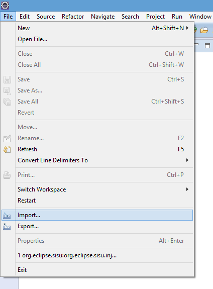
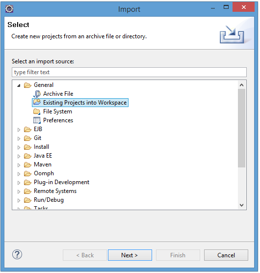
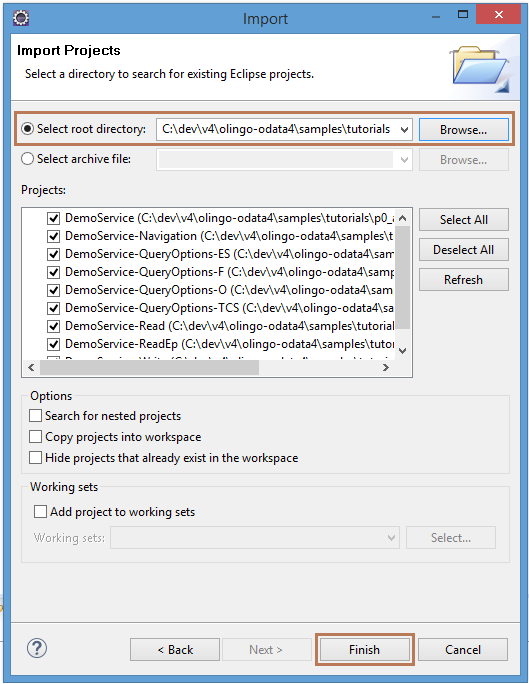

Title: Prerequisites for Apache Olingo Tutorials

# Prerequisites for Apache Olingo Tutorials

## Build Environment

We assume you are familiar with [Maven](https://maven.apache.org/) and [Git](https://git-scm.com/) 
and have installed at least the following versions:   

  - **Maven** Version 3.2.0
  - **Git** Version 3.5.1
  - **JDK** Version 1.6

The tutorials are tested and work with this versions.  

## Tutorial sources
To get the source code of the tutorials, please perform the follwing steps:

  - Clone the  project [git repository](https://gitbox.apache.org/repos/asf/olingo-odata4)    

    *\> git clone https://gitbox.apache.org/repos/asf/olingo-odata4*

  - Checkout the tag 4.6.0

    *\> git checkout tags/4.6.0*

  - Navigate to the tutorial project   
    You can find each tutorial in a separate subdirectory. e.g. [p1_read](http://olingo.staging.apache.org/doc/odata4/tutorials/read/tutorial_read.html)

    *\> cd samples/tutorials*
  - Build the Project and Eclipse Project	
    **Note:** The tutorials projects won`t be created if you build the Olingo library project. To create them, you have to navigate to the sub directory mentioned above.
		
    *\> mvn clean install*

 
## Eclipse support (optional)

   - Create Eclipse projects
    
    *\> mvn eclipse:clean eclipse:eclipse*
     
   - Import projects in Eclipse  
     Open Eclipse and navigate to File -> Import   

Select General -> Existing Projects into Workspace     

Select the directory of the tutorials and click Finish    
