Title:    Tutorial - Read service with Olingo V4

# How to build an OData Service with Olingo V4

## Part 1: Read scenario

This tutorial guides you through the steps required to write an OData Service based on the Olingo OData 4.0 Library for Java (based on current olingo version which can be got via the [Download-Page](../../download.html)).

The final source code can be found in the project [git repository](https://gitbox.apache.org/repos/asf/olingo-odata4).
A detailed description how to checkout the tutorials can be found [here](/doc/odata4/tutorials/prerequisites/prerequisites.html).
This tutorial can be found in subdirectory *\samples\tutorials\p1_read*

We will create a Web Application and deploy it on a local Tomcat server.
Afterwards, the OData service can be invoked from a browser and it will provide the data according to the OData V4 specification.
This tutorial is kept as simple as possible, in order to fully concentrate on the implementation of the service.
For example, only READ scenario is covered in this tutorial, whereas creation, modification and deletion will be covered in the subsequent tutorial.

**Scenario**

The OData service that we are create will implement the following model:

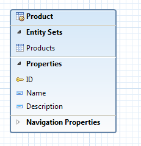

The service will display a list of products and a few properties that describe each product.
This data model will be enhanced in the subsequent tutorials in order to display categories and to support navigation from a product to its category.

**Goal**

We will be dealing with 3 java classes and the web.xml descriptor file.
Furthermore, for building with Maven, we will edit the `pom.xml` file.

This is how our working directory in Eclipse will look:

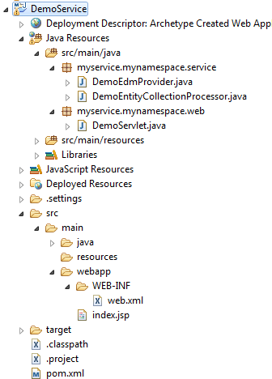

At the end of this tutorial, you will have written an OData service and you will be able to invoke the following URL in a browser:

    http://localhost:8080/DemoService/DemoService.svc/Products

And the browser will display the following collection of data:

~~~json
    {
      "@odata.context": "$metadata#Products",
      "value": [
        {
          "ID": 1,
          "Name": "Notebook Basic 15",
          "Description": "Notebook Basic, 1.7GHz - 15 XGA - 1024MB DDR2 SDRAM - 40GB"
        },
        {
          "ID": 2,
          "Name": "1UMTS PDA",
          "Description": "Ultrafast 3G UMTS/HSDPA Pocket PC, supports GSM network"
        },
        {
          "ID": 3,
          "Name": "Ergo Screen",
          "Description": "17 Optimum Resolution 1024 x 768 @ 85Hz, resolution 1280 x 960"
        }
      ]
    }
~~~

**Table of Contents**

  1. Prerequisites
  2. Preparation
  3. Create Project
      * Create Project
      * Edit `pom.xml` file
      * Check build path
      * Build the project
  4. Implementation - Read scenario to request the EntitySet “Products”
    1. Declare the metadata
    2. Provide the data
    3. Web application implementation
  5. Run the service
      * Run with Eclipse
      * The Service URLs
  6. Summary

---

# 1. Prerequisites

In order to follow this tutorial, you should have

* Basic knowledge about OData and OData V4
* Knowledge of the Java programming language
* Optional: knowledge about developing web applications
* Optional: knowledge about building with Maven

---

# 2. Preparation

Before starting off with the creation of our OData service, we need to prepare the following:

  1. Installed JDK 1.6 (or higher version)
  1. An IDE for writing the Java code
  2. A builder to build the .war file, which will be deployed on server
  3. A web server to run our web application / OData service

I recommend using Eclipse for all 3 needs, as it is the easiest approach.
This means, you should install the pre-packaged Eclipse distribution called “Eclipse IDE for Java EE developers” which can be found here: <http://www.eclipse.org/downloads/>

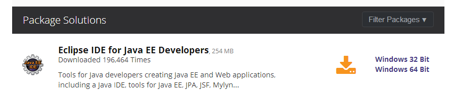

This Eclipse package contains an embedded server and also an integrated Maven builder.

---

# 3. Create Project

The recommended procedure to create a project is to use Maven, because it offers an archetype for generating the project skeleton.
Furthermore, using Maven is convenient for managing the build dependencies.
The description within this section is based on an Eclipse installation that contains the Maven integration.

**Create Project using the maven archetype “webapp”**

Within Eclipse, open the Maven Project wizard via
*File -> New -> Other -> Maven -> Maven Project*

On the second wizard page, choose  the archetype: maven-archetype-webapp

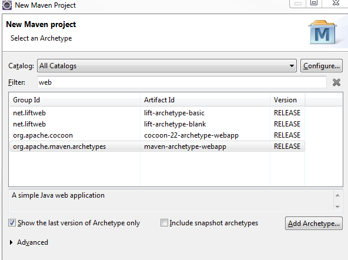

On the next page, enter the following information:

  * Groupd Id: *my.group.id*
  * Artifact Id: *DemoService*
  * Version: *4.6.0*
  * Package: *myservice.mynamespace.service*

> Note:
> If you’re using this wizard for the first time, it might take some time, as maven needs to download the archetype itself to your local maven-repo.

After finishing the wizard, the next step is to edit the *pom.xml* file.

**Edit pom file**

In our project, we will be using several libraries, e.g. the Olingo libraries.
In the pom.xml file, we specify the dependencies and Maven will download them to our local maven repository.
Furthermore, the *pom.xml* file tells Maven which output we want to have as result of our build. In our case, this is a war file.

In our example, the pom.xml file looks as follows:

~~~xml
    <project xmlns="http://maven.apache.org/POM/4.0.0" xmlns:xsi="http://www.w3.org/2001/XMLSchema-instance"
      xsi:schemaLocation="http://maven.apache.org/POM/4.0.0 http://maven.apache.org/maven-v4_0_0.xsd">
      <modelVersion>4.6.0</modelVersion>
      <groupId>my.group.id</groupId>
      <artifactId>DemoService</artifactId>
      <packaging>war</packaging>
      <version>4.6.0</version>

      <name>DemoService Maven Webapp</name>

      <properties>
        <javax.version>2.5</javax.version>
        <odata.version>4.6.0</odata.version>
        <slf4j.version>1.7.7</slf4j.version>
      </properties>

      <dependencies>
        <dependency>
          <groupId>javax.servlet</groupId>
          <artifactId>servlet-api</artifactId>
          <version>${javax.version}</version>
          <scope>provided</scope>
        </dependency>

        <dependency>
          <groupId>org.apache.olingo</groupId>
          <artifactId>odata-server-api</artifactId>
          <version>${odata.version}</version>
        </dependency>
        <dependency>
          <groupId>org.apache.olingo</groupId>
          <artifactId>odata-server-core</artifactId>
          <version>${odata.version}</version>
          <scope>runtime</scope>
        </dependency>

        <dependency>
          <groupId>org.apache.olingo</groupId>
          <artifactId>odata-commons-api</artifactId>
          <version>${odata.version}</version>
        </dependency>
        <dependency>
          <groupId>org.apache.olingo</groupId>
          <artifactId>odata-commons-core</artifactId>
          <version>${odata.version}</version>
        </dependency>

        <dependency>
          <groupId>org.slf4j</groupId>
          <artifactId>slf4j-simple</artifactId>
          <version>${slf4j.version}</version>
          <scope>runtime</scope>
        </dependency>
        <dependency>
	  <groupId>org.slf4j</groupId>
	  <artifactId>slf4j-api</artifactId>
	  <version>1.7.11</version>
	  <scope>compile</scope>
	</dependency>
      </dependencies>
    </project>
~~~

**Check Java build path**

In order to check the Build path settings, open the context menu on the project and choose
*Build Path -> Configure Build Path…*

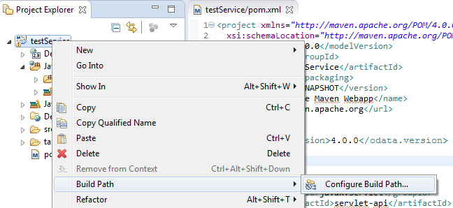

Select the *Source* tab.
You might see that the source folder *src/main/java* is configured, but displays an error marker.

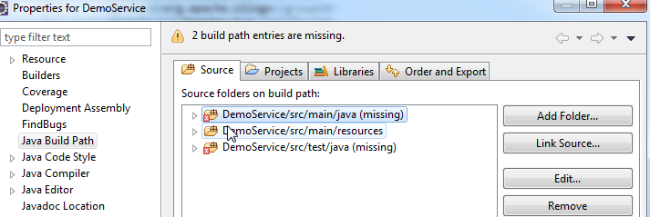

The reason is that it is missing on file system.
So the solution is to create the required folder in Eclipse.

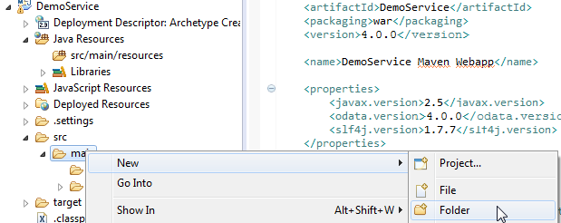

Afterwards, open the Build Path dialog again.
The second error might be about missing test source folder.
Since we don’t need it for our tutorial, we remove it from the build path.

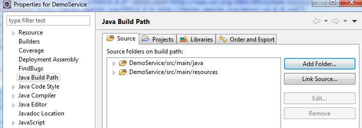

**Build the project**

Although the project doesn’t contain any source files yet, let’s perform our first Maven build, in order to check for any problems.

From the context menu on the project node, chose *Run As -> maven build*
If you have never executed the build before, Maven asks you to specify at least one goal.
Enter the usual goals “clean install” and press “Run”

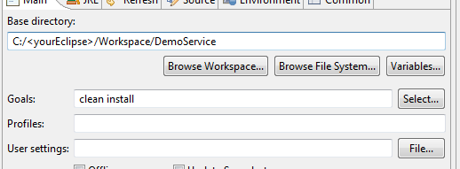

The log output is provided in the Eclipse Console view.
You should check it for the output “Build Success”

> Note:
> If maven provides an error marker right from the beginning,it would help to update your Project:
> From context menu on project node, choose Maven -> update Project -> <your project>

---

# 4. Implementation

The implementation of an OData service based on Olingo server library can be grouped in the following steps:

  * Declaring the metadata of the service
  * Handle service requests

Since our example service has to run on a web server, we have to create some code which calls our service in a web application:

  * Web application implementation

The following section will guide you through every step in detail.

## 4.1. Declare the metadata

### 4.1.1. Background

According to the OData specification, an OData service has to declare its structure in the so-called *Metadata Document*.
This document defines the contract, such that the user of the service knows which requests can be executed, the structure of the result and how the service can be navigated.

The Metadata Document can be invoked via the following URI:

    :::html
    <serviceroot>/$metadata

Furthermore, OData specifies the usage of the so-called Service Document
Here, the user can see which Entity Collections are offered by an OData service.

The service document can be invoked via the following URI:

    <serviceroot>/

The information that is given by these 2 URIs, has to be implemented in the service code.
Olingo provides an API for it and we will use it in the implementation of our *CsdlEdmProvider*.

### 4.1.2. Create class

Create package *myservice.mynamespace.service*
Create class *DemoEdmProvider* and specify the superclass *org.apache.olingo.commons.api.edm.provider.CsdlAbstractEdmProvider*

Note: **edm** is the abbreviation for **Entity Data Model**.
Accordingly, we understand that the *CsdlEdmProvider* is supposed to provide static descriptive information.

The Entity Model of the service can be defined in the EDM Provider. The EDM model basically defines the available EntityTypes and the relation between the entities. An EntityType consists of primitive, complex or navigation properties. The model can be invoked with the Metadata Document request.

As we can see, the Olingo server API provides one package that contains interfaces for the description of the metadata:

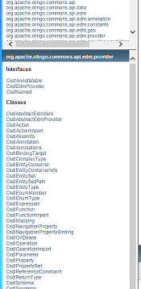

Some of these interfaces are going to be used in the following sections.
**Note:** Take a look into the [Javadoc](/javadoc/odata4/index.html)

### 4.1.3. Implement the required methods

The base class *CsdlAbstractEdmProvider* provides methods for declaring the metadata of all OData elements.

For example:
* The entries that are displayed in the Service Document are provided by the method
*getEntityContainerInfo()*
* The structure of EntityTypes is declared in the method *getEntityType()*

In our simple example, we implement the minimum amount of methods, required to run a meaningful OData service.
These are:

* **_getEntityType()_**
  Here we declare the EntityType “Product” and a few of its properties
* **_getEntitySet()_**
  Here we state that the list of products can be called via the EntitySet “Products”
* **_getEntityContainer()_**
  Here we provide a Container element that is necessary to host the EntitySet.
* **_getSchemas()_**
  The Schema is the root element to carry the elements.
* **_getEntityContainerInfo()_**
  Information about the EntityContainer to be displayed in the Service Document

In Eclipse, in order to select the methods to override, right click into the Java editor and from the context menu choose *Source -> Override/Implement Methods…*
Select the mentioned methods and press OK.

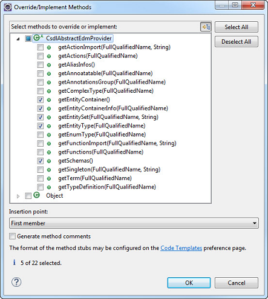

Let’s have a closer look at our methods in detail.

First, we need to declare some constants, to be used in the code below:

~~~java
    // Service Namespace
    public static final String NAMESPACE = "OData.Demo";

    // EDM Container
    public static final String CONTAINER_NAME = "Container";
    public static final FullQualifiedName CONTAINER = new FullQualifiedName(NAMESPACE, CONTAINER_NAME);

    // Entity Types Names
    public static final String ET_PRODUCT_NAME = "Product";
    public static final FullQualifiedName ET_PRODUCT_FQN = new FullQualifiedName(NAMESPACE, ET_PRODUCT_NAME);

    // Entity Set Names
    public static final String ES_PRODUCTS_NAME = "Products";
~~~

**_getEntityType()_**

In our example service, we want to provide a list of products to users who call the OData service.
The user of our service, for example an app-developer, may ask: What does such a "product" entry look like? How is it structured? Which information about a product is provided? For example, the name of it and which data types can be expected from these properties?
Such information is provided by a `CsdlEdmProvider` (and for convenience we extend the `CsdlAbstractEdmProvider`).

In our example service, for modelling the `CsdlEntityType`, we have to provide the following metadata:

The name of the EntityType: “Product”
The properties: name and type and additional info, e.g. “ID” of type “edm.int32”
Which of the properties is the “key” property: a reference to the “ID” property.

~~~java
    public CsdlEntityType getEntityType(FullQualifiedName entityTypeName) {

      // this method is called for one of the EntityTypes that are configured in the Schema
      if(entityTypeName.equals(ET_PRODUCT_FQN)){

        //create EntityType properties
        CsdlProperty id = new CsdlProperty().setName("ID").setType(EdmPrimitiveTypeKind.Int32.getFullQualifiedName());
        CsdlProperty name = new CsdlProperty().setName("Name").setType(EdmPrimitiveTypeKind.String.getFullQualifiedName());
        CsdlProperty  description = new CsdlProperty().setName("Description").setType(EdmPrimitiveTypeKind.String.getFullQualifiedName());

        // create CsdlPropertyRef for Key element
        CsdlPropertyRef propertyRef = new CsdlPropertyRef();
        propertyRef.setName("ID");

        // configure EntityType
        CsdlEntityType entityType = new CsdlEntityType();
        entityType.setName(ET_PRODUCT_NAME);
        entityType.setProperties(Arrays.asList(id, name , description));
        entityType.setKey(Collections.singletonList(propertyRef));

        return entityType;
      }

      return null;
    }
~~~

**_getEntitySet()_**

The procedure for declaring the _Entity Sets_ is similar.
An _EntitySet_ is a crucial resource, when an OData service is used to request data.
In our example, we will invoke the following URL, which we expect to provide us a list of products:

    http://localhost:8080/DemoService/DemoServlet.svc/Products

When declaring an `EntitySet`, we need to define the type of entries which are contained in the list, such as an `CsdlEntityType`.
In our example, we set our previously created `CsdlEntityType`, which is referred by a _FullQualifiedName_.

~~~java
    public CsdlEntitySet getEntitySet(FullQualifiedName entityContainer, String entitySetName) {

      if(entityContainer.equals(CONTAINER)){
        if(entitySetName.equals(ES_PRODUCTS_NAME)){
          CsdlEntitySet entitySet = new CsdlEntitySet();
          entitySet.setName(ES_PRODUCTS_NAME);
          entitySet.setType(ET_PRODUCT_FQN);

          return entitySet;
        }
      }

      return null;
    }
~~~

**_getEntityContainer()_**

In order to provide data, our OData service needs an _EntityContainer_ that carries the _EntitySets_.
In our example, we have only one _EntitySet_, so we create one _EntityContainer_ and set our _EntitySet_.

~~~java
    public CsdlEntityContainer getEntityContainer() {

      // create EntitySets
      List<CsdlEntitySet> entitySets = new ArrayList<CsdlEntitySet>();
      entitySets.add(getEntitySet(CONTAINER, ES_PRODUCTS_NAME));

      // create EntityContainer
      CsdlEntityContainer entityContainer = new CsdlEntityContainer();
      entityContainer.setName(CONTAINER_NAME);
      entityContainer.setEntitySets(entitySets);

      return entityContainer;
    }
~~~

**_getSchemas()_**

Up to this point, we have declared the type of our data (`CsdlEntityType`) and our list (`CsdlEntitySet`), and we have put it into a container (`CsdlEntityContainer`).
Now we are required to put all these elements into a `CsdlSchema`.
While the model of an OData service can have several schemas, in most cases there will probably be only one schema.
So, in our example, we create a list of schemas, where we add one new `CsdlSchema` object.
The schema is configured with a _Namespace_, which serves to uniquely identify all elements.
Then our elements are added to the Schema.

~~~java
    public List<CsdlSchema> getSchemas() {

      // create Schema
      CsdlSchema schema = new CsdlSchema();
      schema.setNamespace(NAMESPACE);

      // add EntityTypes
      List<CsdlEntityType> entityTypes = new ArrayList<CsdlEntityType>();
      entityTypes.add(getEntityType(ET_PRODUCT_FQN));
      schema.setEntityTypes(entityTypes);

      // add EntityContainer
      schema.setEntityContainer(getEntityContainer());

      // finally
      List<CsdlSchema> schemas = new ArrayList<CsdlSchema>();
      schemas.add(schema);

      return schemas;
    }
~~~

**_getEntityContainerInfo()_**

~~~java
    public CsdlEntityContainerInfo getEntityContainerInfo(FullQualifiedName entityContainerName) {

        // This method is invoked when displaying the Service Document at e.g. http://localhost:8080/DemoService/DemoService.svc
        if (entityContainerName == null || entityContainerName.equals(CONTAINER)) {
            CsdlEntityContainerInfo entityContainerInfo = new CsdlEntityContainerInfo();
            entityContainerInfo.setContainerName(CONTAINER);
            return entityContainerInfo;
        }

        return null;
    }
~~~

**Summary:**
We have created a class that declares the metadata of our OData service.
We have declared the main elements of an OData service: _EntityType_, _EntitySet_, _EntityContainer_ and _Schema_ (with the corresponding Olingo classes `CsdlEntityType`, `CsdlEntitySet`, `CsdlEntityContainer` and `CsdlSchema`).

At runtime of an OData service, such metadata can be viewed by invoking the Metadata Document.

In our example invokation of the URL: <http://localhost:8080/DemoService/DemoService.svc/$metadata>

Give us the result below:

~~~xml
    <?xml version='1.0' encoding='UTF-8'?>
    <edmx:Edmx Version="4.0" xmlns:edmx="http://docs.oasis-open.org/odata/ns/edmx">
      <edmx:DataServices>
        <Schema xmlns="http://docs.oasis-open.org/odata/ns/edm" Namespace="OData.Demo">
          <EntityType Name="Product">
            <Key>
              <PropertyRef Name="ID"/>
            </Key>
            <Property Name="ID" Type="Edm.Int32"/>
            <Property Name="Name" Type="Edm.String"/>
            <Property Name="Description" Type="Edm.String"/>
          </EntityType>
          <EntityContainer Name="Container">
            <EntitySet Name="Products" EntityType="OData.Demo.Product"/>
          </EntityContainer>
        </Schema>
      </edmx:DataServices>
    </edmx:Edmx>
~~~

The Service Document can be invoked to view the Entity Sets, like in our example at the URL: <http://localhost:8080/DemoService/DemoService.svc/>

Which give us the Service Document as result:

~~~json
    {
      "@odata.context" : "$metadata",
      "value" : [
      {
        "name" : "Products",
        "url" : "Products"
      } ]
    }
~~~

> Note:
> After implementing the _EdmProvider_, we can, as an intermediate step, build/deploy the service and invoke the 2 static pages:   Service Document and Metadata Document.
> If desired, you can proceed with implementing the required steps for web application as described in
4.3. and run the application as described in chapter 5.

## 4.2. Provide the data

After implementing the _EdmProvider_, the next step is the main task of an OData service: provide data.
In our example, we imagine that our OData service is invoked by a user who wants to see which products are offered by a web shop.
He invokes a URL and gets a list of products.
Providing the list of products is the task that we are going to implement in this chapter.

The work that we have to do in this chapter can be divided into 4 tasks:

  1. Check the URI
      We need to identify the requested resource and have to consider Query Options (if available)
  2. Provide the data
      Based on the URI info, we have to obtain the data from our data store (can be e.g. a database)
  3. Serialize the data
      The data has to be transformed into the required format
  4. Configure the response
      Since we are implementing a “processor”, the last step is to provide the response object

These 4 steps will be considered in the implementation of the `readEntityCollection()` method.

### 4.2.1. Background

In terms of _Olingo_, while processing a service request, a Processor instance is invoked that is supposed to understand the (user HTTP-) request and deliver the desired data.
_Olingo_ provides API for processing different kind of service requests:
Such a service request can ask for a list of entities, or for one entity, or one property.

Example:
In our example, we have stated in our Metadata Document that we will provide a list of “products” whenever the _EntitySet_ with name “Products” is invoked.
This means that the user of our OData service will append the _EntitySet_ name to the root URL of the service and then invoke the full URL.
This is http://localhost:8080/DemoService/DemoServlet1.svc/Products
So, whenever this URL is fired, Olingo will invoke the `EntityCollectionProcessor` implementation of our OData service.
Then our `EntityCollectionProcessor` implementation is expected to provide a list of products.

As we have already mentioned, the Metadata Document is the contract for providing data.
This means that when it comes to provide the actual data, we have to do it according to the specified metadata.
For example, the property names have to match, also the types of the properties, and, if specified, the length of the strings, etc

### 4.2.2. Create class

Within our package `myservice.mynamespace.service`, we create a Java class `DemoEntityCollectionProcessor`  that implements the interface `org.apache.olingo.server.api.processor.EntityCollectionProcessor`.

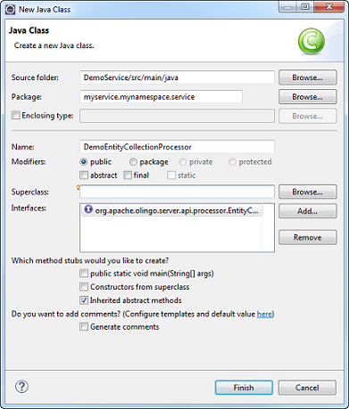

### 4.2.3. Implement the required methods

After creation of the Java class, we can see that there are 2 methods to be implemented:

  * _init()_
    This method is invoked by the _Olingo_ library, allowing us to store the context object
  * _readEntityCollection()_
    Here we have to fetch the required data and pass it back to the _Olingo_ library

Let’s have a closer look

**_init()_**

This method is common to all processor interfaces.
The _Olingo_ framework initializes the processor with an instance of the _OData_ object.
According to the Javadoc, this object is the “Root object for serving factory tasks…”
We will need it later, so we store it as member variable.

~~~java
    public void init(OData odata, ServiceMetadata serviceMetadata) {
      this.odata = odata;
      this.serviceMetadata = serviceMetadata;
    }
~~~

Don’t forget to declare the member variables

~~~java
    private OData odata;
    private ServiceMetadata serviceMetadata;
~~~

**_readEntityCollection()_**

The `EntityCollectionProcessor` exposes only one method: `readEntityCollection(...)`

Here we have to understand that this `readEntityCollection(...)`-method is invoked, when the OData service is called with an HTTP GET operation for an entity collection.

The `readEntityCollection(...)` method is used to “read” the data in the backend (this can be e.g. a database) and to deliver it to the user who calls the OData service.

The method signature:

The “request” parameter contains raw HTTP information. It is typically used for creation scenario, where a request body is sent along with the request.

With the second parameter, the “response” object is passed to our method in order to carry the response data. So here we have to set the response body, along with status code and content-type header.

The third parameter, the “uriInfo”, contains information about the relevant part of the URL. This means, the segments starting after the service name.

**Example:**
If the user calls the following URL:
`http://localhost:8080/DemoService/DemoService.svc/Products`
The `readEntityCollection(...)` method is invoked and the _uriInfo_ object contains one segment: “Products”

If the user calls the following URL:
`http://localhost:8080/DemoService/DemoService.svc/Products?$filter=ID eq 1`
Then the `readEntityCollection(...)` method is invoked and the _uriInfo_ contains the information about the entity set and furthermore the system query option $filter and its value.

The last parameter, the “responseFormat”, contains information about the content type that is requested by the user.
This means that the user has the choice to receive the data either in XML or in JSON.

**Example:**
If the user calls the following URL:
`http://localhost:8080/DemoService/DemoService.svc/Products?$format=application/json;odata.metadata=minimal`

then the content type is:
`application/json;odata.metadata=minimal`
which means that the payload is formatted in JSON (like it is shown in the introduction section of this tutorial)

**Note:**
The content type can as well be specified via the following request header
Accept: application/json;odata.metadata=minimal
In this case as well, our readEntityCollection() method will be called with the parameter responseFormat containing the content type > information.

**Note:**
If the user doesn’t specify any content type, then the default is JSON.

Why is this parameter needed?
Because the `readEntityCollection(...)` method is supposed to deliver the data in the format that is requested by the user. We will use this parameter when creating a serializer based on it.

The steps for implementating the method `readEntityCollection(...)` are:

  1. Which data is requested?
    Usually, an OData service provides different _EntitySets_, so first it is required to identify which _EntitySet_ has been requested. This information can be retrieved from the _uriInfo_ object.

  2. Fetch the data
    As a developer of the OData service, you have to know how and where the data is stored. In many cases, this would be a database. At this point, you would connect to your database and fetch the requested data with an appropriate SQL statement. The data that is fetched from the data storage has to be put into an _EntityCollection_ object.
    The package `org.apache.olingo.commons.api.data` provides interfaces that describe the actual data, not the metadata.

      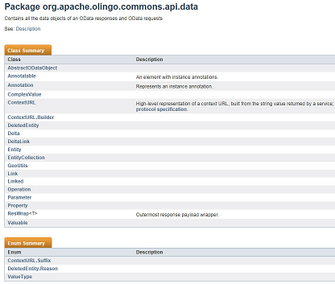

  3. Transform the data
    _Olingo_ expects us to provide the data as low-level _InputStream_ object. However, _Olingo_ supports us in doing so, by providing us with a proper "serializer".
    So what we have to do is create the serializer based on the requested content type, configure it and call it.

  4. Configure the response
    The response object has been passed to us in the method signature. We use it to set the serialized data (the `InputStream` object).
    Furthermore, we have to set the HTTP status code, which means that we have the opportunity to do proper error handling.
    And finally we have to set the content type.

**Sample:**

~~~java
    public void readEntityCollection(ODataRequest request, ODataResponse response, UriInfo uriInfo, ContentType responseFormat)
        throws ODataApplicationException, SerializerException {

      // 1st we have retrieve the requested EntitySet from the uriInfo object (representation of the parsed service URI)
      List<UriResource> resourcePaths = uriInfo.getUriResourceParts();
      UriResourceEntitySet uriResourceEntitySet = (UriResourceEntitySet) resourcePaths.get(0); // in our example, the first segment is the EntitySet
      EdmEntitySet edmEntitySet = uriResourceEntitySet.getEntitySet();

      // 2nd: fetch the data from backend for this requested EntitySetName
      // it has to be delivered as EntitySet object
      EntityCollection entitySet = getData(edmEntitySet);

      // 3rd: create a serializer based on the requested format (json)
      ODataSerializer serializer = odata.createSerializer(responseFormat);

      // 4th: Now serialize the content: transform from the EntitySet object to InputStream
      EdmEntityType edmEntityType = edmEntitySet.getEntityType();
      ContextURL contextUrl = ContextURL.with().entitySet(edmEntitySet).build();

      final String id = request.getRawBaseUri() + "/" + edmEntitySet.getName();
      EntityCollectionSerializerOptions opts = EntityCollectionSerializerOptions.with().id(id).contextURL(contextUrl).build();
      SerializerResult serializerResult = serializer.entityCollection(serviceMetadata, edmEntityType, entitySet, opts);
      InputStream serializedContent = serializerResult.getContent();

      // Finally: configure the response object: set the body, headers and status code
      response.setContent(serializedContent);
      response.setStatusCode(HttpStatusCode.OK.getStatusCode());
      response.setHeader(HttpHeader.CONTENT_TYPE, responseFormat.toContentTypeString());
    }
~~~

**_getData()_**

We have not elaborated on fetching the actual data.
In our tutorial, to keep the code as simple as possible, we use a little helper method that delivers some hardcoded entries.
Since we are supposed to deliver the data inside an `EntityCollection` instance, we create the instance, ask it for the (initially empty) list of entities and add some new entities to it.
We create the entities and their properties according to what we declared in our `DemoEdmProvider` class. So we have to take care to provide the correct names to the new property objects.
If a client requests the response in [ATOM format](http://docs.oasis-open.org/odata/odata-atom-format/v4.0/odata-atom-format-v4.0.html), each entity have to provide it`s own entity id.
The method *createId* allows us to create an id in a convenient way.

~~~java
    private EntityCollection getData(EdmEntitySet edmEntitySet){

       EntityCollection productsCollection = new EntityCollection();
       // check for which EdmEntitySet the data is requested
       if(DemoEdmProvider.ES_PRODUCTS_NAME.equals(edmEntitySet.getName())) {
           List<Entity> productList = productsCollection.getEntities();

           // add some sample product entities
           final Entity e1 = new Entity()
              .addProperty(new Property(null, "ID", ValueType.PRIMITIVE, 1))
              .addProperty(new Property(null, "Name", ValueType.PRIMITIVE, "Notebook Basic 15"))
              .addProperty(new Property(null, "Description", ValueType.PRIMITIVE,
                  "Notebook Basic, 1.7GHz - 15 XGA - 1024MB DDR2 SDRAM - 40GB"));
          e1.setId(createId("Products", 1));
          productList.add(e1);

          final Entity e2 = new Entity()
              .addProperty(new Property(null, "ID", ValueType.PRIMITIVE, 2))
              .addProperty(new Property(null, "Name", ValueType.PRIMITIVE, "1UMTS PDA"))
              .addProperty(new Property(null, "Description", ValueType.PRIMITIVE,
                  "Ultrafast 3G UMTS/HSDPA Pocket PC, supports GSM network"));
          e2.setId(createId("Products", 1));
          productList.add(e2);

          final Entity e3 = new Entity()
              .addProperty(new Property(null, "ID", ValueType.PRIMITIVE, 3))
              .addProperty(new Property(null, "Name", ValueType.PRIMITIVE, "Ergo Screen"))
              .addProperty(new Property(null, "Description", ValueType.PRIMITIVE,
                  "19 Optimum Resolution 1024 x 768 @ 85Hz, resolution 1280 x 960"));
          e3.setId(createId("Products", 1));
          productList.add(e3);
       }

       return productsCollection;
    }
~~~

**_createId()_**   

~~~java
    private URI createId(String entitySetName, Object id) {
        try {
            return new URI(entitySetName + "(" + String.valueOf(id) + ")");
        } catch (URISyntaxException e) {
            throw new ODataRuntimeException("Unable to create id for entity: " + entitySetName, e);
        }
    }
~~~

## 4.3. Web Application

After declaring the metadata and providing the data, our OData service implementation is done.
The last step is to enable our OData service to be called on a web server.
Therefore, we are wrapping our service by a web application.

The web application is defined in the web.xml file, where a servlet is registered.
The servlet is a standard _HttpServlet_ which dispatches the user requests to the _Olingo_ framework.

Let’s quickly do the remaining steps:

### 4.3.1. Create and implement the Servlet

Create a new package _myservice.mynamespace.web_.
Create Java class with name `DemoServlet` that inherits from `HttpServlet`.

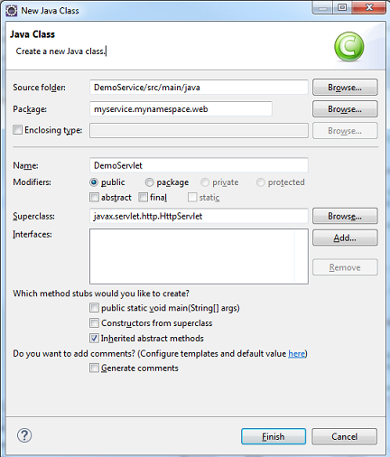

Override the `service()` method.
Basically, what we are doing here is to create an `ODataHttpHandler`, which is a class that is provided by _Olingo_.
It receives the user request and if the URL conforms to the OData specification, the request is delegated to the processor implementation of the OData service.
This means that the handler has to be configured with all processor implementations that have been created along with the OData service (in our example, only one processor).
Furthermore, the `ODataHttpHandler` needs to carry the knowledge about the `CsdlEdmProvider`.

This is where our two implemented classes come together, the metadata declaration and the data provisioning.

~~~java
    public class DemoServlet extends HttpServlet {

      private static final long serialVersionUID = 1L;
      private static final Logger LOG = LoggerFactory.getLogger(DemoServlet.class);

      protected void service(final HttpServletRequest req, final HttpServletResponse resp) throws ServletException, IOException {
        try {
          // create odata handler and configure it with CsdlEdmProvider and Processor
          OData odata = OData.newInstance();
          ServiceMetadata edm = odata.createServiceMetadata(new DemoEdmProvider(), new ArrayList<EdmxReference>());
          ODataHttpHandler handler = odata.createHandler(edm);
          handler.register(new DemoEntityCollectionProcessor());

          // let the handler do the work
          handler.process(req, resp);
        } catch (RuntimeException e) {
          LOG.error("Server Error occurred in ExampleServlet", e);
          throw new ServletException(e);
        }
      }
    }
~~~

### 4.3.2. Edit the web.xml

The very last step of our tutorial is to register the Servlet in the _web.xml_ file.
Furthermore, we need to specify the _url-pattern_ for the servlet, such that our OData service can be invoked.

Open the _src/main/webapp/WEB-INF/web.xml_ file and paste the following content into it:

~~~xml
    <web-app xmlns:xsi="http://www.w3.org/2001/XMLSchema-instance"
        xmlns="http://java.sun.com/xml/ns/javaee"
        xmlns:web="http://java.sun.com/xml/ns/javaee/web-app_2_5.xsd"
        xsi:schemaLocation="http://java.sun.com/xml/ns/javaee http://java.sun.com/xml/ns/javaee/web-app_2_5.xsd"
        id="WebApp_ID" version="2.5">

    <servlet>
      <servlet-name>DemoServlet</servlet-name>
      <servlet-class> myservice.mynamespace.web.DemoServlet</servlet-class>
      <load-on-startup>1</load-on-startup>
    </servlet>

    <servlet-mapping>
      <servlet-name>DemoServlet</servlet-name>
      <url-pattern>/DemoService.svc/*</url-pattern>
    </servlet-mapping>
    </web-app>
~~~

That’s it. Now we can build and run the web application.

---

# 5. Run the service

Running the service means build the war file and deploy it on a server.
In our tutorial, we are using the Eclipse web integration tools, which make life easier.

### Run with Eclipse

Select your project and from the context menu choose _Run As -> Run on Server_
If you don’t have any server configured in Eclipse, you have to “manually define a new server” in the subsequent dialog.
If you have installed a Tomcat server on your local file system, you can use it here.
If not, you can use the _Basic -> J2EE Preview_ option, which is should be enough for our tutorial.

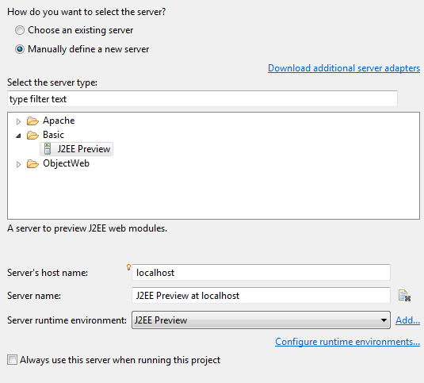

> Note:
> You might have to first execute maven build and also press F5 to refresh the content of the Eclipse project

After pressing "run", Eclipse starts the internal server and deploys the web application on it.
Then the Eclipse internal Browser View is opened and the index.jsp file that has been generated into our Example project is opened.
We ignore it. Instead, we open our OData service in our favorite browser.

> Note:
> If you face problems related to the server, it helps to restart your Eclipse IDE.

### The Service URLs

Try the following URLs:

**Service Document**

    http://localhost:8080/DemoService/DemoService.svc/

The expected result is the Service Document which displays our _EntityContainerInfo_:

~~~json
    {
      "@odata.context" : "$metadata",
      "value" : [
      {
        "name" : "Products",
        "url" : "Products"
      } ]
    }
~~~

**Metadata Document**

    http://localhost:8080/DemoService/DemoService.svc/$metadata

The expected result is the Metadata Document that displays our _Schema_, _EntityType_, _EntityContainer_ and _EntitySet_.

~~~xml
    <?xml version='1.0' encoding='UTF-8'?>
    <edmx:Edmx Version="4.0" xmlns:edmx="http://docs.oasis-open.org/odata/ns/edmx">
      <edmx:DataServices>
        <Schema xmlns="http://docs.oasis-open.org/odata/ns/edm" Namespace="OData.Demo">
          <EntityType Name="Product">
            <Key>
              <PropertyRef Name="ID"/>
            </Key>
            <Property Name="ID" Type="Edm.Int32"/>
            <Property Name="Name" Type="Edm.String"/>
            <Property Name="Description" Type="Edm.String"/>
          </EntityType>
          <EntityContainer Name="Container">
            <EntitySet Name="Products" EntityType="OData.Demo.Product"/>
          </EntityContainer>
        </Schema>
      </edmx:DataServices>
    </edmx:Edmx>
~~~

**Query / EntitySet**

    http://localhost:8080/DemoService/DemoService.svc/Products

The expected result is the hardcoded list of product entries, which we have coded in our processor implementation:

~~~json
    {
      "@odata.context":"$metadata#Products","
      value":[
        {
          "ID":1,
          "Name":"Notebook Basic 15",
          "Description":"Notebook Basic, 1.7GHz - 15 XGA - 1024MB DDR2 SDRAM - 40GB"
        },
        {
          "ID":2,
          "Name":"1UMTS PDA",
          "Description":"Ultrafast 3G UMTS/HSDPA Pocket PC, supports GSM network"
        },
        {
          "ID":3,
          "Name":"Ergo Screen",
          "Description":"17 Optimum Resolution 1024 x 768 @ 85Hz, resolution 1280 x 960"
      }]
    }
~~~

---

# 6. Summary

Finally, we have created our first OData service based on the V4 version of the OData specification and using the V4 server library provided by _Olingo_.
Our first OData service is very simple; it only allows invoking one entity collection, apart from the Service Document and the Metadata Document.

The final source code result can be found in the project [git repository](https://gitbox.apache.org/repos/asf/olingo-odata4).
A detailed description how to checkout the tutorials can be found [here](/doc/odata4/tutorials/prerequisites/prerequisites.html).

# Links

### Tutorials

Further topics to be covered by follow-up tutorials:

  * Tutorial OData V4 service part 1: Read Entity Collection
  * Tutorial OData V4 service part 2: [Read Entity, Read Property](/doc/odata4/tutorials/readep/tutorial_readep.html)
  * Tutorial OData V4 service part 3: [Write (Create, Update, Delete Entity)](/doc/odata4/tutorials/write/tutorial_write.html)
  * Tutorial OData V4 service, part 4: [Navigation](/doc/odata4/tutorials/navigation/tutorial_navigation.html)
  * Tutorial OData V4 service, part 5.1: [System Query Options $top, $skip, $count (this page)](/doc/odata4/tutorials/sqo_tcs/tutorial_sqo_tcs.html)
  * Tutorial OData V4 service, part 5.2: [System Query Options $select, $expand](/doc/odata4/tutorials/sqo_es/tutorial_sqo_es.html)
  * Tutorial OData V4 service, part 5.3: [System Query Options $orderby](/doc/odata4/tutorials/sqo_o/tutorial_sqo_o.html)
  * Tutorial OData V4 service, part 5.4: [System Query Options $filter](/doc/odata4/tutorials/sqo_f/tutorial_sqo_f.html)
  * Tutorial ODATA V4 service, part 6: [Action and Function Imports](/doc/odata4/tutorials/action/tutorial_action.html)
  * Tutorial ODATA V4 service, part 7: [Media Entities](/doc/odata4/tutorials/media/tutorial_media.html)
  * Tutorial OData V4 service, part 8: [Batch Request support](/doc/odata4/tutorials/batch/tutorial_batch.html)
  * Tutorial OData V4 service, part 9: [Handling "Deep Insert" requests](/doc/odata4/tutorials/deep_insert/tutorial_deep_insert.html)
  
### Code and Repository
  * [Git Repository](https://gitbox.apache.org/repos/asf/olingo-odata4)
  * [Guide - To fetch the tutorial sources](/doc/odata4/tutorials/prerequisites/prerequisites.html)
  * [Demo Service source code as zip file (contains all tutorials)](http://www.apache.org/dyn/closer.lua/olingo/odata4/4.6.0/DemoService_Tutorial.zip)

### Further reading

  * [Official OData Homepage](http://odata.org/)
  * [OData documentation](http://www.odata.org/documentation/)
  * [Olingo Javadoc](/javadoc/odata4/index.html)
