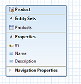

Title:    Tutorial - Read service with Olingo V4

# How to build an OData Service with Olingo V4

## Part 2: Read scenario continued

### Introduction

In the first tutorial, we’ve learned how to build a very simple OData service.
That service exposes its metadata and allows reading a list of products.
It doesn’t support accessing the URL for a single product.
And it also doesn’t support reading a single property of a product.
These 2 topics will be covered in the present tutorial.  

Note that this tutorial doesn’t cover modifying operations like create, update and delete.
Such operations will be the focus of the Olingo V4 tutorial no. 3

**Note**  
The final source code can be found in the project [git repository](https://gitbox.apache.org/repos/asf/olingo-odata4).
A detailed description how to checkout the tutorials can be found [here](/doc/odata4/tutorials/prerequisites/prerequisites.html).   
This tutorial can be found in subdirectory *\samples\tutorials\p2_readep*

**Disclaimer**  
Again, in the present tutorial, We will focus only on the relevant implementation, in order to keep the code small and simple.
The sample code shouldn't be reused for advanced scenarios.

**Table of Contents**

  1. Prerequisites
  2. Preparation
    1. Create data class
    2. Adapt the servlet class
    3. Modify the DemoEntityCollectionProcessor
    4. Create utility class
  3. Implementation of Read Single Entity
    1. Implement the EntityProcessor interface
    2. Adapt the DemoServlet class
    3. Run the service
  4. Implementation of Read Single Property
    1. Implement the PrimitiveProcessor interface
    2. Adapt the DemoServlet class
    3. Run the service
  5. Summary
  6. Links
  7. Appendix: PrimitiveValueProcessor

# 1. Prerequisites

Follow [Tutorial Part 1: Read Entity Collection](/doc/odata4/tutorials/read/tutorial_read.html), which also covers setting up the environment and running the service.

# 2. Preparation

Follow the [Tutorial Part 1: Read Entity Collection](/doc/odata4/tutorials/read/tutorial_read.html) or import the the tutorial form subdirectory [*\samples\tutorials\p1_read*](/doc/odata4/tutorials/prerequisites/prerequisites.html) into your Eclipse workspace.  
Afterwards do a *Deploy and run*: it should be working.  
Before we start with the actual tutorial, we need to adapt the existing code to meet the requirements of the present tutorial.

## 2.1. Create a new data-class

In the first tutorial, we had created a single method called `getData()` to provide sample data for the list of products.
Handling the sample data will get a bit more advanced from now on, so we move the code into a separate class.

Create a new package *myservice.mynamespace.data*  
Within this package, create a new class *Storage.java* to simulate the data layer (in a real scenario, this would be e.g. a database or any other data storage)

Here’s the full implementation of this class:

~~~java
    package myservice.mynamespace.data;

    import java.util.ArrayList;
    import java.util.List;
    import java.util.Locale;

    import myservice.mynamespace.service.DemoEdmProvider;
    import myservice.mynamespace.util.Util;

    import org.apache.olingo.commons.api.data.Entity;
    import org.apache.olingo.commons.api.data.EntityCollection;
    import org.apache.olingo.commons.api.data.Property;
    import org.apache.olingo.commons.api.data.ValueType;
    import org.apache.olingo.commons.api.edm.EdmEntitySet;
    import org.apache.olingo.commons.api.edm.EdmEntityType;
    import org.apache.olingo.commons.api.http.HttpStatusCode;
    import org.apache.olingo.server.api.ODataApplicationException;
    import org.apache.olingo.server.api.uri.UriParameter;

    public class Storage {

        private List<Entity> productList;

        public Storage() {
            productList = new ArrayList<Entity>();
            initSampleData();
        }

        /* PUBLIC FACADE */

        public EntityCollection readEntitySetData(EdmEntitySet edmEntitySet)throws ODataApplicationException{

            // actually, this is only required if we have more than one Entity Sets
            if(edmEntitySet.getName().equals(DemoEdmProvider.ES_PRODUCTS_NAME)){
                return getProducts();
            }

            return null;
        }

        public Entity readEntityData(EdmEntitySet edmEntitySet, List<UriParameter> keyParams) throws ODataApplicationException{

            EdmEntityType edmEntityType = edmEntitySet.getEntityType();

            // actually, this is only required if we have more than one Entity Type
            if(edmEntityType.getName().equals(DemoEdmProvider.ET_PRODUCT_NAME)){
                return getProduct(edmEntityType, keyParams);
            }

            return null;
        }

        /*  INTERNAL */

        private EntityCollection getProducts(){
            EntityCollection retEntitySet = new EntityCollection();

            for(Entity productEntity : this.productList){
                retEntitySet.getEntities().add(productEntity);
            }

            return retEntitySet;
        }

        private Entity getProduct(EdmEntityType edmEntityType, List<UriParameter> keyParams) throws ODataApplicationException{

            // the list of entities at runtime
            EntityCollection entitySet = getProducts();

            /*  generic approach  to find the requested entity */
            Entity requestedEntity = Util.findEntity(edmEntityType, entitySet, keyParams);

            if(requestedEntity == null){
                // this variable is null if our data doesn't contain an entity for the requested key
                // Throw suitable exception
                throw new ODataApplicationException("Entity for requested key doesn't exist",
                                           HttpStatusCode.NOT_FOUND.getStatusCode(), Locale.ENGLISH);
            }

            return requestedEntity;
         }

         /* HELPER */
         private void initSampleData(){

             // add some sample product entities
             final Entity e1 = new Entity()
                                   .addProperty(new Property(null, "ID", ValueType.PRIMITIVE, 1))
                                   .addProperty(new Property(null, "Name", ValueType.PRIMITIVE, "Notebook Basic 15"))
                                   .addProperty(new Property(null, "Description", ValueType.PRIMITIVE,
                                                "Notebook Basic, 1.7GHz - 15 XGA - 1024MB DDR2 SDRAM - 40GB"));
            e1.setId(createId("Products", 1));
            productList.add(e1);

            final Entity e2 = new Entity()
                                  .addProperty(new Property(null, "ID", ValueType.PRIMITIVE, 2))
                                  .addProperty(new Property(null, "Name", ValueType.PRIMITIVE, "1UMTS PDA"))
                                  .addProperty(new Property(null, "Description", ValueType.PRIMITIVE,
                                               "Ultrafast 3G UMTS/HSDPA Pocket PC, supports GSM network"));
            e2.setId(createId("Products", 1));
            productList.add(e2);

            final Entity e3 = new Entity()
                                  .addProperty(new Property(null, "ID", ValueType.PRIMITIVE, 3))
                                  .addProperty(new Property(null, "Name", ValueType.PRIMITIVE, "Ergo Screen"))
                                  .addProperty(new Property(null, "Description", ValueType.PRIMITIVE,
						"19 Optimum Resolution 1024 x 768 @ 85Hz, resolution 1280 x 960"));
            e3.setId(createId("Products", 1));
            productList.add(e3);
        }

        private URI createId(String entitySetName, Object id) {
            try {
                return new URI(entitySetName + "(" + String.valueOf(id) + ")");
            } catch (URISyntaxException e) {
                throw new ODataRuntimeException("Unable to create id for entity: " + entitySetName, e);
            }
        }
    }
~~~

The *Public Façade* contains the methods that are called from outside.  
They are data-layer-agnostic; their parameters are objects from the OData world.  
The implementation of these methods simply delegates the logic to the internal methods.  

The *internal* methods do know about the names of tables or columns and these methods know how to e.g. find a single product.

## 2.2. Adapt the servlet class

The `Data-Storage` class will be instantiated in the `DemoServlet` class and attached to the HTTP-session.  
This has the advantage that our final OData service can be tested and the sample data can be changed and the changes will remain active until the session is closed.

Open the class `myservice.mynamespace.web.DemoServlet`

Change the code such that it looks as follows:

~~~java
    protected void service(HttpServletRequest req, HttpServletResponse resp) throws ServletException, IOException {
    	try {
    		HttpSession session = req.getSession(true);
    		Storage storage = (Storage) session.getAttribute(Storage.class.getName());
    		if (storage == null) {
    		   storage = new Storage();
    		   session.setAttribute(Storage.class.getName(), storage);
    		}

    		// create odata handler and configure it with EdmProvider and Processor
    		OData odata = OData.newInstance();
    		ServiceMetadata edm = odata.createServiceMetadata(new DemoEdmProvider(), new ArrayList<EdmxReference>());
    		ODataHttpHandler handler = odata.createHandler(edm);
    		handler.register(new DemoEntityCollectionProcessor(storage));
      } /* more code */
    }
~~~

Note that we pass the instance of the `Storage` object to the constructor of our existing `DemoEntityCollectionProcessor`.

So the next step is to adapt the `DemoEntityCollectionProcessor` class.

## 2.3. Modify the DemoEntityCollectionProcessor

In the `DemoEntityCollectionProcessor` class that we created in the first tutorial, we have to make 3 changes:

### 2.3.1 Create Constructor

We have to create a Constructor that takes the `Storage` instance and stores it as a member variable:

~~~java
    public class DemoEntityCollectionProcessor implements EntityCollectionProcessor {

    	private OData odata;
        private ServiceMetadata serviceMetadata;
    	private Storage storage;

    	public DemoEntityCollectionProcessor(Storage storage) {
    		this.storage = storage;
    	}
    }
~~~

### 2.3.2. Delete the getData() method

The code that we had written in this method has been moved to the `init()` method of the Storage class.
So we can delete this `getData()` method.

### 2.3.3. Adapt the usage of the getData() method

After deleting the `getData()` method, we get a compile error in the line where this method is used.
We replace this method invocation with a call to our `Storage` object:

~~~java
    EntitySet entitySet = storage.readEntitySetData(edmEntitySet);
~~~

The new code looks as follows:

~~~java
    public void readEntityCollection(ODataRequest request, ODataResponse response,
                                    UriInfo uriInfo, ContentType responseFormat)
                                    throws ODataApplicationException, SerializerException {

    	// 1st retrieve the requested EntitySet from the uriInfo (representation of the parsed URI)
    	List<UriResource> resourcePaths = uriInfo.getUriResourceParts();
        // in our example, the first segment is the EntitySet
    	UriResourceEntitySet uriResourceEntitySet = (UriResourceEntitySet) resourcePaths.get(0);
    	EdmEntitySet edmEntitySet = uriResourceEntitySet.getEntitySet();

    	// 2nd: fetch the data from backend for this requested EntitySetName and deliver as EntitySet
    	EntityCollection entityCollection = storage.readEntitySetData(edmEntitySet);
    }
~~~

## 2.4. Create utility class

Furthermore, we create one more class, to  host a few helper methods.  
Create package `myservice.mynamespace.util`
Within this package, create a class `Util.java`

Copy the following code into this class:

~~~java
    package myservice.mynamespace.util;

    import java.util.List;
    import java.util.Locale;

    import org.apache.olingo.commons.api.data.Entity;
    import org.apache.olingo.commons.api.data.EntityCollection;
    import org.apache.olingo.commons.api.edm.EdmEntityType;
    import org.apache.olingo.commons.api.edm.EdmPrimitiveType;
    import org.apache.olingo.commons.api.edm.EdmPrimitiveTypeException;
    import org.apache.olingo.commons.api.edm.EdmProperty;
    import org.apache.olingo.commons.api.edm.EdmType;
    import org.apache.olingo.commons.api.http.HttpStatusCode;
    import org.apache.olingo.server.api.ODataApplicationException;
    import org.apache.olingo.server.api.uri.UriParameter;

    public class Util {

    	public static EdmEntitySet getEdmEntitySet(UriInfoResource uriInfo) throws ODataApplicationException {

    		List<UriResource> resourcePaths = uriInfo.getUriResourceParts();
    		 // To get the entity set we have to interpret all URI segments
    		if (!(resourcePaths.get(0) instanceof UriResourceEntitySet)) {
    			throw new ODataApplicationException("Invalid resource type for first segment.",
    			                        HttpStatusCode.NOT_IMPLEMENTED.getStatusCode(),Locale.ENGLISH);
    		}

    		UriResourceEntitySet uriResource = (UriResourceEntitySet) resourcePaths.get(0);

    		return uriResource.getEntitySet();
    	}

    	public static Entity findEntity(EdmEntityType edmEntityType,
    	                                EntityCollection rt_entitySet, List<UriParameter> keyParams)
    	                                throws ODataApplicationException {

    		List<Entity> entityList = rt_entitySet.getEntities();

    		// loop over all entities in order to find that one that matches all keys in request
    		// an example could be e.g. contacts(ContactID=1, CompanyID=1)
    		for(Entity rt_entity : entityList){
    			boolean foundEntity = entityMatchesAllKeys(edmEntityType, rt_entity, keyParams);
    			if(foundEntity){
    				return rt_entity;
    			}
    		}

    		return null;
    	}

    	public static boolean entityMatchesAllKeys(EdmEntityType edmEntityType, Entity rt_entity,  List<UriParameter> keyParams)
    	                                            throws ODataApplicationException {

            // loop over all keys
            for (final UriParameter key : keyParams) {
            	// key
            	String keyName = key.getName();
            	String keyText = key.getText();

            	// Edm: we need this info for the comparison below
            	EdmProperty edmKeyProperty = (EdmProperty )edmEntityType.getProperty(keyName);
    			Boolean isNullable = edmKeyProperty.isNullable();
    			Integer maxLength = edmKeyProperty.getMaxLength();
    			Integer precision = edmKeyProperty.getPrecision();
    			Boolean isUnicode = edmKeyProperty.isUnicode();
    			Integer scale = edmKeyProperty.getScale();
    			// get the EdmType in order to compare
    			EdmType edmType = edmKeyProperty.getType();
    			// Key properties must be instance of primitive type
    			EdmPrimitiveType edmPrimitiveType = (EdmPrimitiveType)edmType;

    			// Runtime data: the value of the current entity
    			Object valueObject = rt_entity.getProperty(keyName).getValue(); // null-check is done in FWK

    			// now need to compare the valueObject with the keyText String
    			// this is done using the type.valueToString //
    			String valueAsString = null;
    			try {
    				valueAsString = edmPrimitiveType.valueToString(valueObject, isNullable, maxLength,
    				                                                precision, scale, isUnicode);
    			} catch (EdmPrimitiveTypeException e) {
    				throw new ODataApplicationException("Failed to retrieve String value",
    				                             HttpStatusCode.INTERNAL_SERVER_ERROR.getStatusCode(),Locale.ENGLISH, e);
    			}

    			if (valueAsString == null){
    				return false;
    			}

    			boolean matches = valueAsString.equals(keyText);
    			if(!matches){
    				// if any of the key properties is not found in the entity, we don't need to search further
    				return false;
    			}
    		}

    		return true;
    	}
    }
~~~

These helper methods are going to be used within the implementation of the Processor implementations.

___

# 3. Implementation of Read Single Entity

The user of our sample OData service is enabled to invoke the list of products via the following URL:

    http://localhost:8080/DemoService/DemoService.svc/Products

In a next step, he wants to read the details of a single product entity.
This is done via the following URL:

    http://localhost:8080/DemoService/DemoService.svc/Products(3)

From the above URL we can see that the user requests the product which has an ID with value 3  
Whenever such a URL is requested, the Olingo library will delegate the request to an implementation of the Interface `EntityProcessor`.

This means, we have to create a new Java class that implements the mentioned interface and we have to register it in the `DemoServlet` class (remember that all Processor-implementations have to be registered there).

## 3.1. Implement the EntityProcessor interface

The interface `org.apache.olingo.server.api.processor.EntityProcessor` has 5 methods to implement:

  - *init(...)*  
  Here we are initialized by the Framework to pass the context objects to us

  - *readEntity(…)*  
  This method is relevant for reading a single entity

  - *createEntity(…)*  
  We will ignore this method in the present tutorial

  - *updateEntity(…)*  
  We will ignore this method in the present tutorial

  - *deleteEntity(…)*  
  We will ignore this method in the present tutorial

Let’s have a look at the implementation.

Create the class `DemoEntityProcessor` in package `myservice.mynamespace.service` which implements the interface `EntityProcessor`.  
First we need to implement the `init()` method, in order to store the `OData` object.
Second, as described in the preparation-section, we need to create a constructor that takes and stores our `Storage` instance

~~~java
    public class DemoEntityProcessor implements EntityProcessor {

    	private OData odata;
    	private ServiceMetadata serviceMetadata;
    	private Storage storage;

    	public DemoEntityProcessor(Storage storage) {
    		this.storage = storage;
    	}

    	public void init(OData odata, ServiceMetadata serviceMetadata) {
    		this.odata = odata;
    		this.serviceMetadata = serviceMetadata;
    	}
    }
~~~

**readEntity(...)**

When going through the implementation, let’s keep in mind that the user invokes e.g. the following URL

    http://localhost:8080/DemoService/DemoService.svc/Products(3)

and he receives the following response in the browser:

~~~json
    {
      @odata.context: "$metadata#Products",
      ID: 3,
      Name: "Ergo Screen",
      Description: "19 Optimum Resolution 1024 x 768 @ 85Hz, resolution 1280 x 960"
    }
~~~

**Steps**  
The steps to be followed in the implementation of the `readEntity(...)` method are the same that we followed in the previous tutorial, when we implemented the `readEntityCollection(...)` method:

  1. **Which data is requested?**  
    Check the UriInfo instance for information about which *EntityCollection* has been requested.  
    Note that in the code, we directly access the first segment of the URI and cast it to `UriResourceEntitySet`

    ~~~java
        UriResourceEntitySet uriResourceEntitySet = (UriResourceEntitySet) resourcePaths.get(0);
    ~~~
    
    This is only possible, because in our current sample scenario we only support simple URIs. In a real production environment OData service, which supports navigation and other OData V4 features, the code would be more complex.

  2. **Fetch the data from backend**  
    In the backend, which in our sample is represented by the `Storage` class, we have a list with products.
    From this list we have to pick that one that is requested by the user.
    The information, which one is requested, is contained in the so-called *KeyPredicates*.
    In our OData model, we have only one property that is marked as “key”, it is the property with name *ID*
    In other models, the key could also be composed by multiple properties. In such a case, all key-properties are mentioned in the URI.
    That’s why the *KeyPredicate* information is provided as a list:

    ~~~java
        List<UriParameter> keyPredicates = uriResourceEntitySet.getKeyPredicates();
    ~~~

    Now our task is to loop over all product entities that we have in our backend and to find that one that matches all keys. Which means that we have to loop over all key params.
    In our sample code, we have moved this logic to the *Util* class that has a *findEntity()* method, which loops over all existing product entities, and a *entityMatchesAllKeys()* method that checks if the given entity is the right one.

  3. **Transform the data**  
    After fetching the Entity object from the backend, we have to convert it to an `InputStream`, using the proper `ODataSerializer` method:

    ~~~java
        ODataSerializer serializer = odata.createSerializer(responseFormat);
        SerializerResult serializerResult = serializer.entity(serviceMetadata, entityType, entity, options);
        InputStream entityStream = serializerResult.getContent();
    ~~~

    **Note:**
    The `ODataSerializer` object has to be configured with a `ContextURL` (in case that it is requested) and with `EntitySerializerOptions`. In our sample we keep the code simple, since we know that we don’t support advanced operations.

  4. **Configure the response**  
    As usual, we have to set the body, the content type and the HTTP status code, as required by the specification.

The following snippet shows the implementation of the `readEntity(...)` method.

~~~java
    public void readEntity(ODataRequest request, ODataResponse response,
                            UriInfo uriInfo, ContentType responseFormat)
    		                throws ODataApplicationException, SerializerException {

    	// 1. retrieve the Entity Type
    	List<UriResource> resourcePaths = uriInfo.getUriResourceParts();
    	// Note: only in our example we can assume that the first segment is the EntitySet
    	UriResourceEntitySet uriResourceEntitySet = (UriResourceEntitySet) resourcePaths.get(0);
    	EdmEntitySet edmEntitySet = uriResourceEntitySet.getEntitySet();

    	// 2. retrieve the data from backend
    	List<UriParameter> keyPredicates = uriResourceEntitySet.getKeyPredicates();
    	Entity entity = storage.readEntityData(edmEntitySet, keyPredicates);

    	// 3. serialize
    	EdmEntityType entityType = edmEntitySet.getEntityType();

    	ContextURL contextUrl = ContextURL.with().entitySet(edmEntitySet).build();
        // expand and select currently not supported
    	EntitySerializerOptions options = EntitySerializerOptions.with().contextURL(contextUrl).build();

    	ODataSerializer serializer = odata.createSerializer(responseFormat);
    	SerializerResult serializerResult = serializer.entity(serviceMetadata, entityType, entity, options);
    	InputStream entityStream = serializerResult.getContent();

    	//4. configure the response object
    	response.setContent(entityStream);
    	response.setStatusCode(HttpStatusCode.OK.getStatusCode());
    	response.setHeader(HttpHeader.CONTENT_TYPE, responseFormat.toContentTypeString());
    }
~~~

## 3.2. Adapt the DemoServlet class

As we’ve learned in our first tutorial, the Processor implementations have to be registered on the `ODataHttpHandler` instance in the servlet class.
Open the `DemoServlet` class and add the line that registers the `DemoEntityProcessor` instance:

~~~java
    // create odata handler and configure it with EdmProvider and Processor
    OData odata = OData.newInstance();
    ServiceMetadata edm = odata.createServiceMetadata(new DemoEdmProvider(),
    new ArrayList<EdmxReference>());
    ODataHttpHandler handler = odata.createHandler(edm);
    handler.register(new DemoEntityCollectionProcessor(storage));
    handler.register(new DemoEntityProcessor(storage));
~~~

## 3.3. Run the service

We have provided the implementation for the `readEntity(...)`, we have registered the processor and in the preparation section, we’ve created the `Storage` class and the `Util` class.
After building and deploying the project, we can invoke e.g. the following URL:

    http://localhost:8080/DemoService/DemoService.svc/Products(3)

and get the expected result:

~~~json
    {
      @odata.context: "$metadata#Products",
      ID: 3,
      Name: "Ergo Screen",
      Description: "19 Optimum Resolution 1024 x 768 @ 85Hz, resolution 1280 x 960"
    }
~~~

---

# 4. Implementation of Read Single Property

In the following section, We will add the capabilities to our service that allows the user to invoke e.g. the following URL:

    http://localhost:8080/DemoService/DemoService.svc/Products(1)/Description

Remember:
As described in our first tutorial, “Description” is the name of a property in our OData model.

When a user invokes this URL, he doesn’t want to receive the full payload of the entity (since usually there are more properties than in our example), but instead, only the value of the property he is interested in.

Example result:

~~~json
    {
       @odata.context: "$metadata#Products/Description",
       value: "Notebook Basic, 1.7GHz - 15 XGA - 1024MB DDR2 SDRAM - 40GB"
    }
~~~

**Advantages:**  
Allows more performant implementation in the backend, (e.g. SQL statement).  
Sends less data through the network to the client (e.g. mobile phone).  

**Note:**  
Don’t mix the above mentioned call with this one:

    http://localhost:8080/DemoService/DemoService.svc/Products(1)/Description/$value

Here, the response body contains only the pure value of the property, in plain text.
This can be realized by implementing the interface `PropertyValueProcessor` (see Appendix)

## 4.1. Implement the PrimitiveProcessor interface

The interface `org.apache.olingo.server.api.processor.PrimitiveProcessor` has 4 methods to implement:

  - `init()`  
    Here we are initialized by the Framework to pass the context objects to us

  - `readPrimitive`  
    This one is relevant for reading a single property of a single entity

  - `updatePrimitive`  
    We will ignore this method in the present tutorial

  - `deletePrimitive`  
    We will ignore this method in the present tutorial

Create the class `DemoPrimitiveProcessor` in package `myservice.mynamespace.service` which implements the interface `PrimitiveProcessor`

We have to create a Constructor that takes the `Storage` instance and stores it as a member variable:

~~~java
    public class DemoPrimitiveProcessor implements PrimitiveProcessor {

        private OData odata;
        private Storage storage;
        private ServiceMetadata serviceMetadata;

        public DemoPrimitiveProcessor(Storage storage) {
            this.storage = storage;
        }

        public void init(OData odata, ServiceMetadata serviceMetadata) {
            this.odata = odata;
            this.serviceMetadata = serviceMetadata;
        }
~~~

**readPrimitive**

Again, we have the following 4 steps to follow:

  1. Which data is requested?  
    From the `UriInfo` object, we not only have to retrieve the information about the `EntitySet` that is requested, but as well the desired property.

  2. Fetch the data from backend  
    Based on this information, we can retrieve the backend-data for the entity, just like we did in the `readEntity()` method, described above.
    The property value can then be extracted from it.

  3. Transform the data  
    The third step is to serialize the backend data into an `InputStream` object.  
    For the current use case, the `ODataSerializer` instance offers a method called `primitive(...)`

  4. Configure the response  
    When reading a property, we have to consider that the value of the property can be empty.  
    If this is the case, when configuring the response object, we don’t provide response body and header.

    ~~~java
        public void readPrimitive(ODataRequest request, ODataResponse response, UriInfo uriInfo, ContentType responseFormat)
                                  throws ODataApplicationException, SerializerException {

                 // 1. Retrieve info from URI
                 // 1.1. retrieve the info about the requested entity set
                 List<UriResource> resourceParts = uriInfo.getUriResourceParts();
                 // Note: only in our example we can rely that the first segment is the EntitySet
                 UriResourceEntitySet uriEntityset = (UriResourceEntitySet) resourceParts.get(0);
                 EdmEntitySet edmEntitySet = uriEntityset.getEntitySet();
                 // the key for the entity
                 List<UriParameter> keyPredicates = uriEntityset.getKeyPredicates();

                 // 1.2. retrieve the requested (Edm) property
                 // the last segment is the Property
                 UriResourceProperty uriProperty = (UriResourceProperty) resourceParts.get(resourceParts.size() -1);
                 EdmProperty edmProperty = uriProperty.getProperty();
                 String edmPropertyName = edmProperty.getName();
                 // in our example, we know we have only primitive types in our model
                 EdmPrimitiveType edmPropertyType = (EdmPrimitiveType) edmProperty.getType();

                 // 2. retrieve data from backend
                 // 2.1. retrieve the entity data, for which the property has to be read
                 Entity entity = storage.readEntityData(edmEntitySet, keyPredicates);
                 if (entity == null) { // Bad request
                     throw new ODataApplicationException("Entity not found",
                                 HttpStatusCode.NOT_FOUND.getStatusCode(), Locale.ENGLISH);
                 }

                 // 2.2. retrieve the property data from the entity
                 Property property = entity.getProperty(edmPropertyName);
                 if (property == null) {
                      throw new ODataApplicationException("Property not found",
                                 HttpStatusCode.NOT_FOUND.getStatusCode(), Locale.ENGLISH);
                 }

                 // 3. serialize
                 Object value = property.getValue();
                 if (value != null) {
                      // 3.1. configure the serializer
                      ODataSerializer serializer = odata.createSerializer(responseFormat);

                      ContextURL contextUrl = ContextURL.with().entitySet(edmEntitySet).navOrPropertyPath(edmPropertyName).build();
                      PrimitiveSerializerOptions options = PrimitiveSerializerOptions.with().contextURL(contextUrl).build();
                      // 3.2. serialize
                      SerializerResult serializerResult = serializer.primitive(serviceMetadata, edmPropertyType, property, options);
                      InputStream propertyStream = serializerResult.getContent();

                      //4. configure the response object
                      response.setContent(propertyStream);
                      response.setStatusCode(HttpStatusCode.OK.getStatusCode());
                      response.setHeader(HttpHeader.CONTENT_TYPE, responseFormat.toContentTypeString());
                   }else{
                       // in case there's no value for the property, we can skip the serialization
                       response.setStatusCode(HttpStatusCode.NO_CONTENT.getStatusCode());
                   }
      }
    ~~~

## 4.2. Adapt the DemoServlet class

The DemoServlet has to register a third processor:

~~~java
    // create odata handler and configure it with EdmProvider and Processor
    OData odata = OData.newInstance();
    ServiceMetadata edm = odata.createServiceMetadata(new DemoEdmProvider(),
    new ArrayList<EdmxReference>());
    ODataHttpHandler handler = odata.createHandler(edm);
    handler.register(new DemoEntityCollectionProcessor(storage));
    handler.register(new DemoEntityProcessor(storage));
    handler.register(new DemoPrimitiveProcessor(storage));
~~~

## 4.3. Run the service

We have provided the implementation for the `readPrimitive`, we have registered the processor and in the preparation section, we’ve created the `Storage` class and the `Util` class.
After building and deploying the project, we can invoke e.g. the following URL

    http://localhost:8080/DemoService/DemoService.svc/Products(ID=3)/Description

and get the expected result:

~~~json
    {
      @odata.context: "$metadata#Products/Description",
      value: "19 Optimum Resolution 1024 x 768 @ 85Hz, resolution 1280 x 960"
    }
~~~

Of course, all other properties can be accessed in the same way:  

    http://localhost:8080/DemoService/DemoService.svc/Products(ID=3)/Name
    http://localhost:8080/DemoService/DemoService.svc/Products(ID=3)/ID

---

# 5. Summary

In this tutorial we have learned how to implement the read operation for single entity and single property.
It has been based on a simple OData model, focusing on simple sample code and sample data.

In the next tutorial ([Part 3: Write](/doc/odata4/tutorials/write/tutorial_write.html)) we will learn how to implement write operations, i.e. create, update and delete of an entity.

---

# 6. Links

### Tutorials

  * Tutorial OData V4 service part 1: [Read Entity Collection](/doc/odata4/tutorials/read/tutorial_read.html)
  * Tutorial OData V4 service part 2: Read Entity, Read Property
  * Tutorial OData V4 service part 3: [Write (Create, Update, Delete Entity)](/doc/odata4/tutorials/write/tutorial_write.html)
  * Tutorial OData V4 service, part 4: [Navigation](/doc/odata4/tutorials/navigation/tutorial_navigation.html)
  * Tutorial OData V4 service, part 5.1: [System Query Options $top, $skip, $count (this page)](/doc/odata4/tutorials/sqo_tcs/tutorial_sqo_tcs.html)
  * Tutorial OData V4 service, part 5.2: [System Query Options $select, $expand](/doc/odata4/tutorials/sqo_es/tutorial_sqo_es.html)
  * Tutorial OData V4 service, part 5.3: [System Query Options $orderby](/doc/odata4/tutorials/sqo_o/tutorial_sqo_o.html)
  * Tutorial OData V4 service, part 5.4: [System Query Options $filter](/doc/odata4/tutorials/sqo_f/tutorial_sqo_f.html)
  * Tutorial ODATA V4 service, part 6: [Action and Function Imports](/doc/odata4/tutorials/action/tutorial_action.html)
  * Tutorial ODATA V4 service, part 7: [Media Entities](/doc/odata4/tutorials/media/tutorial_media.html)
  * Tutorial OData V4 service, part 8: [Batch Request support](/doc/odata4/tutorials/batch/tutorial_batch.html)
  * Tutorial OData V4 service, part 9: [Handling "Deep Insert" requests](/doc/odata4/tutorials/deep_insert/tutorial_deep_insert.html)
  
### Code and Repository
  * [Git Repository](https://gitbox.apache.org/repos/asf/olingo-odata4)
  * [Guide - To fetch the tutorial sources](/doc/odata4/tutorials/prerequisites/prerequisites.html)
  * [Demo Service source code as zip file (contains all tutorials)](http://www.apache.org/dyn/closer.lua/olingo/odata4/4.0.0/DemoService_Tutorial.zip)

### Further reading

  * [Official OData Homepage](http://odata.org/)
  * [OData documentation](http://www.odata.org/documentation/)
  * [Olingo Javadoc](/javadoc/odata4/index.html)
