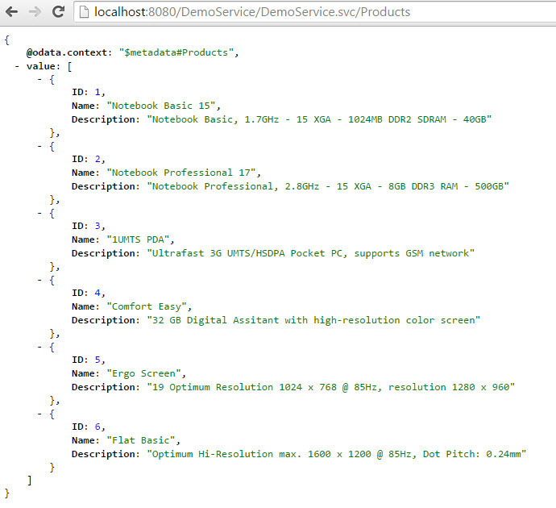
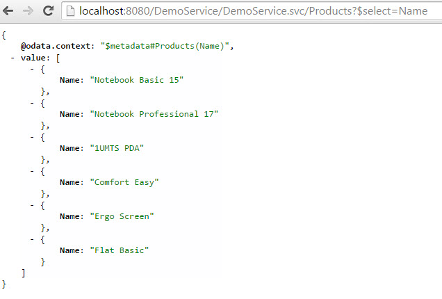
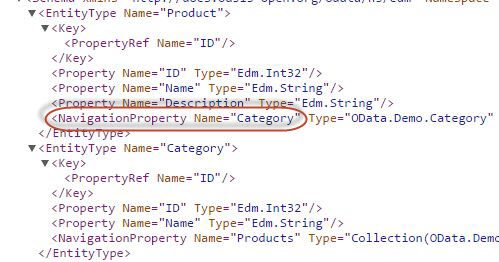
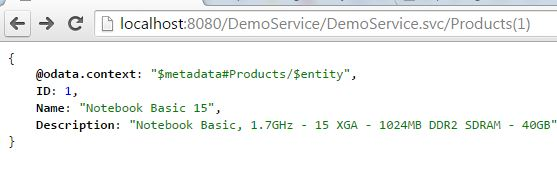
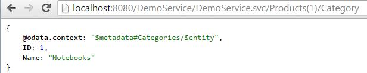
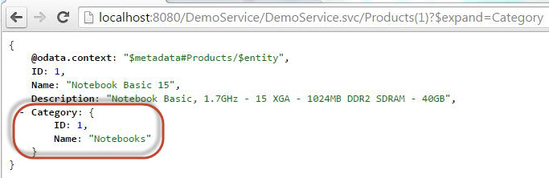
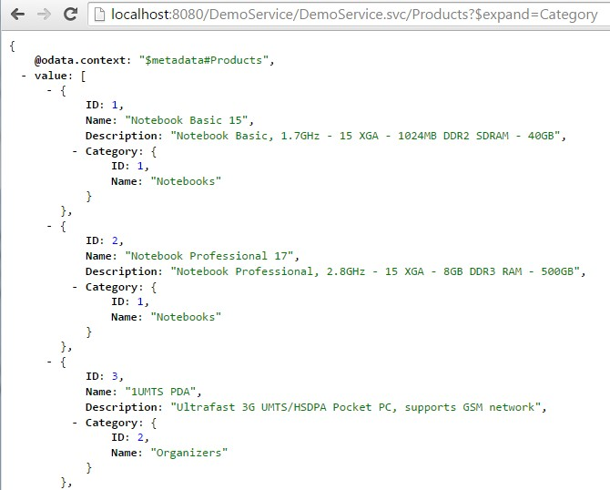

Title:    Tutorial - System Query Options - Select and Expand

# How to build an OData Service with Olingo V4

# Part 5.2: System Query Options: `$select`, `$expand`

## Introduction

In the present tutorial, we will continue implementing **OData system query options**.
After we have learned the rather simple system query options `$top`, `$skip` and `$count` in the previous tutorial, we’re going to deal with `$select` and `$expand` in the present tutorial.


**Note:**  
The final source code can be found in the project [git repository](https://gitbox.apache.org/repos/asf/olingo-odata4).
A detailed description how to checkout the tutorials can be found [here](/doc/odata4/tutorials/prerequisites/prerequisites.html).   
This tutorial can be found in subdirectory *\samples\tutorials\p6_queryoptions-es*

**Disclaimer:**  
Again, in the present tutorial, we’ll focus only on the relevant implementation, in order to keep the code small and simple. The sample code as it is, shouldn’t be reused for advanced scenarios.

**Table of Contents**

  1. Prerequisites
  2. Preparation
  3. Implementating system query options
     1. Implement `$select`
     2. Implement `$expand`
  4. Run the implemented service
  5. Summary
  6. Links


___

# 1. Prerequisites

Same prerequisites as in [Tutorial Part 4: Navigation](doc/odata4/tutorials/navigation/tutorial_navigation.html) as well as basic knowledge about the concepts presented there.

Furthermore, basic knowledge about *System Query Options* (see [Tutorial Part 5.1](doc/odata4/tutorials/sqo_tcs/tutorial_sqo_tcs.html)) is helpful.

___

# 2. Preparation

Follow [Tutorial Part 4: Navigation](doc/odata4/tutorials/navigation/tutorial_navigation.html) or as shortcut import  *Part 4: Navigation* into your Eclipse workspace.

Afterwards do a _Deploy and run_: it should be working.


___


# 3. Implementation

Open the class `myservice.mynamespace.service.DemoEntityProcessor`  
The method `readEntity()` contains the code for navigation which was treated in Tutorial Part 4. In the current tutorial we want to focus on query options and to keep the code as simple as possible, therefore we delete the code of the `readEntity()` method and start from scratch.

## 3.1. Implement `$select`

**Background**  
When requesting an entity collection from the backend, the OData service returns a list of entities and each entity contains a list of properties.  
In some cases, the user might not actually need all the properties. As such, he wants to tell the server to return only those properties that he is interested in.  
OData supports this requirement with the system query option `$select`.  
This parameter can be specified in the following ways:  

  * Specify one property name only: `$select=Name`  
  * Specify a comma-separated list of properties: `$select=Name,Description`
  * Specify a star to include all properties: `$select=*`

**Example**  
First, just to remember how the full payload looks like, the “normal” query of the product without query options:  
<http://localhost:8080/DemoService/DemoService.svc/Products>



The following request provides only one property for each entry in the collection:  
<http://localhost:8080/DemoService/DemoService.svc/Products?$select=Name>  



**Implementation**  
The following section describes how to enable the `EntityProcessor` class and the `readEntity()` method for `$select`.

Because we start from scratch with the empty `readEntity()` method, we have to write a bit preparation code before we start with the implementation of the `$select`.  
The following lines are a copy of the Tutorial Part 2 and are necessary to fetch the data for a single entity.

```java
    // 1. retrieve the Entity Type
    List<UriResource> resourcePaths = uriInfo.getUriResourceParts();
    UriResourceEntitySet uriResourceEntitySet = (UriResourceEntitySet) resourcePaths.get(0);
    EdmEntitySet edmEntitySet = uriResourceEntitySet.getEntitySet();
    // 2. retrieve the data from backend
    List<UriParameter> keyPredicates = uriResourceEntitySet.getKeyPredicates();
    Entity entity = storage.readEntityData(edmEntitySet, keyPredicates);
```


The Olingo library parses the `$select` option from the request and provides support in the serializer to serialize only the selected properties.  
Based on that the simplest implementation for `$select` is to get the `SelectOption` from the request (via `UriInfo` object) and pass this together with the enties to the serializer.  
The drawback of this implementation is, that the full payload is fetched from the backend and afterwards the unnecessary properties are removed. From performance point of view, this is not optimal. It would be better to fetch only the requested properties from the backend. Which of course depends on the backend.  

In this tutorial we use the simple implementation to show the concept for `$select` so that there are only a few steps that have to be done by us.  

  * We have to get the SelectOption from the UriInfo:

```java
        // 3rd: apply system query options
        SelectOption selectOption = uriInfo.getSelectOption();
```

  * We have to take care about the context URL, which is different in case that `$select` is used.
  Again, the Olingo library provides some support, which we use to build the select list that has to be passed to the ContextURL builder:

```java
        // we need the property names of the $select, in order to build the context URL
        String selectList = odata.createUriHelper().buildContextURLSelectList(edmEntityType,
                                                                              null, selectOption);
        ContextURL contextUrl = ContextURL.with()
                                          .entitySet(edmEntitySet)
                                          .selectList(selectList)
                                          .build();
```

  * Furthermore, the serializer has to know about the usage of `$select`.
  Therefore, the serializer options instance is initialized with the selectOption object that we’ve obtained above. If this object is not null, then the serializer will take care to consider the `$select` statement

```java
        EntityCollectionSerializerOptions opts = EntityCollectionSerializerOptions.with()
                                                                                  .contextURL(contextUrl)
                                                                                  .select(selectOption)
                                                                                  .build();
```


**The full implementation of the `readEntityCollection()` method:**

```java
    public void readEntityCollection(ODataRequest request, ODataResponse response,
                        UriInfo uriInfo, ContentType responseFormat)
                          throws ODataApplicationException, SerializerException {

      // 1st retrieve the requested EdmEntitySet from the uriInfo
      List<UriResource> resourcePaths = uriInfo.getUriResourceParts();
      UriResourceEntitySet uriResourceEntitySet = (UriResourceEntitySet) resourcePaths.get(0);
      EdmEntitySet edmEntitySet = uriResourceEntitySet.getEntitySet();

      // 2nd: fetch the data from backend for this requested EntitySetName  
      EntityCollection entityCollection = storage.readEntitySetData(edmEntitySet);

      // 3rd: apply system query options
      // Note: $select is handled by the lib, we only configure ContextURL + SerializerOptions
      // for performance reasons, it might be necessary to implement the $select manually
      SelectOption selectOption = uriInfo.getSelectOption();

      // 4th: create a serializer based on the requested format (json)
      ODataSerializer serializer = odata.createSerializer(responseFormat);

      // and serialize the content: transform from the EntitySet object to InputStream
      EdmEntityType edmEntityType = edmEntitySet.getEntityType();
      // we need the property names of the $select, in order to build the context URL
      String selectList = odata.createUriHelper().buildContextURLSelectList(edmEntityType,
                                                                            null, selectOption);
      ContextURL contextUrl = ContextURL.with()
                                        .entitySet(edmEntitySet)
                                        .selectList(selectList)
                                        .build();


      // adding the selectOption to the serializerOpts will tell the lib to do the job
      final String id = request.getRawBaseUri() + "/" + edmEntitySet.getName();
      EntityCollectionSerializerOptions opts = EntityCollectionSerializerOptions.with()
                                                                                .contextURL(contextUrl)
                                                                                .select(selectOption)
                                                                                .id(id)
                                                                                .build();

      SerializerResult serializerResult = serializer.entityCollection(srvMetadata, edmEntityType,
                                                                          entityCollection, opts);

      // 5th: configure the response object: set the body, headers and status code
      response.setContent(serializerResult.getContent());
      response.setStatusCode(HttpStatusCode.OK.getStatusCode());
      response.setHeader(HttpHeader.CONTENT_TYPE, responseFormat.toContentTypeString());
    }
```


## 3.2. Implement `$expand`

**Background**

In order to understand the `$expand` system query option, let’s first quickly recap what we’ve learned in the navigation-tutorial:

  1. In order to be able to navigate from one entity to another entity, we need at least 2 EntityTypes and at least one NavigationProperty  
      

  1. We can invoke one single entity, e.g. display one product:  
      

  1. And we can follow the navigation to the second entity, by appending the navigation property name, e.g. invoke the category of that product.
  As we’ve seen in the metadata above, the name of the navigation property is *Category*  
      

We have executed two requests to our OData service, in order to obtain the data for the product and for its related category.  
Now, since the category info is so tightly bound to the selected product, we’d like to get the same info by executing only **one** request.

This can be achieved with the `$expand`  

The URL is built as follows:  

  * specify the request URI for the single read operation: <http://localhost:8080/DemoService/DemoService.svc/Products(1)>  
  * append the `?` to indicate that system query options will follow  
  * append the `$expand`  
  * specify the name of the desired navigation property:  <http://localhost:8080/DemoService/DemoService.svc/Products(1)?$expand=Category>  

As a result, the data of both entities is provided within one payload.  
The data of the target entity is presented *inline*, which means as a child element of the source entity.  



One more advantage is that the system query option `$expand` can also be applied to an entity collection:



More details can be found in the [OData specification - Protocol](http://docs.oasis-open.org/odata/odata/v4.0/errata02/os/complete/part1-protocol/odata-v4.0-errata02-os-part1-protocol-complete.html#_Toc406398298) and [OData specification - Url Conventions](http://docs.oasis-open.org/odata/odata/v4.0/errata02/os/complete/part2-url-conventions/odata-v4.0-errata02-os-part2-url-conventions-complete.html#_Toc406398162)


**Implementation**  

In the following section, we’ll focus on the implementation of the `$expand` for a single entity request e.g. <http://localhost:8080/DemoService/DemoService.svc/Products(1)?$expand=Category>

**Note:**  
The implementation for the entity collection is the same, just that we have to loop over all entities and apply the below code to each of them.

In brief, what we have to do is: fetch the data for both entities and merge into one entity

We can distinguish the following steps:  

  1. Retrieve the ExpandOption from Uri.  
  In our example: `$expand=Category`  
  2. Retrieve the (target) EdmEntityType which corresponds to the expand.  
  In our example: *Category*  
  3. Build the response data for the entity, enriched with the data of the expand entity.  
  In our example: *product1* merged with *category1*  

Let's have a detailed look.

##### Step 1: Retrieve the ExpandOption from Uri  

We need the retrieve the ExpandOption from the UriInfo:  

```java
    ExpandOption expandOption = uriInfo.getExpandOption();
```

As usual, if this object is `null`, then the user hasn’t used the `$expand` in his request, and we don’t need to do anything.


##### Step 2: Retrieve the EdmEntityType corresponding to the expand

In brief: `ExpandOption` -> `NavigationProperty` -> `EdmEntityType`  

From the `ExpandOption`, we can get the ExpandItems.  
An `ExpandItem` corresponds to the name of the navigation property.  
So for the URL <http://localhost:8080/DemoService/DemoService.svc/Products?$expand=Category> we get one `ExpandItem`, which corresponds to the navigation property *Category*.  

In the present tutorial, we’re keeping the implementation as simple as possible.
So we’re relying on the fact that our example service only contains one navigation property per entity type.
Therefore, we can directly access the first `ExpandItem`.  

```java
    ExpandItem expandItem = expandOption.getExpandItems().get(0);
```

**Note:**  
Most OData services will have more entity types and more navigation possibilities. In such services, it might be desired to invoke `$expand` with more than one navigation property, like for example: <http://localhost:8080/DemoService/DemoService.svc/Products?$expand=Category,Supplier,Sales>  
Such `$expand` expression is not considered in our example.  


Now that we have the `ExpandItem`, the next step is to extract the navigation property (`EdmNavicationProperty`) from it.  

For the case of a request with `$expand=*` (to expand all navigation items which is checked via `expandItem.isStar()`), all known `EdmNavigationPropertyBinding`s from the expanded `EdmEntityType` have to be checked.
For our (reduced) sample service we know that only one navigation exists, hence the implementation is:

```java
    if(expandItem.isStar()) {
      List<EdmNavigationPropertyBinding> bindings = edmEntitySet.getNavigationPropertyBindings();
      // we know that there are navigation bindings
      // however normally in this case a check if navigation bindings exists is done
      if(!bindings.isEmpty()) {
        // can in our case only be 'Category' or 'Products', so we can take the first
        EdmNavigationPropertyBinding binding = bindings.get(0);
        EdmElement property = edmEntitySet.getEntityType().getProperty(binding.getPath());
        // we don't need to handle error cases, as it is done in the Olingo library
        if(property instanceof EdmNavigationProperty) {
          edmNavigationProperty = (EdmNavigationProperty) property;
        }
      }
    } else {
    ...
```

For the case of a request with defined name of navigation property to expand (e.g. `$expand=Category`), we have to ask the ExpandItem for its list if resource segments.  
The reason why an ExpandItem can be formed by multiple segments is that a navigation property can be in a `ComplexType`, such that it would be required to address it by a path.  

In our simple example, we don’t need to specify a path, therefore we can safely write  

```java
    ...
    } else {
      // can be 'Category' or 'Products', no path supported
      UriResource uriResource = expandItem.getResourcePath().getUriResourceParts().get(0);
      // we don't need to handle error cases, as it is done in the Olingo library
      if(uriResource instanceof UriResourceNavigation) {
        edmNavigationProperty = ((UriResourceNavigation) uriResource).getProperty();
      }
    }
```

This `uriResource` corresponds to the navigation property that we want to extract.  
We expect that the `uriResource` is of type `UriResourceNavigation`, such that we can cast.  
The `UriResourceNavigation` can then be asked for the `NavigationProperty` which in turn delivers the corresponding `EdmEntityType`, which we’re interested in.

Finally after one of above cases we have the necessary `EdmNavigationProperty` from which we need the `EdmEntityType` and the `name` of the navigation property to build the resopnse data.

```java
    if(edmNavigationProperty != null) {
      EdmEntityType expandEdmEntityType = edmNavigationProperty.getType();
      String navPropName = edmNavigationProperty.getName();
      ...
```

##### Step 3: Build the response data

Lets follow our example.
As we have said, we have to merge the data of two entities.  
The first one, the product, is already fetched, as we’ve done that earlier in the code:  

```java
    Entity entity = storage.readEntityData(edmEntitySet, keyPredicates);
```

This entity corresponds to the product.

Now we’re ready to fetch the category, as we’ve already retrieved the `EdmEntityType` from the expand expression.  
We can invoke a helper method that we created in Tutorial Part 4 (Navigation), a helper method that is located in our database-mock and that returns the category entity corresponding to a given product entity:  

```java
    Entity expandEntity = storage.getRelatedEntity(entity, expandEdmEntityType);
```

In our example, this `expandEntity` contains the data of the related category.  

Now we have to merge both entities.  
This is done via a `Link` object that contains the inline entity object.  
And the link is added to the source entity.  
The relevant code is:  

```java
    Link link = new Link();
    link.setTitle(navPropName);
    link.setInlineEntity(expandEntity);
    entity.getNavigationLinks().add(link);
```

**Note:**  
It is important to set the correct navigation property name, otherwise the linking doesn’t work and the inline data cannot be displayed.


##### Final step
Now that the response data has been built, we need to tell the serializer to consider the expand, otherwise the data will not be displayed.  
Also, the `expandOption` has to be considered while building the `ContextUrl`.  

```java
    String selectList = odata.createUriHelper().buildContextURLSelectList(
                                                edmEntityType, expandOption, selectOption);
    ContextURL contextUrl = ContextURL.with()
                                      .entitySet(edmEntitySet)
                                      .selectList(selectList)
                                      .suffix(Suffix.ENTITY).build();

    // make sure that `$expand` and $select are considered by the serializer
    // adding the selectOption to the serializerOpts will actually tell the lib to do the job
    final String id = request.getRawBaseUri() + "/" + edmEntitySet.getName();
    EntitySerializerOptions opts = EntitySerializerOptions.with()
                                                          .contextURL(contextUrl)
                                                          .select(selectOption)
                                                          .expand(expandOption)
                                                          .id(id)
                                                          .build();
```

**Note:**  
The complete `readEntity(...)` method can be found in the *Appendix* at the end of the site or together with the `readEntityCollection(...)` method in the [sample project zip](http://www.apache.org/dyn/closer.cgi/olingo/odata4/Tutorials/DemoService_Tutorial_sqo_es.zip) ([md5](https://dist.apache.org/repos/dist/release/olingo/odata4/Tutorials/DemoService_Tutorial_sqo_es.zip.md5), [sha512](https://dist.apache.org/repos/dist/release/olingo/odata4/Tutorials/DemoService_Tutorial_sqo_es.zip.sha512), [pgp](https://dist.apache.org/repos/dist/release/olingo/odata4/Tutorials/DemoService_Tutorial_sqo_es.zip.asc)).

## 3.3. Implement `$expand` with options

**Background**

As of OData v4 spec, the expand can also be further refined with system query options  

Some samples:

  * Expand an navigation with only the first entity:
    * <http://localhost:8080/DemoService/DemoService.svc/Categories?$expand=Products($top=1)>  
        
  * A common use case would be the following request, where all products are displayed along with their corresponding category, but only the interesting properties:  
    * <http://localhost:8080/DemoService/DemoService.svc/Products?$select=Name,Description&$expand=Category($select=Name)>  

  * With respect to the system query options that are applied to the expand, multiple options are allowed, which are separated by semicolon, e.g.  
    * <http://localhost:8080/DemoService/DemoService.svc/Categories(1)?$expand=Products($top=1;$select=Name)>  

  * The $select option can itself define a list of comma-separated properties:  
    * <http://localhost:8080/DemoService/DemoService.svc/Categories(1)?$expand=NavToProducts($top=1;$select=Name,Description)>  


**Implementation**

The code for applying system query options to the `$expand` is similar to what is described in the Tutorial Part 5.1.
We only need to know from where to get the information about the query options used in the request URL:   It is located in the `ExpandItem` instance.

The procedure is:

  * Get the data for the navigation property (the normal expand)  
  * Refine the result by applying the system query options  

**Support for `$select` with `$expand`**  
Like described in section 3.1, the Olingo library provides support and convenience methods for `$select` implementation. So the necessary creation and pass of the `selectList` to the creation of `ContextURL` and pass of the `selectOptions` to the `EntitySerializerOptions` is already done (see also code sample in the final step in section 3.2).  

---

# 4. Run the implemented service

After building and deploying your service to your server, you can try the following URLs:  

  * The “normal” payload without query option  
    * <http://localhost:8080/DemoService/DemoService.svc/Products(1)>

  * Using `$select`  
    * <http://localhost:8080/DemoService/DemoService.svc/Products(1)?$select=Name>
    * <http://localhost:8080/DemoService/DemoService.svc/Products(1)?$select=Description>
    * <http://localhost:8080/DemoService/DemoService.svc/Products(1)?$select=Name,Description>
    * <http://localhost:8080/DemoService/DemoService.svc/Products(1)?$select=*>
    * <http://localhost:8080/DemoService/DemoService.svc/Categories(1)?$select=Name>

  * Using `$expand`
    * <http://localhost:8080/DemoService/DemoService.svc/Products(1)?$expand=Category>  
    * <http://localhost:8080/DemoService/DemoService.svc/Products(1)?$expand=Category>  
    * <http://localhost:8080/DemoService/DemoService.svc/Categories(1)?$expand=Products>  
    * <http://localhost:8080/DemoService/DemoService.svc/Categories(1)?$expand=*>

  * Using `$select` and `$expand`  
    * <http://localhost:8080/DemoService/DemoService.svc/Products(1)?$select=Name&$expand=Category>  

  * Using `$expand` with nested `$select`  
  We’re interested in *Product* and the name of its *Category*
    * <http://localhost:8080/DemoService/DemoService.svc/Products(1)?$expand=Category($select=Name)>
    * <http://localhost:8080/DemoService/DemoService.svc/Products(1)?$expand=Category($select=Name,ID)>

  * Using `$select` and `$expand` with nested $select  
  We’re interested in *Product* and its *Category*, but only the *name* of both  
    * <http://localhost:8080/DemoService/DemoService.svc/Products(1)?$select=Name&$expand=Category($select=Name)>


**Note:**
The same system query option expressions can be applied to entity collections  

---

# 5. Summary

In this tutorial we have learned the basics of the `$select` and `$expand` *system query options* within the OData context as well as how to implement those features with the *Apache Olingo library* by using the provided convenience and support methods.

---

# 6. Links

### Tutorials
  * Tutorial OData V4 service part 1: [Read Entity Collection](/doc/odata4/tutorials/read/tutorial_read.html)
  * Tutorial OData V4 service part 2: [Read Entity, Read Property](/doc/odata4/tutorials/readep/tutorial_readep.html)
  * Tutorial OData V4 service part 3: [Write (Create, Update, Delete Entity)](/doc/odata4/tutorials/write/tutorial_write.html)
  * Tutorial OData V4 service, part 4: [Navigation](/doc/odata4/tutorials/navigation/tutorial_navigation.html)
  * Tutorial OData V4 service, part 5.1: [System Query Options $top, $skip, $count (this page)](/doc/odata4/tutorials/sqo_tcs/tutorial_sqo_tcs.html)
  * Tutorial OData V4 service, part 5.2: System Query Options $select, $expand (this page)
  * Tutorial OData V4 service, part 5.3: [System Query Options $orderby](/doc/odata4/tutorials/sqo_o/tutorial_sqo_o.html)
  * Tutorial OData V4 service, part 5.4: [System Query Options $filter](/doc/odata4/tutorials/sqo_f/tutorial_sqo_f.html)
  * Tutorial ODATA V4 service, part 6: [Action and Function Imports](/doc/odata4/tutorials/action/tutorial_action.html)
  * Tutorial ODATA V4 service, part 7: [Media Entities](/doc/odata4/tutorials/media/tutorial_media.html)
  * Tutorial OData V4 service, part 8: [Batch Request support](/doc/odata4/tutorials/batch/tutorial_batch.html)
  * Tutorial OData V4 service, part 9: [Handling "Deep Insert" requests](/doc/odata4/tutorials/deep_insert/tutorial_deep_insert.html)
  
### Code and Repository
  * [Git Repository](https://gitbox.apache.org/repos/asf/olingo-odata4)
  * [Guide - To fetch the tutorial sources](/doc/odata4/tutorials/prerequisites/prerequisites.html)
  * [Demo Service source code as zip file (contains all tutorials)](http://www.apache.org/dyn/closer.lua/olingo/odata4/4.6.0/DemoService_Tutorial.zip)

### Further reading

  * [Official OData Homepage](http://odata.org/)
  * [OData documentation](http://www.odata.org/documentation/)
  * [Olingo Javadoc](/javadoc/odata4/index.html)

# 7. Appendix

### Sample code snippets

**readEntity(...)**

```java
    public void readEntity(ODataRequest request, ODataResponse response, UriInfo uriInfo, ContentType responseFormat)
            throws ODataApplicationException, SerializerException {

      // 1. retrieve the Entity Type
      List<UriResource> resourcePaths = uriInfo.getUriResourceParts();
      // Note: only in our example we can assume that the first segment is the EntitySet
      UriResourceEntitySet uriResourceEntitySet = (UriResourceEntitySet) resourcePaths.get(0);
      EdmEntitySet edmEntitySet = uriResourceEntitySet.getEntitySet();

      // 2. retrieve the data from backend
      List<UriParameter> keyPredicates = uriResourceEntitySet.getKeyPredicates();
      Entity entity = storage.readEntityData(edmEntitySet, keyPredicates);

      // 3. apply system query options

      // handle $select
      SelectOption selectOption = uriInfo.getSelectOption();
      // in our example, we don't have performance issues, so we can rely upon the handling in the Olingo lib
      // nothing else to be done

      // handle $expand
      ExpandOption expandOption = uriInfo.getExpandOption();
      // in our example: http://localhost:8080/DemoService/DemoService.svc/Categories(1)/$expand=Products
      // or http://localhost:8080/DemoService/DemoService.svc/Products(1)?$expand=Category
      if(expandOption != null) {
        // retrieve the EdmNavigationProperty from the expand expression
        // Note: in our example, we have only one NavigationProperty, so we can directly access it
        EdmNavigationProperty edmNavigationProperty = null;
        ExpandItem expandItem = expandOption.getExpandItems().get(0);
        if(expandItem.isStar()) {
          List<EdmNavigationPropertyBinding> bindings = edmEntitySet.getNavigationPropertyBindings();
          // we know that there are navigation bindings
          // however normally in this case a check if navigation bindings exists is done
          if(!bindings.isEmpty()) {
            // can in our case only be 'Category' or 'Products', so we can take the first
            EdmNavigationPropertyBinding binding = bindings.get(0);
            EdmElement property = edmEntitySet.getEntityType().getProperty(binding.getPath());
            // we don't need to handle error cases, as it is done in the Olingo library
            if(property instanceof EdmNavigationProperty) {
              edmNavigationProperty = (EdmNavigationProperty) property;
            }
          }
        } else {
          // can be 'Category' or 'Products', no path supported
          UriResource uriResource = expandItem.getResourcePath().getUriResourceParts().get(0);
          // we don't need to handle error cases, as it is done in the Olingo library
          if(uriResource instanceof UriResourceNavigation) {
            edmNavigationProperty = ((UriResourceNavigation) uriResource).getProperty();
          }
        }

        // can be 'Category' or 'Products', no path supported
        // we don't need to handle error cases, as it is done in the Olingo library
        if(edmNavigationProperty != null) {
          EdmEntityType expandEdmEntityType = edmNavigationProperty.getType();
          String navPropName = edmNavigationProperty.getName();

          // build the inline data
          Link link = new Link();
          link.setTitle(navPropName);
          link.setType(Constants.ENTITY_NAVIGATION_LINK_TYPE);
          link.setRel(Constants.NS_ASSOCIATION_LINK_REL + navPropName);

          if(edmNavigationProperty.isCollection()){ // in case of Categories(1)/$expand=Products
            // fetch the data for the $expand (to-many navigation) from backend
            // here we get the data for the expand
            EntityCollection expandEntityCollection = storage.getRelatedEntityCollection(entity, expandEdmEntityType);
            link.setInlineEntitySet(expandEntityCollection);
            link.setHref(expandEntityCollection.getId().toASCIIString());
          } else {  // in case of Products(1)?$expand=Category
            // fetch the data for the $expand (to-one navigation) from backend
            // here we get the data for the expand
            Entity expandEntity = storage.getRelatedEntity(entity, expandEdmEntityType);
            link.setInlineEntity(expandEntity);
            link.setHref(expandEntity.getId().toASCIIString());
          }

          // set the link - containing the expanded data - to the current entity
          entity.getNavigationLinks().add(link);
        }
      }


      // 4. serialize
      EdmEntityType edmEntityType = edmEntitySet.getEntityType();
      // we need the property names of the $select, in order to build the context URL
      String selectList = odata.createUriHelper().buildContextURLSelectList(edmEntityType, expandOption, selectOption);
      ContextURL contextUrl = ContextURL.with().entitySet(edmEntitySet)
                                                .selectList(selectList)
                                                .suffix(Suffix.ENTITY)
                                                .build();

      // make sure that $expand and $select are considered by the serializer
      // adding the selectOption to the serializerOpts will actually tell the lib to do the job
      EntitySerializerOptions opts = EntitySerializerOptions.with()
                                                            .contextURL(contextUrl)
                                                            .select(selectOption)
                                                            .expand(expandOption)
                                                            .build();

      ODataSerializer serializer = this.odata.createSerializer(responseFormat);
      SerializerResult serializerResult = serializer.entity(srvMetadata, edmEntityType, entity, opts);

      // 5. configure the response object
      response.setContent(serializerResult.getContent());
      response.setStatusCode(HttpStatusCode.OK.getStatusCode());
      response.setHeader(HttpHeader.CONTENT_TYPE, responseFormat.toContentTypeString());
    }
```