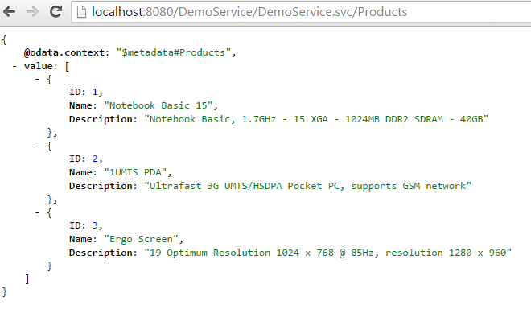
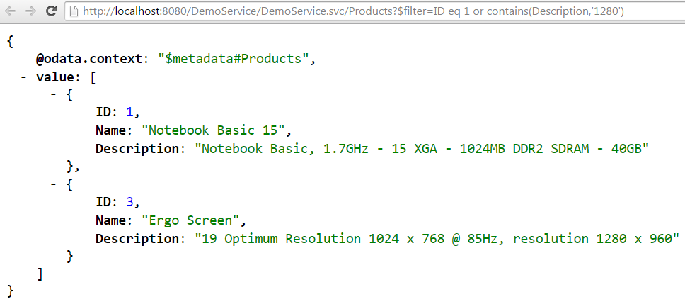
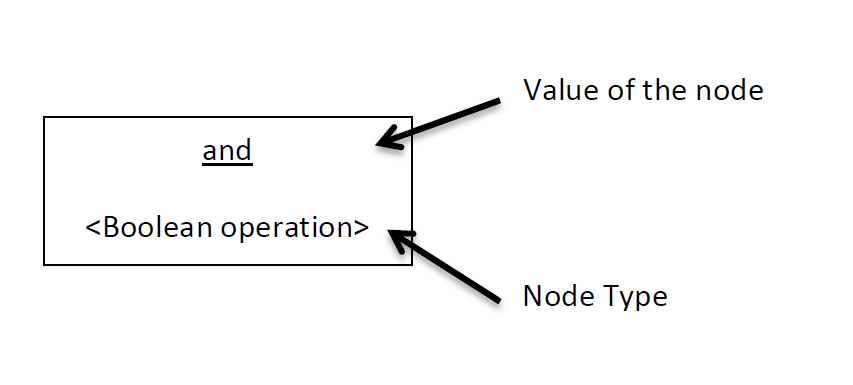

Title:    Tutorial - System Query Options - Filter

# How to build an OData Service with Olingo V4

# Part 5.4: System Query Options: `$filter`

## Introduction

In the present tutorial, we’ll continue implementing OData system query options, this time focusing on `$filter`

**Note:**
The final source code can be found in the project [git repository](https://gitbox.apache.org/repos/asf/olingo-odata4).
A detailed description how to checkout the tutorials can be found [here](/doc/odata4/tutorials/prerequisites/prerequisites.html).   
This tutorial can be found in subdirectory *\samples\tutorials\p8_queryoptions-f*

**Table of Contents**

  1. Preparation
  2. Implementation
    1. Implement `$filter`
  3. Run the implemented service
  4. Summary
  5. Links

# 1. Preparation

Follow [Tutorial Part 1: Read Entity Collection](doc/odata4/tutorials/read/tutorial_read.html) and [Tutorial Part 2: Read Entity](doc/odata4/tutorials/readep/tutorial_readep.html) or as shortcut import *Part 2: Read Entity, Read Property* into your Eclipse workspace.

Afterwards do a _Deploy and run_: it should be working.

# 2. Implementation

The system query options we’re focusing on are applied to the entity collection only, therefore our
implementation for the `$filter` query options is done in the class
`myservice.mynamespace.service.DemoEntityCollectionProcessor`

The general sequence is again:

  1. Analyze the URI
  2. Fetch data from backend
  3. Apply the system query option
  4. Serialize
  5. Configure the response

### 2.1 Implement `$filter`

#### Background

When requesting a list of entities from a service, the default behaviour is to return all entities on the list. The consumer of an OData service might want to be able to receive a subset by specifying certain criteria which each of the returned entities have to fulfill.  
For example, a common use case would be to request all products with a specified minimum and maximum price.
OData supports this requirement with the system query option `$filter`

It is specified as follows:

    $filter=<BooleanExpression>

See here for more details:   
[OData Version 4.0 Part 1: Protocol Plus Errata 02](http://docs.oasis-open.org/odata/odata/v4.0/errata02/os/complete/part1-protocol/odata-v4.0-errata02-os-part1-protocol-complete.html#_Toc406398301)

[OData Version 4.0 Part 2: URL Conventions Plus Errata 02](http://docs.oasis-open.org/odata/odata/v4.0/errata02/os/complete/part2-url-conventions/odata-v4.0-errata02-os-part2-url-conventions-complete.html#_Toc406398094)

The expression given by the `$filter` query option has to return a Boolean value when applied to a certain entity on the entity list. If the value returned for a given entity is *“true”*, the service has to return the entity. Otherwise the service has to discard the entity.

**Example**

First, just to remember how the full payload looks like, the “normal” query of the product:

[http://localhost:8080/DemoService/DemoService.svc/Products](http://localhost:8080/DemoService/DemoService.svc/Products)

Now have a look to the following Uri:  
[http://localhost:8080/DemoService/DemoService.svc/Products?$filter=ID eq 1 or contains(Description,'1280')]([http://localhost:8080/DemoService/DemoService.svc/Products?$filter=ID eq 1 or contains(Description,'1280'))

The `$filter` system query option has been applied to the Products Entity Collection. The client requests all products which fulfills the following condition: ID equals to one or the Description should contain the string ‘1280’

**Visitor pattern**

First things first, the Uri parser creates an *abstract syntax tree* (AST).  An abstract syntax tree describes the expression in a hierarchical way. (see figure 1) For example to calculate the root node, all nodes below have to be calculated first. The idea is to traverse the tree in pre order (depth-first).

Consider the following Uri

    “/Products?$format=(Price lt 2000) and contains(Description,’Notebook’)”.

As you can see, the intention is to request all Products, which costs less than 2000 monetary units and contains the word ‘Notebook’ in their description. The expression is split up in two parts by the binary operator “and”.  To calculate the result of the “and” node, the left and also the right child have to be calculated first. The left child itself is another binary operation. So to calculate “less than” the type and value of the property “Price” has to be determined. And so on...

")

Key  

So the following actions have to be done (The values of the properties are fictitious):

Action                                                        | Result - Type | Result              | Method
--------------------------------------------------------------|---------------|---------------------|------
1. Get the value of the property “Price”                      | Edm.Double    | 500.00              | visitMember
2. Determine the Type and value of the literal 2000.00        | Edm.Double    | 2000.00             | visitLiteral
3. Calculate – 500.00 **lt** 2000                             | Edm.Boolean   | true                | visitBinaryOperator
4. Get the value of the Property “Description”                | Edm.String    | "Notebook basic..." | visitMember
5. Determine the type and value of the literal ‘Notebook’     | Edm.String    | “Notebook”          | visitLiteral
6. Calculate – **contains**(“Notebook Basic…”, “Notebook”)    | Edm.Boolean   | true                | visitMethodCall
7. Calculate – true **and** true                              | Edm.Boolean   | true                | visitBinaryOperator

Olingo uses the vistor pattern to traverse the AST. Each of these actions is mapped to one method of the ExpressionVistor interface. You can see the name of the methods in last column of table 1. As service developers we have to implement this methods but we do not have to take care about calling them. The libaray will call the proper method and we have only to calculate the result.

#### Implementation

First we will create the *Filter Expression Visitor* and after that, we will integrate the just created Visitor in `EntityCollectionProcessor`.

**1.1 Create our FilterExpressionVisitor**

Create a new class `FilterExpressionVisitor` in package `myservice.mynamespace.service` and  
implement the Interface `org.apache.olingo.server.api.uri.queryoption.expression.ExpressionVisitor`.

As you mentioned the interface needs a generic parameter.
This generic type is used as (return) parameter for the visitXXX methods (e.g. `visitLiteral` ). It is up to your implementation to
choose a proper type for your use case. The main task is to keep track of the type and also the return value of a node in the abstract syntax tree.
In real world scenarios it is common to build a statement to query a database or backend instead modifying the preloaded data.

In this tutorial we will use just `Object` and pass the native Java values around.

~~~java
public class FilterExpressionVisitor implements ExpressionVisitor<Object> {
~~~

Please create also a constructor to pass an entity to our visitor implementation.

~~~java
private Entity currentEntity;

public FilterExpressionVisitor(Entity currentEntity) {
    this.currentEntity = currentEntity;
}
~~~

**1.2 Implement the interface**

In this basic tutorial we will implement only a subset of the Expression Visitor.
The following methods will **not** be implemented. Add an `ODataApplicationException` to their bodies:

  - `public Object visitTypeLiteral(EdmType type)`
  - `public Object visitAlias(String aliasName)`
  - `public Object visitEnum(EdmEnumType type, List<String> enumValues)`
  - `public Object visitLambdaExpression(String lambdaFunction, String lambdaVariable, Expression expression)`
  - `public Object visitLambdaReference(String variableName)`

**Example**

~~~java
@Override
public Object visitTypeLiteral(EdmType type) throws ExpressionVisitException, ODataApplicationException {
    throw new ODataApplicationException("Type literals are not implemented",
        			HttpStatusCode.NOT_IMPLEMENTED.getStatusCode(), Locale.ENGLISH);
}
~~~

**Implement method visitMember**  
This method is been called if the current node in the AST is a property. So all we have to do is to take the current entity and return the value of the addressed property.

~~~java
public Object visitMember(UriInfoResource member) throws ExpressionVisitException, ODataApplicationException {
    // To keeps things simple, this tutorial allows only primitive properties.
    // We have faith that the java type of Edm.Int32 is Integer
    final List<UriResource> uriResourceParts = member.getUriResourceParts();

    // Make sure that the resource path of the property contains only a single segment and a
    // primitive property has been addressed. We can be sure, that the property exists because  
    // the UriParser checks if the property has been defined in service metadata document.

    if(uriResourceParts.size() == 1 && uriResourceParts.get(0) instanceof UriResourcePrimitiveProperty) {
      UriResourcePrimitiveProperty uriResourceProperty = (UriResourcePrimitiveProperty) uriResourceParts.get(0);
      return currentEntity.getProperty(uriResourceProperty.getProperty().getName()).getValue();
    } else {
      // The OData specification allows in addition complex properties and navigation    
      // properties with a target cardinality 0..1 or 1.
      // This means any combination can occur e.g. Supplier/Address/City
      //  -> Navigation properties  Supplier
      //  -> Complex Property       Address
      //  -> Primitive Property     City
      // For such cases the resource path returns a list of UriResourceParts
      throw new ODataApplicationException("Only primitive properties are implemented in filter
          expressions", HttpStatusCode.NOT_IMPLEMENTED.getStatusCode(), Locale.ENGLISH);
    }
}
~~~

**Implement method visitLiteral**

The next method takes a String and has to return the type and also the value of literal.  

**Example**  

  - "`‘1’`" is a string with the value "`1`"
  - "`1`"   could be an Edm.Byte, Edm.SByte, Edm.Int16, Edm.Int32, Edm.Int64, Edm.Single, Edm.Double, Edm.Decimal with value 1

As you can see in this little example, it can be difficult to guess the right type. In this tutorial we will focus on Edm.Int32.

In real world scenarios, there is something called “numeric promotion”, which converts numbers to the next higher type. [OData Version 4.0 Part 2: URL Conventions Plus Errata 02](http://docs.oasis-open.org/odata/odata/v4.0/errata02/os/complete/part2-url-conventions/odata-v4.0-errata02-os-part2-url-conventions-complete.html#_Toc406398161)

~~~java
@Override
public Object visitLiteral(Literal literal) throws ExpressionVisitException, ODataApplicationException {
    // To keep this tutorial simple, our filter expression visitor supports only Edm.Int32 and Edm.String
    // In real world scenarios it can be difficult to guess the type of an literal.
    // We can be sure, that the literal is a valid OData literal because the URI Parser checks
    // the lexicographical structure
     // String literals start and end with an single quotation mark
    String literalAsString = literal.getText();
    if(literal.getType() instanceof EdmString) {
        String stringLiteral = "";
        if(literal.getText().length() > 2) {
            stringLiteral = literalAsString.substring(1, literalAsString.length() - 1);
        }

        return stringLiteral;
    } else {
        // Try to convert the literal into an Java Integer
        try {
            return Integer.parseInt(literalAsString);
        } catch(NumberFormatException e) {
            throw new ODataApplicationException("Only Edm.Int32 and Edm.String literals are implemented",
                HttpStatusCode.NOT_IMPLEMENTED.getStatusCode(), Locale.ENGLISH);
        }
    }
}
~~~

**Implement the operators**

The first two implemented methods dealt on the leaves of the AST. Now we will implement the operations, which can be performed on these values.

The idea behind the implementation is always the same.

  1. Check if the types fit together
  2. If true => Calculate and return the result
  3. Otherwise => Throw an `ODataApplicationException` with StatusCode 400 Bad Request

OData supports two different unary operators. First there is the binary negation (*not*) and second the arithmetic minus (*-*).

~~~java
public Object visitUnaryOperator(UnaryOperatorKind operator, Object operand)
      throws ExpressionVisitException, ODataApplicationException {
    // OData allows two different unary operators. We have to take care, that the type of the
    // operand fits to the operand

    if(operator == UnaryOperatorKind.NOT && operand instanceof Boolean) {
      // 1.) boolean negation
      return !(Boolean) operand;
    } else if(operator == UnaryOperatorKind.MINUS && operand instanceof Integer){
      // 2.) arithmetic minus
      return -(Integer) operand;
    }

    // Operation not processed, throw an exception
    throw new ODataApplicationException("Invalid type for unary operator",
        HttpStatusCode.BAD_REQUEST.getStatusCode(), Locale.ENGLISH);
}
~~~

Next are the binary operations.  Have a look at the source code comments for a detailed explanation.´

~~~java
@Override
public Object visitBinaryOperator(BinaryOperatorKind operator, Object left, Object right)     
            throws ExpressionVisitException, ODataApplicationException {

    // Binary Operators are split up in three different kinds. Up to the kind of the
    // operator it can be applied to different types
    //   - Arithmetic operations like add, minus, modulo, etc. are allowed on numeric
    //     types like Edm.Int32
    //   - Logical operations are allowed on numeric types and also Edm.String
    //   - Boolean operations like and, or are allowed on Edm.Boolean
    // A detailed explanation can be found in OData Version 4.0 Part 2: URL Conventions

    if (operator == BinaryOperatorKind.ADD
        || operator == BinaryOperatorKind.MOD
        || operator == BinaryOperatorKind.MUL
        || operator == BinaryOperatorKind.DIV
        || operator == BinaryOperatorKind.SUB) {
      return evaluateArithmeticOperation(operator, left, right);
    } else if (operator == BinaryOperatorKind.EQ
        || operator == BinaryOperatorKind.NE
        || operator == BinaryOperatorKind.GE
        || operator == BinaryOperatorKind.GT
        || operator == BinaryOperatorKind.LE
        || operator == BinaryOperatorKind.LT) {
      return evaluateComparisonOperation(operator, left, right);
    } else if (operator == BinaryOperatorKind.AND
        || operator == BinaryOperatorKind.OR) {
      return evaluateBooleanOperation(operator, left, right);
    } else {
      throw new ODataApplicationException("Binary operation " + operator.name() + " is not
           implemented", HttpStatusCode.NOT_IMPLEMENTED.getStatusCode(), Locale.ENGLISH);
    }
}

private Object evaluateBooleanOperation(BinaryOperatorKind operator, Object left, Object right)
 	    throws ODataApplicationException {

    // First check that both operands are of type Boolean
    if(left instanceof Boolean && right instanceof Boolean) {
       Boolean valueLeft = (Boolean) left;
       Boolean valueRight = (Boolean) right;

       // Than calculate the result value
       if(operator == BinaryOperatorKind.AND) {
           return valueLeft && valueRight;
       } else {
           // OR
           return valueLeft || valueRight;
       }
   } else {
       throw new ODataApplicationException("Boolean operations needs two numeric operands",
                 HttpStatusCode.BAD_REQUEST.getStatusCode(), Locale.ENGLISH);
   }
}

private Object evaluateComparisonOperation(BinaryOperatorKind operator, Object left, Object right) throws ODataApplicationException {

    // All types in our tutorial supports all logical operations, but we have to make sure that   
    // the types are equal
    if(left.getClass().equals(right.getClass())) {
      // Luckily all used types String, Boolean and also Integer support the interface
      // Comparable
      int result;
      if(left instanceof Integer) {
        result = ((Comparable<Integer>) (Integer) left).compareTo((Integer) right);
      } else if(left instanceof String) {
        result = ((Comparable<String>) (String) left).compareTo((String) right);
      } else if(left instanceof Boolean) {
        result = ((Comparable<Boolean>) (Boolean) left).compareTo((Boolean) right);
      } else {
        throw new ODataApplicationException("Class " + left.getClass().getCanonicalName() + " not expected",
            HttpStatusCode.INTERNAL_SERVER_ERROR.getStatusCode(), Locale.ENGLISH);
      }

      if (operator == BinaryOperatorKind.EQ) {
        return result == 0;
      } else if (operator == BinaryOperatorKind.NE) {
        return result != 0;
      } else if (operator == BinaryOperatorKind.GE) {
        return result >= 0;
      } else if (operator == BinaryOperatorKind.GT) {
        return result > 0;
      } else if (operator == BinaryOperatorKind.LE) {
        return result <= 0;
      } else {
        // BinaryOperatorKind.LT
        return result < 0;
      }

    } else {
      throw new ODataApplicationException("Comparison needs two equal types",
          HttpStatusCode.BAD_REQUEST.getStatusCode(), Locale.ENGLISH);
    }
}

private Object evaluateArithmeticOperation(BinaryOperatorKind operator, Object left,
      	Object right) throws ODataApplicationException {

    // First check if the type of both operands is numerical
    if(left instanceof Integer && right instanceof Integer) {
        Integer valueLeft = (Integer) left;
        Integer valueRight = (Integer) right;

        // Than calculate the result value
        if(operator == BinaryOperatorKind.ADD) {
          return valueLeft + valueRight;
        } else if(operator == BinaryOperatorKind.SUB) {
          return valueLeft - valueRight;
        } else if(operator == BinaryOperatorKind.MUL) {
          return valueLeft * valueRight;
        } else if(operator == BinaryOperatorKind.DIV) {
          return valueLeft / valueRight;
        } else {
          // BinaryOperatorKind,MOD
          return valueLeft % valueRight;
        }
    } else {
        throw new ODataApplicationException("Arithmetic operations needs two numeric
     		operands", HttpStatusCode.BAD_REQUEST.getStatusCode(), Locale.ENGLISH);
    }
}
~~~

The last method we have to implement is `visitMethodCall`. The principle is always the same, check the types and calculate the return value. As a developer you can be sure, that the number of parameters fits to the MethodKind but the types have to be checked by yourself. E.g. *contains* takes two Strings and return *Edm.Boolean* but

       $filter=contains(123,123)

would not lead to an error. It is up to you to throw an exception.

~~~java
@Override
public Object visitMethodCall(MethodKind methodCall, List<Object> parameters)
	    throws ExpressionVisitException, ODataApplicationException {

    // To keep this tutorial small and simple, we implement only one method call
    // contains(String, String) -> Boolean
    if(methodCall == MethodKind.CONTAINS) {
      if(parameters.get(0) instanceof String && parameters.get(1) instanceof String) {
        String valueParam1 = (String) parameters.get(0);
        String valueParam2 = (String) parameters.get(1);

        return valueParam1.contains(valueParam2);
      } else {
        throw new ODataApplicationException("Contains needs two parametes of type Edm.String",
            HttpStatusCode.BAD_REQUEST.getStatusCode(), Locale.ENGLISH);
      }
    } else {
      throw new ODataApplicationException("Method call " + methodCall + " not implemented",
          HttpStatusCode.NOT_IMPLEMENTED.getStatusCode(), Locale.ENGLISH);
    }
}
~~~

**2. EntityCollectionProcessor changes**

The following section describes the simple approach to enable the EntityCollectionProcessor class and the readEntityCollection() method for `$filter`.

Just like in the previous tutorials, the data is first fetched from the backend, then the system query option is applied.

~~~java
EntityCollection entityCollection = storage.readEntitySetData(edmEntitySet);
List<Entity> entityList = entityCollection.getEntities();
~~~

We will proceed according to these 4 steps:

  1. Get the query option from the UriInfo. If null is returned then nothing has to be done.
  2. Get the expression from the query option
  3. Instantiate our Expression Visitor and evaluate the result for each entity in the collection
  4. Modify the EntityCollection based on the result of the expression

**2.1 Get the FilterOption from the uriInfo**

    FilterOption filterOption = uriInfo.getFilterOption();
    if(filterOption != null) {

**2.2 Get the expression from the query option**

    Expression filterExpression = filterOption.getExpression();

**2.3 Loop over all entities in the collection and calculate the result of the expression for a given entity**

~~~java
    try {
      List<Entity> entityList = entityCollection.getEntities();
      Iterator<Entity> entityIterator = entityList.iterator();

      // Evaluate the expression for each entity
      // If the expression is evaluated to "true", keep the entity otherwise remove it from
      // the entityList
      while (entityIterator.hasNext()) {
        // To evaluate the the expression, create an instance of the Filter Expression
        // Visitor and pass the current entity to the constructor
        Entity currentEntity = entityIterator.next();
        FilterExpressionVisitor expressionVisitor = new FilterExpressionVisitor(currentEntity);

        // Evaluating the expression
        Object visitorResult = filterExpression.accept(expressionVisitor);
        …
~~~

**2.4 Modify the collection**   

~~~java  
         // The result of the filter expression must be of type Edm.Boolean
         if(visitorResult instanceof Boolean) {
            if(!Boolean.TRUE.equals(visitorResult)) {
              // The expression evaluated to false (or null), so we have to remove the
              // currentEntity from entityList
    	      entityIterator.remove();
            }
         } else {
             throw new ODataApplicationException("A filter expression must evaulate to type Edm.Boolean", HttpStatusCode.BAD_REQUEST.getStatusCode(), Locale.ENGLISH);
         }
      } // End while
    } catch (ExpressionVisitException e) {
       throw new ODataApplicationException("Exception in filter evaluation",
                     HttpStatusCode.INTERNAL_SERVER_ERROR.getStatusCode(), Locale.ENGLISH);
    }
~~~

### 3. Run the implemented service

After building and deploying your service to your server, you can try the following URLs:

**Comparison operators**

  - [http://localhost:8080/DemoService/DemoService.svc/Products?$filter=ID eq 1](http://localhost:8080/DemoService/DemoService.svc/Products?$filter=ID eq 1)
  - [http://localhost:8080/DemoService/DemoService.svc/Products?$filter=ID ne 1](http://localhost:8080/DemoService/DemoService.svc/Products?$filter=ID ne 1)
  - [http://localhost:8080/DemoService/DemoService.svc/Products?$filter=ID gt 2](http://localhost:8080/DemoService/DemoService.svc/Products?$filter=ID gt 2)
  - [http://localhost:8080/DemoService/DemoService.svc/Products?$filter=ID ge 2](http://localhost:8080/DemoService/DemoService.svc/Products?$filter=ID ge 2)
  - [http://localhost:8080/DemoService/DemoService.svc/Products?$filter=ID le 2](http://localhost:8080/DemoService/DemoService.svc/Products?$filter=ID le 2)
  - [http://localhost:8080/DemoService/DemoService.svc/Products?$filter=ID lt 2](http://localhost:8080/DemoService/DemoService.svc/Products?$filter=ID lt 2)

**Unary operators**

  - [http://localhost:8080/DemoService/DemoService.svc/Products?$filter=-ID eq -1](http://localhost:8080/DemoService/DemoService.svc/Products?$filter=-ID eq -1)
  - [http://localhost:8080/DemoService/DemoService.svc/Products?$filter=not(ID eq 1)](http://localhost:8080/DemoService/DemoService.svc/Products?$filter=not(ID eq 1))

**Method calls and strong binding unary not**

  - [http://localhost:8080/DemoService/DemoService.svc/Products?$filter=contains(Name,'Ergo')](http://localhost:8080/DemoService/DemoService.svc/Products?$filter=contains(Name,'Ergo'))
  - [http://localhost:8080/DemoService/DemoService.svc/Products?$filter=not contains(Name,'Ergo')](http://localhost:8080/DemoService/DemoService.svc/Products?$filter=not contains(Name,'Ergo'))

**Arithmetic operators**

  - [http://localhost:8080/DemoService/DemoService.svc/Products?$filter=ID add 1 eq 2](http://localhost:8080/DemoService/DemoService.svc/Products?$filter=ID add 1 eq 2)
  - [http://localhost:8080/DemoService/DemoService.svc/Products?$filter=ID sub 1 eq 1](http://localhost:8080/DemoService/DemoService.svc/Products?$filter=ID sub 1 eq 1)
  - [http://localhost:8080/DemoService/DemoService.svc/Products?$filter=ID div 2 eq 1](http://localhost:8080/DemoService/DemoService.svc/Products?$filter=ID div 2 eq 1)
  - [http://localhost:8080/DemoService/DemoService.svc/Products?$filter=ID mul 2 eq 6](http://localhost:8080/DemoService/DemoService.svc/Products?$filter=ID mul 2 eq 6)
  - [http://localhost:8080/DemoService/DemoService.svc/Products?$filter=ID mod 2 eq 1](http://localhost:8080/DemoService/DemoService.svc/Products?$filter=ID mod 2 eq 1)

**String literal**

  - [http://localhost:8080/DemoService/DemoService.svc/Products?$filter=Name eq '1UMTS PDA'](http://localhost:8080/DemoService/DemoService.svc/Products?$filter=Name eq '1UMTS PDA')

**Boolean operators**

  - [http://localhost:8080/DemoService/DemoService.svc/Products?$filter=contains(Name,'Ergo') or ID eq 1](http://localhost:8080/DemoService/DemoService.svc/Products?$filter=contains(Name,'Ergo') or ID eq 1)
  - [http://localhost:8080/DemoService/DemoService.svc/Products?$filter=contains(Name,'Ergo') and ID eq 1](http://localhost:8080/DemoService/DemoService.svc/Products?$filter=contains(Name,'Ergo') and ID eq 1)
  - [http://localhost:8080/DemoService/DemoService.svc/Products?$filter=contains(Name,'Ergo') and ID eq 3](http://localhost:8080/DemoService/DemoService.svc/Products?$filter=contains(Name,'Ergo') and ID eq 3)

## Summary

In this tutorial we have learned how to implement a simple service with `$filter` system query option. The very same Expression Visitor can be used to support advanced $orderby query options. The main difference is that, the Expression Visitor used by $orderby returns a (may be calculated) value of a primitive property instead a Boolean value.

## Links

### Tutorials
  * Tutorial OData V4 service part 1: [Read Entity Collection](/doc/odata4/tutorials/read/tutorial_read.html)
  * Tutorial OData V4 service part 2: [Read Entity, Read Property](/doc/odata4/tutorials/readep/tutorial_readep.html)
  * Tutorial OData V4 service part 3: [Write (Create, Update, Delete Entity)](/doc/odata4/tutorials/write/tutorial_write.html)
  * Tutorial OData V4 service, part 4: [Navigation](/doc/odata4/tutorials/navigation/tutorial_navigation.html)
  * Tutorial OData V4 service, part 5.1: [System Query Options $top, $skip, $count (this page)](/doc/odata4/tutorials/sqo_tcs/tutorial_sqo_tcs.html)
  * Tutorial OData V4 service, part 5.2: [System Query Options $select, $expand](/doc/odata4/tutorials/sqo_es/tutorial_sqo_es.html)
  * Tutorial OData V4 service, part 5.3: [System Query Options $orderby](/doc/odata4/tutorials/sqo_o/tutorial_sqo_o.html)
  * Tutorial OData V4 service, part 5.4: System Query Options $filter (this page)
  * Tutorial ODATA V4 service, part 6: [Action and Function Imports](/doc/odata4/tutorials/action/tutorial_action.html)
  * Tutorial ODATA V4 service, part 7: [Media Entities](/doc/odata4/tutorials/media/tutorial_media.html)
  * Tutorial OData V4 service, part 8: [Batch Request support](/doc/odata4/tutorials/batch/tutorial_batch.html)
  * Tutorial OData V4 service, part 9: [Handling "Deep Insert" requests](/doc/odata4/tutorials/deep_insert/tutorial_deep_insert.html)
  
### Code and Repository
  * [Git Repository](https://gitbox.apache.org/repos/asf/olingo-odata4)
  * [Guide - To fetch the tutorial sources](/doc/odata4/tutorials/prerequisites/prerequisites.html)
  * [Demo Service source code as zip file (contains all tutorials)](http://www.apache.org/dyn/closer.lua/olingo/odata4/4.0.0/DemoService_Tutorial.zip)

### Further reading

  * [Official OData Homepage](http://odata.org/)
  * [OData documentation](http://www.odata.org/documentation/)
  * [Olingo Javadoc](/javadoc/odata4/index.html)
