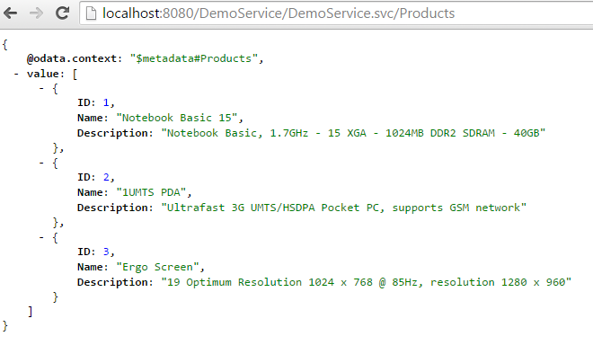

Title:    Tutorial - System Query Options - OrderBy

# How to build an OData Service with Olingo V4

# Part 5.3: System Query Options: `$orderby`

## Introduction

In the present tutorial, we will continue implementing OData system query options, this time focusing on `$orderby`

**Note:**
The final source code can be found in the project [git repository](https://gitbox.apache.org/repos/asf/olingo-odata4).
A detailed description how to checkout the tutorials can be found [here](/doc/odata4/tutorials/prerequisites/prerequisites.html).   
This tutorial can be found in subdirectory *\samples\tutorials\p7_queryoptions-o*

**Disclaimer:**
Again, in the present tutorial, we will focus only on the relevant implementation, in order to keep the code small and simple. The sample code as it is, shouldn’t be reused for advanced scenarios.

**Table of Contents**

  1.	Prerequisites
  2.	Preparation
  3.	Implementation
    1. Implement `$orderby`
  4.	Run the implemented service
  5.	Summary
  6.	Links

__

# 1. Prerequisites

Same prerequisites as in [Tutorial Part 1: Read Entity Collection](http://olingo.apache.org/doc/odata4/tutorials/read/tutorial_read.html)
 and [Tutorial Part 2: Read Entity](http://olingo.apache.org/doc/odata4/tutorials/readep/tutorial_readep.html) as well as basic knowledge about the concepts presented in both tutorials.

Furthermore, Tutorial Part 5.1 should have been read.

# 2. Preparation

Follow _Tutorial Part 1: Read Entity Collection_ and _Tutorial Part 2: Read Entity_ or as shortcut import *Part 2: Read Entity, Read Property* into your Eclipse workspace.

Afterwards do a _Deploy and run_: it should be working.

# Implementation

The system query options we’re focusing on are applied to the entity collection only, therefore our
implementation for all query options is done in the class
*myservice.mynamespace.service.DemoEntityCollectionProcessor*

The general sequence is again:

  1.	Analyze the URI
  2.	Fetch data from backend
  3.	Apply the system query option
  4.	Serialize
  5.	Configure the response

## 3.1. Implement `$orderby`

**Background**

When requesting a list of entities from a service, it is up to the service implementation to decide in which order they are presented. This can depend on the backend data source, anyways, it is undefined.
But the consumer of an OData service might want to be able to specify the order, according to his needs.

For example, a usual case would be that the list of entities is sorted as per default by its ID number, but for a user, the ID is not relevant and he would prefer a sorting e.g. by the name
OData supports this requirement with the system query option `$orderby`
It is specified as follows:

    $orderby=<propertyName>

The order can be ascending or descending:

    $orderby=<propertyName> asc
    $orderby=<propertyName> desc

If not specified, the default is ascending.

See here for more details:
[OData Version 4.0 Part 1: Protocol Plus Errata 02](http://docs.oasis-open.org/odata/odata/v4.0/errata02/os/complete/part1-protocol/odata-v4.0-errata02-os-part1-protocol-complete.html#_Toc406398305)

**Note:**
As of the OData specification, the `$orderby` system query option can be applied to multiple properties.
In that case, the value is specified as comma-separated list.

**Example:**

    <http://localhost:8080/DemoService/DemoService.svc/Products?$orderby=Name asc, Description desc>

In this example, all the products are sorted by their name. Moreover, all products with the same name are sorted by their description in descending order.
Another example could be that I want to display all my customers, they should be sorted by their country. Additionally, within each country, they should be sorted by their name

In order to support such sorting, the OData service implementation has to make use of the *ExpressionVisitor* concept.
We haven’t used it in the present tutorial, because the ExpressionVisitor will be explained in the $filter section

**Example**
First, just to remember how the full payload looks like, the “normal” query of the product:
[http://localhost:8080/DemoService/DemoService.svc/Products](http://localhost:8080/DemoService/DemoService.svc/Products)

The following request specifies the sorting by the name.
The order is ascending, if not specified elsewise.

[http://localhost:8080/DemoService/DemoService.svc/Products?$orderby=Name](http://localhost:8080/DemoService/DemoService.svc/Products?$orderby=Name)

**Implementation**

The following section describes the simple approach to enable the *EntityCollectionProcessor* class and the *readEntityCollection()* method for *$orderby*.

Just like in the previous tutorials, the data is first fetched from the backend, then the system query option is applied.

~~~java
    EntityCollection entityCollection = storage.readEntitySetData(edmEntitySet);
    List<Entity> entityList = entityCollection.getEntities();
~~~

We will proceed according to these 4 steps:

 1. Get the query option from the *UriInfo*. If null is returned then nothing has to be done.
 2. Get the value from the query option
 3. Analyze the value
 4. Modify the *EntityCollection*

**1. Get the OrderByOption from the UriInfo:**

~~~java
    OrderByOption orderByOption = uriInfo.getOrderByOption();
    if (orderByOption != null) {
~~~

**2. Get the value of the OrderByOption:**

~~~java
    List<OrderByItem> orderItemList = orderByOption.getOrders();
    final OrderByItem orderByItem = orderItemList.get(0);
~~~

The instance of an OrderByOption can be asked for the list of its *OrderByItems*.
Why a list?
Because the `$orderby` expression can be composed with multiple properties
For example, for the following URL, we get 2 OrderByItems:

    http://localhost:8080/DemoService/DemoService.svc/Products?$orderby=Name asc, Description desc

In our example, we support only one property, therefore we directly access the first OrderByItem in the list.

**3. Analyze the value**

What do we want to do?
From the backend we got a list of entities that are products. We want to apply a sorter to that list and we want to sort by the property name that is given in the URI.
In our example, the property name that is provided in the URI can be “Name”, “Description” or “ID”
So we have to retrieve the property name from the URI.

~~~java
    Expression expression = orderByItem.getExpression();
    if(expression instanceof Member){
    	UriInfoResource resourcePath = ((Member)expression).getResourcePath();
    	UriResource uriResource = resourcePath.getUriResourceParts().get(0);
    	if (uriResource instanceof UriResourcePrimitiveProperty) {
           EdmProperty edmProperty = ((UriResourcePrimitiveProperty)uriResource).getProperty();
    	   final String sortPropertyName = edmProperty.getName();
~~~

**4. Modify the EntityCollection**

The remaining work is to do the sorting.
We have a list of entities that has to be sorted, therefore we create a java.util.Comparator for Entity:

~~~java
    Collections.sort(entityList, new Comparator<Entity>() {
~~~

In the compare method, we extract the required property from the entity.
The required property is the one that we retrieved from the URI.
In our sample, the properties can be of type String or Integer, therefore we have to distinguish these 2 cases.
The actual work of comparing can then be delegated to the String and Integer classes.

~~~java
    if(sortPropertyName.equals("ID")){
    	Integer integer1 = (Integer) entity1.getProperty(sortPropertyName).getValue();
    	Integer integer2 = (Integer) entity2.getProperty(sortPropertyName).getValue();
    	compareResult = integer1.compareTo(integer2);
    }else{
    	String propertyValue1 = (String) entity1.getProperty(sortPropertyName).getValue();
    	String propertyValue2 = (String) entity2.getProperty(sortPropertyName).getValue();
    	compareResult = propertyValue1.compareTo(propertyValue2);
    }
~~~

After the sorting is done, we still have to consider, if the required order is ascending or descending.
So we have to retrieve that information from the OrderByItem and then we can simply reverse the current order accordingly:

~~~java
    if(orderByItem.isDescending()){
    	return - compareResult; // just convert the result to negative value to change the order
    }
~~~

The full implementation of the readEntityCollection() method:

~~~java
    public void readEntityCollection(ODataRequest request, ODataResponse response, UriInfo uriInfo, ContentType responseFormat)
         throws ODataApplicationException, SerializerException {

    	// 1st retrieve the requested EntitySet from the uriInfo
    	List<UriResource> resourcePaths = uriInfo.getUriResourceParts();
    	UriResourceEntitySet uriResourceEntitySet = (UriResourceEntitySet) resourcePaths.get(0);
    	EdmEntitySet edmEntitySet = uriResourceEntitySet.getEntitySet();

    	// 2nd: fetch the data from backend
    	EntityCollection entityCollection = storage.readEntitySetData(edmEntitySet);
    	List<Entity> entityList = entityCollection.getEntities();

    	// 3rd apply $orderby
    	OrderByOption orderByOption = uriInfo.getOrderByOption();
    	if (orderByOption != null) {
    		List<OrderByItem> orderItemList = orderByOption.getOrders();
    		final OrderByItem orderByItem = orderItemList.get(0); // we support only one
    		Expression expression = orderByItem.getExpression();
    		if(expression instanceof Member){
    			UriInfoResource resourcePath = ((Member)expression).getResourcePath();
    			UriResource uriResource = resourcePath.getUriResourceParts().get(0);
    			if (uriResource instanceof UriResourcePrimitiveProperty) {
    				EdmProperty edmProperty = ((UriResourcePrimitiveProperty)uriResource).getProperty();
    				final String sortPropertyName = edmProperty.getName();

    				// do the sorting for the list of entities  
    				Collections.sort(entityList, new Comparator<Entity>() {

    					// delegate the sorting to native sorter of Integer and String
    					public int compare(Entity entity1, Entity entity2) {
    						int compareResult = 0;

    						if(sortPropertyName.equals("ID")){
    							Integer integer1 = (Integer) entity1.getProperty(sortPropertyName).getValue();
    							Integer integer2 = (Integer) entity2.getProperty(sortPropertyName).getValue();

    							compareResult = integer1.compareTo(integer2);
    						}else{
    							String propertyValue1 = (String) entity1.getProperty(sortPropertyName).getValue();
    							String propertyValue2 = (String) entity2.getProperty(sortPropertyName).getValue();

    							compareResult = propertyValue1.compareTo(propertyValue2);
    						}

    						// if 'desc' is specified in the URI, change the order
    						if(orderByItem.isDescending()){
    							return - compareResult; // just reverse order
    						}

    						return compareResult;
    					}
    				});
    			}
    		}
    	}

    	// 4th: create a serializer based on the requested format (json)
    	ODataSerializer serializer = odata.createSerializer(responseFormat);

    	// and serialize the content: transform from the EntitySet object to InputStream
    	EdmEntityType edmEntityType = edmEntitySet.getEntityType();
    	ContextURL contextUrl = ContextURL.with().entitySet(edmEntitySet).build();

        final String id = request.getRawBaseUri() + "/" + edmEntitySet.getName();
    	EntityCollectionSerializerOptions opts = EntityCollectionSerializerOptions.with().contextURL(contextUrl).id(id).build();
    	SerializerResult serializerResult = serializer.entityCollection(serviceMetadata, edmEntityType, entityCollection, opts);
    	InputStream serializedContent = serializerResult.getContent();

    	// 5th: configure the response object: set the body, headers and status code
    	response.setContent(serializedContent);
    	response.setStatusCode(HttpStatusCode.OK.getStatusCode());
    	response.setHeader(HttpHeader.CONTENT_TYPE, responseFormat.toContentTypeString());
    }
~~~

**4. Run the implemented service**

After building and deploying your service to your server, you can try the following URLs:

  - The “normal” payload without query option  [http://localhost:8080/DemoService/DemoService.svc/Products](http://localhost:8080/DemoService/DemoService.svc/Products)
  - Sort by Name ascending   [http://localhost:8080/DemoService/DemoService.svc/Products?$orderby=Name](http://localhost:8080/DemoService/DemoService.svc/Products?$orderby=Name)
  - Sort by Name descending [http://localhost:8080/DemoService/DemoService.svc/Products?$orderby=Name desc](http://localhost:8080/DemoService/DemoService.svc/Products?$orderby=Name desc)
  - Sort by Description ascending  [http://localhost:8080/DemoService/DemoService.svc/Products?$orderby=Description](http://localhost:8080/DemoService/DemoService.svc/Products?$orderby=Description)
  - Sort by Description descending [http://localhost:8080/DemoService/DemoService.svc/Products?$orderby=Description desc](http://localhost:8080/DemoService/DemoService.svc/Products?$orderby=Description desc)

# 5. Summary

In this tutorial we have learned how to implement a simple `$orderby`.
We have decided to not go for the advanced way of implementing `$orderby`, which would have been using an ExpressionVisitor, because that is treated in the `$filter` implementation.

# 6. Links

### Tutorials
  * Tutorial OData V4 service part 1: [Read Entity Collection](/doc/odata4/tutorials/read/tutorial_read.html)
  * Tutorial OData V4 service part 2: [Read Entity, Read Property](/doc/odata4/tutorials/readep/tutorial_readep.html)
  * Tutorial OData V4 service part 3: [Write (Create, Update, Delete Entity)](/doc/odata4/tutorials/write/tutorial_write.html)
  * Tutorial OData V4 service, part 4: [Navigation](/doc/odata4/tutorials/navigation/tutorial_navigation.html)
  * Tutorial OData V4 service, part 5.1: [System Query Options $top, $skip, $count (this page)](/doc/odata4/tutorials/sqo_tcs/tutorial_sqo_tcs.html)
  * Tutorial OData V4 service, part 5.2: [System Query Options $select, $expand](/doc/odata4/tutorials/sqo_es/tutorial_sqo_es.html)
  * Tutorial OData V4 service, part 5.3: System Query Options $orderby (this page)
  * Tutorial OData V4 service, part 5.4: [System Query Options $filter](/doc/odata4/tutorials/sqo_f/tutorial_sqo_f.html)
  * Tutorial ODATA V4 service, part 6: [Action and Function Imports](/doc/odata4/tutorials/action/tutorial_action.html)
  * Tutorial ODATA V4 service, part 7: [Media Entities](/doc/odata4/tutorials/media/tutorial_media.html)
  * Tutorial OData V4 service, part 8: [Batch Request support](/doc/odata4/tutorials/batch/tutorial_batch.html)
  * Tutorial OData V4 service, part 9: [Handling "Deep Insert" requests](/doc/odata4/tutorials/deep_insert/tutorial_deep_insert.html)
  
### Code and Repository
  * [Git Repository](https://gitbox.apache.org/repos/asf/olingo-odata4)
  * [Guide - To fetch the tutorial sources](/doc/odata4/tutorials/prerequisites/prerequisites.html)
  * [Demo Service source code as zip file (contains all tutorials)](http://www.apache.org/dyn/closer.lua/olingo/odata4/4.0.0/DemoService_Tutorial.zip)

### Further reading

  * [Official OData Homepage](http://odata.org/)
  * [OData documentation](http://www.odata.org/documentation/)
  * [Olingo Javadoc](/javadoc/odata4/index.html)
