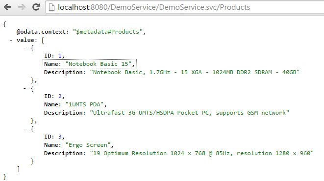
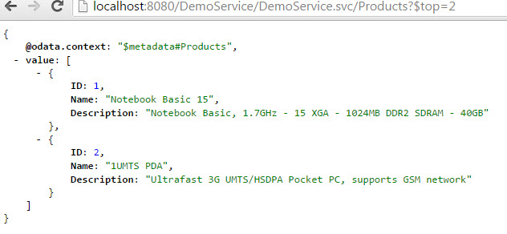

Title:    Tutorial - Read service with Olingo V4

# How to build an OData Service with Olingo V4

# Part 5.1: System Query Options `$top`, `$skip`, `$count`

## Introduction

In the present tutorial, we’ll learn how to implement **system query options**.
Query options are used to refine the result of a query.
The [OData V4 specification document](http://docs.oasis-open.org/odata/odata/v4.0/errata02/os/complete/part2-url-conventions/odata-v4.0-errata02-os-part2-url-conventions-complete.html#_Toc406398093) gives the following definition:

> “System query options are query string parameters that control the amount and order of the data returned for the resource identified by the URL. The names of all system query options are prefixed with a dollar ($) character.”


Query options are not part of the resource path, they’re appended to the URL after the `?`.
As an example the URL <http://localhost:8080/my/page?example=true> has *example* as *query option* with the value *true*.

As an example for a system query option in Odata:
When querying the list of products, the order of the returned entries is defaulted by the OData service.
However, the user can change the order of the list by specifying the query option `$orderby`.

Examples for system query options that are commonly used:

  * `$top`
  * `$skip`
  * `$count`
  * `$select`
  * `$orderby`
  * `$filter`
  * `$expand`

The present tutorial focuses on the first three query options: `$top`, `$skip` and `$count`

**Examples**

The following example calls are based on our sample service and illustrate the usage of these 3 query options.

First, just to remember, the “normal” query of the product without query options:
<http://localhost:8080/DemoService/DemoService.svc/Products>



The following URL provides only the first 2 entries and ignores all the rest:
<http://localhost:8080/DemoService/DemoService.svc/Products?$top=2>



The following request returns the products starting with the 3rd and ignores the first 2 entries:
<http://localhost:8080/DemoService/DemoService.svc/Products?$skip=2>


The following request returns the total number of products and includes it in the payload:
<http://localhost:8080/DemoService/DemoService.svc/Products?$count=true>


**Note:**
TThe final source code can be found in the project [git repository](https://gitbox.apache.org/repos/asf/olingo-odata4).
A detailed description how to checkout the tutorials can be found [here](/doc/odata4/tutorials/prerequisites/prerequisites.html).
This tutorial can be found in subdirectory *\samples\tutorials\p5_queryoptions-tcs*

**Disclaimer:**
Again, in the present tutorial, we’ll focus only on the relevant implementation, in order to keep the code small and simple. The sample code shouldn’t be reused for advanced scenarios.

**Table of Contents**

  1. Prerequisites
  2. Preparation
  3. Implementating system query options
     1. Implement `$count`
     2. Implement `$skip`
     3. Implement `$top`
  4. Run the implemented service
  5. Summary
  6. Links


___

# 1. Prerequisites

Same prerequisites as in [Tutorial Part 1: Read Entity Collection](/doc/odata4/tutorials/read/tutorial_read.html)
 and [Tutorial Part 2: Read Entity](/doc/odata4/tutorials/readep/tutorial_readep.html) as well as basic knowledge about the concepts presented in both tutorials.

___

# 2. Preparation

Follow [Tutorial Part 1: Read Entity Collection](/doc/odata4/tutorials/read/tutorial_read.html)
 and [Tutorial Part 2: Read Entity](/doc/odata4/tutorials/readep/tutorial_readep.html) or as shortcut import the project attached to Tutorial Part 2 into your Eclipse workspace.

Afterwards do a _Deploy and run_: it should be working.


___


# 3. Implementing system query options

The system query options we’re focusing on are applied to the entity collection only (for example, it doesn’t make sense to apply a `$top` to a READ request of a single entity)

Therefore our implementation for all three query options is done in the class
`myservice.mynamespace.service.DemoEntityCollectionProcessor`

The general sequence of the implementation remains unchanged:

  1.	Analyze the URI
  2.	Fetch data from backend
  3.	Serialize
  4.	Configure the response

The only difference is that we apply the query options after getting the data from the backend (our database-mock).
So the procedure will be:

  1.	Analyze the URI
  2.	Fetch data from backend
  3.	Apply all system query options
  4.	Serialize
  5.	Configure the response

The following sections describe how such system query options are implemented.
The procedure will be similar in all 3 cases:

  1. Get the query option from the UriInfo. If null is returned then nothing has to be done.
  1. Get the value from the query option
  1. Analyze the value
  1. Modify the EntityCollection


## 3.1. Implement `$count`

**Background**
The `$count` allows users to request a count of the matching resources.
The number will be included with the resources in the response (see screenshot above).

The user specifies the `$count` as follows:
`$count=true`
`$count=false`

If the value of `$count` is set to _false_, then no number is returned, the same like if `$count` is not specified at all. However, this case has to be considered in our code as well.

Note:
For those who are used to OData V2:
In V2, the query option `$inlinecount` has now been replaced in V4 by `$count=true`.
In V2, the `/$count` that was part of the resource path, has now been removed in V4.


There’s one more important detail that we have to consider before writing the code:
`$count` always returns the original number of entities, without considering _$top_ and `$skip`.
This is specified by the [OData V4 specification](
http://docs.oasis-open.org/odata/odata/v4.0/errata02/os/complete/part1-protocol/odata-v4.0-errata02-os-part1-protocol-complete.html#_Toc406398308):
> “The `$count` system query option ignores any $top, `$skip`, or `$expand` query options, and returns the total count of results across all pages including only those results matching any specified `$filter` and $search.”


Therefore, in our sample code, the `$count` will be the first to be implemented, to make sure that the data provided by the backend is not modified at the moment when we "count" it.


**Implementation**
As in the previous tutorials, the data is fetched from the backend.
It is provided as `EntityCollection` which we can ask for the list of contained `Entity` instances.
The size of this genuine list is the relevant information for our `$count`.
Furthermore, we create a new instance of an `EntityCollection` object, which will carry the modified list of entities after applying all the query options.

```java
    EntityCollection entityCollection = storage.readEntitySetData(edmEntitySet);
    List<Entity> entityList = entityCollection.getEntities();
    EntityCollection returnEntityCollection = new EntityCollection();
```

Then we proceed with the 4 steps as described above:

  1. Get the query option from the `UriInfo`. If null is returned then nothing has to be done.
  1. Get the value from the query option
  1. Analyze the value
  1. Modify the `EntityCollection`

And this is the sample code:

```java
    CountOption countOption = uriInfo.getCountOption();
    if (countOption != null) {
        boolean isCount = countOption.getValue();
        if(isCount){
            returnEntityCollection.setCount(entityList.size());
        }
    }
```

**Note:**
We don’t need to check if the value of the `$count` is incorrect (e.g. `$count=xxx`), as this is handled by the _Olingo OData V4_ library.

One additional step has to be considered:
As we know, if `$count=true` is specified, the structure of the response payload is different.
So we have to inform the serializer.that `$count` has to be considered.
So we have to modify the line of code, where the `EntityCollectionSerializerOptions` is created:

```java
    EntityCollectionSerializerOptions opts = EntityCollectionSerializerOptions.with()
                                             .contextURL(contextUrl)
                                             .id(id)
                                             .count(countOption)
                                             .build();
```

Furthermore, we have to change the following line, because the `EntityCollection` to be returned is now different;


```java
    SerializerResult serializerResult = serializer.entityCollection(serviceMetadata,
                                        edmEntityType,
                                        returnEntityCollection,
                                        opts);
```

## 3.2. Implement `$skip`

**Background**
With the query option `$skip`, the user of an OData service can specify the number of entries that should be ignored at the beginning of a collection.
So if a user specifies `$skip=n` then our OData service has to return the list of entries starting at position n+1

One important rule that we have to consider is described by the [OData V4 specification](http://docs.oasis-open.org/odata/odata/v4.0/errata02/os/complete/part1-protocol/odata-v4.0-errata02-os-part1-protocol-complete.html#_Toc406398306):
> “Where `$top` and `$skip` are used together, `$skip` MUST be applied before $top, regardless of the order in which they appear in the request.”

This means for us that we add the code for `$skip` before the code for `$top`.


**Implementation**

Again we follow the 4 mentioned steps.
We get the `SkipOption` object from the `UriInfo`.
If the `SkipOption` is null, then it hasn’t been specified by the user.
Since it is not mandatory to specify any query option, we can ignore the case of `SkipOption` being null.
We ask the `SkipOption` object for the value that has been specified by the user.
Since the user might give invalid numbers, we have to check that and throw an exception with HTTP status as “Bad Request”.
Then we can do the actual job, which is adapting the backend-data according to the specified `$skip`.

```java
    SkipOption skipOption = uriInfo.getSkipOption();
    if (skipOption != null) {
        int skipNumber = skipOption.getValue();
        if (skipNumber >= 0) {
            if(skipNumber <= entityList.size()) {
                entityList = entityList.subList(skipNumber, entityList.size());
            } else {
                // The client skipped all entities
                entityList.clear();
            }
        } else {
            throw new ODataApplicationException("Invalid value for $skip", HttpStatusCode.BAD_REQUEST.getStatusCode(), Locale.ROOT);
        }
    }
```

After applying the query option, we have the desired set of entities in the variable `entityList`.
Now we have to populate the `EntityCollection` instance, that we created in the section above, with these entities, before we can pass it to the serializer:

```java
    for(Entity entity : entityList){
        returnEntityCollection.getEntities().add(entity);
    }
```

## 3.3. Implement $top

**Background**
With the query option `$top`, the user of an OData service can specify the maximum number of entries that should be returned, starting from the beginning.

**Implementation**

Again we follow the 4 mentioned steps, the code is very similar, only the logic for reducing the entityList is different:

```java
    TopOption topOption = uriInfo.getTopOption();
    if (topOption != null) {
        int topNumber = topOption.getValue();
        if (topNumber >= 0) {
            if(topNumber <= entityList.size()) {
                entityList = entityList.subList(0, topNumber);
            }  // else the client has requested more entities than available => return what we have
        } else {
            throw new ODataApplicationException("Invalid value for $top", HttpStatusCode.BAD_REQUEST.getStatusCode(), Locale.ROOT);
        }
    }
```

So now we can finally have a look at the full implementation of the `readEntityCollection()` method, containing all the three query options:

```java
    public void readEntityCollection(ODataRequest request, ODataResponse response, UriInfo uriInfo, ContentType responseFormat)
                                    throws ODataApplicationException, SerializerException {

        // 1st retrieve the requested EntitySet from the uriInfo
        List<UriResource> resourcePaths = uriInfo.getUriResourceParts();
        UriResourceEntitySet uriResourceEntitySet = (UriResourceEntitySet) resourcePaths.get(0);
        EdmEntitySet edmEntitySet = uriResourceEntitySet.getEntitySet();

        // 2nd: fetch the data from backend for this requested EntitySetName
        EntityCollection entityCollection = storage.readEntitySetData(edmEntitySet);

        // 3rd: apply System Query Options
        // modify the result set according to the query options, specified by the end user
        List<Entity> entityList = entityCollection.getEntities();
        EntityCollection returnEntityCollection = new EntityCollection();

        // handle $count: return the original number of entities, ignore $top and $skip
        CountOption countOption = uriInfo.getCountOption();
        if (countOption != null) {
            boolean isCount = countOption.getValue();
            if(isCount){
                returnEntityCollection.setCount(entityList.size());
            }
        }

        // handle $skip
        SkipOption skipOption = uriInfo.getSkipOption();
        if (skipOption != null) {
            int skipNumber = skipOption.getValue();
            if (skipNumber >= 0) {
                if(skipNumber <= entityList.size()) {
                    entityList = entityList.subList(skipNumber, entityList.size());
                } else {
                    // The client skipped all entities
                    entityList.clear();
                }
            } else {
                throw new ODataApplicationException("Invalid value for $skip", HttpStatusCode.BAD_REQUEST.getStatusCode(), Locale.ROOT);
            }
        }

        // handle $top
        TopOption topOption = uriInfo.getTopOption();
        if (topOption != null) {
            int topNumber = topOption.getValue();
            if (topNumber >= 0) {
                if(topNumber <= entityList.size()) {
                    entityList = entityList.subList(0, topNumber);
                }  // else the client has requested more entities than available => return what we have
            } else {
                throw new ODataApplicationException("Invalid value for $top", HttpStatusCode.BAD_REQUEST.getStatusCode(), Locale.ROOT);
            }
        }

        // after applying the query options, create EntityCollection based on the reduced list
        for(Entity entity : entityList){
            returnEntityCollection.getEntities().add(entity);
        }

        // 4th: create a serializer based on the requested format (json)
        ODataSerializer serializer = odata.createSerializer(responseFormat);

        // and serialize the content: transform from the EntitySet object to InputStream
        EdmEntityType edmEntityType = edmEntitySet.getEntityType();
        ContextURL contextUrl = ContextURL.with().entitySet(edmEntitySet).build();

        final String id = request.getRawBaseUri() + "/" + edmEntitySet.getName();
        EntityCollectionSerializerOptions opts = EntityCollectionSerializerOptions.with()
                                                                .contextURL(contextUrl)
                                                                .id(id)
                                                                .count(countOption)
                                                                .build();
        SerializerResult serializerResult = serializer.entityCollection(serviceMetadata, edmEntityType,
                                                                        returnEntityCollection, opts);

        // 5th: configure the response object: set the body, headers and status code
        response.setContent(serializedContent);
        response.setStatusCode(HttpStatusCode.OK.getStatusCode());
        response.setHeader(HttpHeader.CONTENT_TYPE, responseFormat.toContentTypeString());
    }
```

---

# 4. Run the implemented service

After building and deploying your service to your server, you can try the following URLs:

  * The full collection, no query option
  <http://localhost:8080/DemoService/DemoService.svc/Products>

  * First 2 products only
  <http://localhost:8080/DemoService/DemoService.svc/Products?$top=2>

  * Exclude the first 2 products
  <http://localhost:8080/DemoService/DemoService.svc/Products?$skip=2>

  * Add the full number of all products to the response payload
  <http://localhost:8080/DemoService/DemoService.svc/Products?$count=true>

  * Combine `$top` and `$skip`
  <http://localhost:8080/DemoService/DemoService.svc/Products?$skip=1&$top=1>
  <http://localhost:8080/DemoService/DemoService.svc/Products?$top=1&$skip=1>
  Regardless of the order, the result should be the same

  * Combine all 3 query options
  <http://localhost:8080/DemoService/DemoService.svc/Products?$skip=1&$top=1&$count=true>

---

# 5. Summary

In this tutorial we have learned how enhance our OData service to support system query options.
In a first step, we’ve covered `$top`, `$skip` and `$count`.
More system query options will be treated in the subsequent tutorials.

---

# 6. Links

### Tutorials
  * Tutorial OData V4 service part 1: [Read Entity Collection](/doc/odata4/tutorials/read/tutorial_read.html)
  * Tutorial OData V4 service part 2: [Read Entity, Read Property](/doc/odata4/tutorials/readep/tutorial_readep.html)
  * Tutorial OData V4 service part 3: [Write (Create, Update, Delete Entity)](/doc/odata4/tutorials/write/tutorial_write.html)
  * Tutorial OData V4 service, part 4: [Navigation](/doc/odata4/tutorials/navigation/tutorial_navigation.html)
  * Tutorial OData V4 service, part 5.1: System Query Options $top, $skip, $count (this page)
  * Tutorial OData V4 service, part 5.2: [System Query Options $select, $expand](/doc/odata4/tutorials/sqo_es/tutorial_sqo_es.html)
  * Tutorial OData V4 service, part 5.3: [System Query Options $orderby](/doc/odata4/tutorials/sqo_o/tutorial_sqo_o.html)
  * Tutorial OData V4 service, part 5.4: [System Query Options $filter](/doc/odata4/tutorials/sqo_f/tutorial_sqo_f.html)
  * Tutorial ODATA V4 service, part 6: [Action and Function Imports](/doc/odata4/tutorials/action/tutorial_action.html)
  * Tutorial ODATA V4 service, part 7: [Media Entities](/doc/odata4/tutorials/media/tutorial_media.html)
  * Tutorial OData V4 service, part 8: [Batch Request support](/doc/odata4/tutorials/batch/tutorial_batch.html)
  * Tutorial OData V4 service, part 9: [Handling "Deep Insert" requests](/doc/odata4/tutorials/deep_insert/tutorial_deep_insert.html)

### Code and Repository
  * [Git Repository](https://gitbox.apache.org/repos/asf/olingo-odata4)
  * [Guide - To fetch the tutorial sources](/doc/odata4/tutorials/prerequisites/prerequisites.html)
  * [Demo Service source code as zip file (contains all tutorials)](http://www.apache.org/dyn/closer.lua/olingo/odata4/4.0.0/DemoService_Tutorial.zip)

### Further reading

  * [Official OData Homepage](http://odata.org/)
  * [OData documentation](http://www.odata.org/documentation/)
  * [Olingo Javadoc](/javadoc/odata4/index.html)
